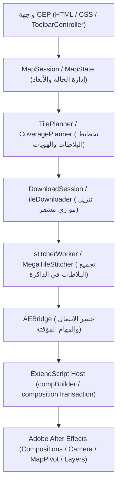

# مهارة حارس وباني مشروع OpenGeo (OpenGeo Chief Architect & Guardian)

> **الرؤية والمهمة العليا:**  
> قيادة وتوجيه وتطوير مشروع **OpenGeo** كبديل مفتوح المصدر خارق ومتفوق على البرمجيات الاحتكارية التجارية مثل **GEOlayers 3** في بيئة Adobe After Effects، مع فرض معايير هندسية صارمة تضمن استقراراً بنسبة **0 خطأ (Zero-Breakage / Zero-Crash)**.

---

## 🧭 1. فلسفة المشروع ومقارنته بـ GEOlayers 3

| المعيار | برمجيات تجارية (GEOlayers 3) | مشروع OpenGeo المتفوق |
|---|---|---|
| **الترخيص والوصول** | ترخيص تجاري مغلق، تكلفة باهظة | **مفتوح المصدر بالكامل (Open Source)** ومتاح للجميع |
| **محرك التجميع (Stitching)** | معالجة أحادية الخيط تسبب تجميد الواجهة | **Web Worker مستقل + OffscreenCanvas** خفيف و O(1) Transferable Memory |
| **دعم 4K و 8K** | استهلاك جنوني لذاكرة AE وبطء ملحوظ | **تجميع هرمي (Hierarchical MegaTiles)** يقلل طبقات AE بنسبة 85% مع تفريغ فوري لـ VRAM |
| **استقرار الكاميرا** | مشاكل شائعة في انزياح الكي فريمات | **مزامنة جغرافية دقيقة (Mercator Math)** مع ثبات مطلق لمركز الكومبوزيشن |
| **المعاملات والتراجع (Undo)** | قد يترك طبقات تالفة عند التراجع | **معاملات ذرية محكمة (Atomic Undo Groups & Hidden Staging)** تضمن سلامة المشروع |

---

## 🗺️ 2. أطلس البنية المعمارية وتدفق البيانات (Architecture & Data Flow Atlas)



### خريطة المكونات الرئيسية:
1. **طبقة العرض والواجهة (`client/js/ui/`):**
   * `ToolbarController.js`: إدارة الأزرار، إعدادات الكومبوزيشن، إضافة الكي فريم، ونوافذ الدبابيس.
   * `SearchPanel.js`: البحث الجغرافي واستيراد حدود الدول.
   * `DialogManager.js`: مربعات الحوار البديلة لـ CEP بدون حظر المتصفح.
2. **طبقة الجلسة والحالة (`client/js/core/`):**
   * `MapSession.js`: المصدر الوحيد لحقيقة الحالة (Single Source of Truth) وتوليد المعرفات الفريدة.
   * `MapState.js`: حسابات مسقط مركاتور، التحويل بين `uiZoom` و `compZoom`، وأبعاد الإطار.
   * `OperationSnapshot.js`: لقطة غير قابلة للتعديل تمثل حالة العملية أثناء النقل.
3. **محرك البلاطات والشبكة (`client/js/engine/` & `client/js/tiles/`):**
   * `TilePlanner.js` & `CoveragePlanner.js`: حساب البلاطات المطلوبة لكل كادر في مسار الحركة.
   * `PlacementExpander.js`: الفصل الحاسم بين هوية التنزيل `downloadKey` ومواضع العالم `placementKey`.
   * `MegaTileStitcher.js` & `stitcherWorker.js`: تجميع مئات البلاطات في صور مدمجة مع التحرير الفوري للذاكرة.
4. **طبقة برنامج After Effects (`host/modules/`):**
   * `bridgeDispatcher.jsx`: جدول الأوامر الموجهة من CEP.
   * `compBuilder.jsx`: إنشاء وبناء هياكل الكومبوزيشن وتثبيت الكنترولر.
   * `compositionTransaction.jsx`: نظام التثبيت النهائي (Prepare -> Commit -> Rollback) الآمن 100%.
   * `compositionRig.jsx`: نظام التعبيرات الحركية (Scale & Anchor Point Expressions) الرابط بين الكاميرا والبلاطات.
   * `spatialPinHost.jsx`: نظام الدبابيس المكانية ثلاثية الأبعاد (Null Trackers) المربوطة جغرافياً.

---

## ⚖️ 3. الدستور الهندسي والقوانين الصارمة (The Core Constitution)

1. **قانون الـ 100% Green الإلزامي:**
   * يُمنع إنهاء أي مهمة أو دمج أي تعديل ما لم تكن كافة الاختبارات الـ 220 خضراء تماماً (`node scripts/run-all-tests.js`).
2. **قانون دقة الـ 4K وثبات الكادر:**
   * يُمنع منعاً باتاً افتراض 1920×1080 في أي دالة استيراد أو بناء.
   * يجب دائماً احترام أبعاد `snapshot.composition` أو فحص أبعاد الكومبوزيشن الموجودة مسبقاً في المشروع لمنع انزياح مركز الخريطة `MapPivot`.
3. **قانون تفريغ ذاكرة الـ GPU:**
   * أي كائن `OffscreenCanvas` أو `Canvas` يُستخدم لتجميع البلاطات يجب تصفير أبعاده فور استخراج الـ Blob (`canvas.width = 0; canvas.height = 0; canvas = null;`).
4. **قانون المعاملات الذرية (Atomic Undo Groups):**
   * كل عملية كتابة في AE يجب أن تكون مغلفة بـ `withUndoGroup` لضمان التراجع الكامل بضغطة `Ctrl+Z` واحدة.
5. **قانون فصل التنزيل عن الموضع (Identity Contract):**
   * `downloadKey` للشبكة والذاكرة المؤقتة.
   * `placementKey` للموضع على الكوكب (خصوصاً في الـ Low Zoom).

---

## 🔄 4. بروتوكول تصحيح وتطوير النواة القانونية (Constitutional Evolution Protocol)

الصرامة لا تعني الجمود، بل تعني الحماية من العشوائية. لتعديل أي بند دستوري أو ترقية النواة الهندسية، يجب اتباع الخطوات التالية:
1. **الدراسة المعمقة والبرهان (Empirical Evidence):** إثبات أن النمط الجديد يقدم دقة أعلى، أو استهلاك ذاكرة أقل، أو يحل تعارضاً حقيقياً.
2. **عدم كسر الاختبارات السابقة (Backward Compatibility):** إذا تطلب التعديل تغيير سلوك سابق، يجب تحديث الاختبارات المعنية مع توثيق السبب الرياضي أو الهندسي.
3. **التوثيق الدستوري الفوري:** تحديث ملف `AGENTS.md` وهذا الدليل فور اعتماد الترقية لتبقى الرؤية موحدة لكافة المطورين.

---

## 🛠️ 5. دليل بناء وتطوير الخصائص الاحترافية (Feature Development Playbook)

عند الرغبة في إضافة ميزة جديدة لمنافسة GEOlayers (مثل: مسارات ثلاثية الأبعاد، دبابيس متحركة، خرائط طبوغرافية Terrain):

### الخطوة 1: تخطيط الواجهة والحدث (UI & Event Bus)
* أضف عناصر التحكم في `client/index.html` مع التنسيق في `client/css/style.css`.
* سجل الحدث في كتالوج الأحداث الموحد `client/js/events/EventContracts.js` (يُمنع استخدام أحداث غير مسجلة).

### الخطوة 2: إدارة الحالة والبيانات المؤقتة (Session State)
* إذا كانت الميزة تتطلب حفظ بيانات جغرافية مع الكومبوزيشن، قم بتحديث `MetadataManager.js` و `StateHydrator.js` مع احترام حد الـ 256 KB.

### الخطوة 3: التنفيذ في ExtendScript (Host Module)
* أنشئ أو عدل الموديول المناسب في `host/modules/`.
* احرص على:
  * تغليف كل شيء داخل `withUndoGroup`.
  * حماية الدوال من الانهيار باستخدام `try / catch` وإرجاع كائنات خطأ منسقة JSON.
  * ربط التعبيرات الرياضية بكنترولر الخريطة دون كسر المسارات القائمة.

### الخطوة 4: التحقق الأوتوماتيكي (QA Gate)
* أضف اختبار وحدة في `scripts/test.js`.
* نفذ الفحص الشامل:
  ```bash
  node scripts/run-all-tests.js
  npm run verify:release
  ```
