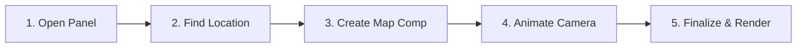

<p align="center">
  
</p>

<h1 align="center">OpenGeo</h1>

<p align="center">
  <strong>The Free, Open-Source Geospatial & Map Animation Engine for Adobe After Effects</strong>
</p>

<p align="center">
  <em>An enterprise-grade, 100% free alternative to commercial map plugins like GEOlayers. Create breathtaking satellite photogrammetry, cinematic 3D camera animations, vector boundaries, and interactive spatial pins directly in After Effects — with zero subscriptions, zero watermarks, and unlimited creative freedom.</em>
</p>

<p align="center">
  <a href="https://github.com/wittybrandcode/OpenGeo/releases"></a>
  
  
  
  
  
</p>

---

## 🌍 Why OpenGeo?

For years, motion designers, VFX artists, and documentarians were forced to rely on expensive commercial plugins and restrictive recurring subscriptions just to animate maps inside Adobe After Effects. 

**OpenGeo changes the game.** Built from the ground up as a native, open-source geospatial engine, OpenGeo gives you full studio-grade cartography tools right inside your After Effects workspace:

* **💰 100% Free & Open-Source Forever:** No monthly fees, no credit systems, no license dongles. Use it for personal passion projects or commercial Hollywood-grade broadcasts.
* **🎥 Bi-Directional 3D Camera Sync:** Move your camera in After Effects, and the OpenGeo panel responds instantly. Pan or zoom in the panel, and your AE composition camera updates in real-time.
* **🛰️ Rich Multi-Provider Tile Ecosystem:** Switch effortlessly between high-resolution satellite imagery (ESRI / Maxar, Sentinel-2 2024/2025), clean street vectors (OpenStreetMap), stylish dark and light cartography (CartoDB Dark Matter / Positron), and topographic relief (Stamen / Stadia Terrain) — or connect your own Mapbox and MapTiler API keys.
* **⛰️ Native 3D Tilt & Frustum Overscan:** Pitch your camera up to 45° with interactive HUD angle scrubbers. OpenGeo automatically calculates 3D camera frustums and overscans tiles so you never see black edges or void clipping during dramatic flyovers.
* **⚡ 4K & Ultra MegaTile Pipeline:** Download, assemble, and stitch thousands of map tiles into clean, high-resolution MegaTiles ($1024\text{px}$, $2048\text{px}$) off the main thread using dedicated Web Workers — keeping After Effects fluid and light.
* **📍 Precision 3D Spatial Pins:** Drop location pins that stay locked to exact GPS coordinates on the Earth's surface with automatic scale compensation and layer parenting.
* **🗺️ One-Click Vector Boundaries (GeoJSON):** Search for any country or region and convert its exact geographic borders into native, customizable After Effects Shape Layers.
* **🗂️ Project Maps Hub & Safe Duplication:** Visual project map cards, instant cover-art capture, and collision-free composition cloning (`v1.0.2`) that guarantees duplicated maps never overwrite each other's visual tiles.

---

## 🎬 Quick Start (5 Minutes to Your First Map Animation)



### Step 1: Launch the Panel
In Adobe After Effects, go to the top menu:
> **Window → Extensions → OpenGeo**

### Step 2: Frame Your Location
* Use the interactive viewport to drag, pan, and scroll-zoom to your desired location.
* Or use the **Search Bar** to type any city, country, or coordinate (e.g. `Tokyo`, `Paris`, `24.7136, 46.6753`).
* Use the **Pitch HUD Scrubber** to tilt the camera for a dynamic 3D perspective angle.

### Step 3: Create the Map Composition
* Click the green **Create Map** button.
* OpenGeo instantly builds an optimized After Effects composition with a rigged `OpenGeo Camera`, `OpenGeo Controller`, and `MapPivot`.

### Step 4: Animate Your Flight Path
* Move the timeline Current Time Indicator (CTI) to where you want the animation to start.
* Click **Record** or **Add Key** in the OpenGeo HUD.
* Move the timeline forward, adjust your position/zoom in the panel, and add another keyframe. OpenGeo records smooth spatial Bézier curves automatically!

### Step 5: Finalize for High Resolution
* Click **Finalize** in the bottom bar.
* Choose your quality tier (**Normal**, **High**, or **Ultra**).
* OpenGeo fetches the exact high-res tiles needed along your camera flight path, stitches them, and replaces draft tiles with production-ready footage!

---

## 📦 Supported Map Providers

OpenGeo comes pre-configured with the world's leading open map providers ready to use out of the box:

| Provider | Type | Resolution / Zoom | Best For |
| :--- | :--- | :--- | :--- |
| **ESRI World Imagery** | Satellite (Maxar) | Zoom up to 18 | Global satellite views & high-detail cities |
| **Sentinel-2 (2024 / 2025)** | Cloudless Satellite | Zoom up to 14 | Crisp, cloud-free seasonal satellite coverage |
| **OpenStreetMap** | Street Map | Zoom up to 19 | Navigation, urban layouts, roads, and transit |
| **CartoDB Dark Matter** | Minimal Vector Dark | Zoom up to 19 | High-tech infographics, data viz, night aesthetics |
| **CartoDB Positron** | Minimal Vector Light | Zoom up to 19 | Editorial graphics, print style, clean typography |
| **Stamen / Stadia Terrain** | Topographic Relief | Zoom up to 18 | Mountains, elevation contours, outdoor recreation |
| **Mapbox Satellite** | Ultra Satellite | Zoom up to 22 | Ultra-high resolution *(optional free API key)* |
| **MapTiler Satellite** | Clean Satellite | Zoom up to 20 | High-res photogrammetry *(optional free API key)* |

---

## 📥 Installation

### Windows Installation:
1. Download the latest release from the [Releases](https://github.com/wittybrandcode/OpenGeo/releases) page.
2. Extract the `OpenGeo` folder into:
   ```
   C:\Program Files (x86)\Common Files\Adobe\CEP\extensions\OpenGeo
   ```
   *(or `%APPDATA%\Adobe\CEP\extensions\OpenGeo`)*
3. Restart Adobe After Effects.
4. Open from **Window → Extensions → OpenGeo**.

### macOS Installation:
1. Download the latest release from the [Releases](https://github.com/wittybrandcode/OpenGeo/releases) page.
2. Extract the `OpenGeo` folder into:
   ```
   /Library/Application Support/Adobe/CEP/extensions/OpenGeo
   ```
   *(or `~/Library/Application Support/Adobe/CEP/extensions/OpenGeo`)*
3. Restart Adobe After Effects.
4. Open from **Window → Extensions → OpenGeo**.

---

## ⌨️ Pro Shortcuts & Controls

| Action | Control |
| :--- | :--- |
| **Pan Map** | Left Click + Drag |
| **Zoom In / Out** | Mouse Wheel / Touchpad Pinch |
| **Adjust 3D Pitch** | Drag the HUD Pitch Slider (0° to 45°) |
| **Add Camera Keyframe** | Click `Add Key` or `K` |
| **Toggle Keyframe Recording** | Click `Record` |
| **Search Location** | Click Search icon or press `Ctrl + F` / `Cmd + F` |
| **Duplicate Map Safely** | Click the Duplicate icon on any card in the **Project Maps** gallery |
| **Reset View** | Double click on the canvas |

---

## 🛠️ For Developers & Contributors

Are you a software engineer, technical director, or GIS developer interested in extending OpenGeo, creating new tile providers, or integrating custom shaders?

👉 **Read our comprehensive [Developer Architecture Guide](docs/DEVELOPER_GUIDE.md)** for detailed documentation on:
* The dual-runtime **Chromium + ExtendScript** execution model.
* The **Bridge Protocol v2** typed command routing.
* The **MegaTile OffscreenCanvas WebWorker** stitching pipeline.
* How to run the **12 Master QA Test Suites** (`npm test` and `node scripts/run-all-tests.js`).
* How to add custom providers, tools, and UI dialogs.

---

## 🔒 System Requirements

* **Host Application:** Adobe After Effects 2022, 2023, 2024, or 2025+
* **Operating System:** Windows 10/11 (64-bit) or macOS 12+ (Apple Silicon & Intel)
* **Internet Connection:** Required for live satellite and street tile fetching (cached tiles work offline)
* **Renderer Support:** Compatible with Classic 3D and Advanced 3D render engines

---

## 📄 License & Open-Source Community

OpenGeo is free and open-source software licensed under the **MIT License**.  
Maintained and championed with passion by **wittybrandcode** and the global motion graphics community.

*If OpenGeo helps you create amazing map animations, consider starring ⭐ the repository and sharing your animations with the world!*
