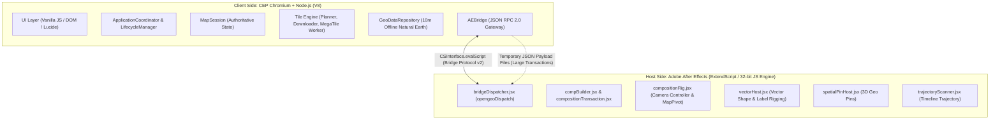
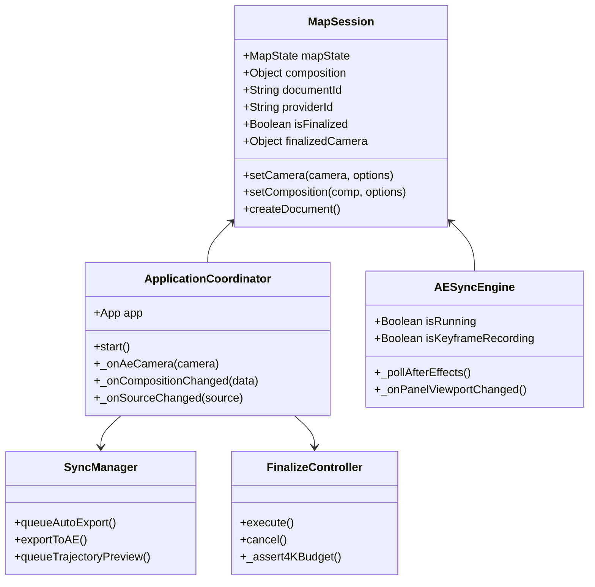
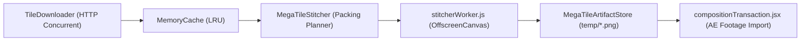

# التقرير الهندسي الشامل والتحليل الدقيق لكود مشروع OpenGeo
### Comprehensive Line-by-Line Architectural Audit & Technical Reference Manual

---

## 1. النظرة العامة على بنية النظام وفلسفة التصميم (Executive Architecture & Philosophy)

مشروع **OpenGeo** هو إضافة احترافية لبرنامج **Adobe After Effects** مبنية على إطار عمل **Adobe CEP (Common Extensibility Platform)**. مهمة الإضافة الأساسية هي تمكين فناني التحريك والمؤثرات البصرية من استيراد الخرائط الجغرافية الحقيقية (Real Earth Satellite & Cartographic Maps)، ومعالجة البلاطات عالية الدقة حتى **4K و 8K**، ورسم الحدود الدولية والخرائط المتجهية (Vector Outlines & GeoJSON)، وربط حركة الكاميرا والكي فريمز (Keyframe Trajectory) مع برنامج After Effects بشكل متزامن وبدقة جغرافية بكسلية متناهية.

### أ. نموذج التشغيل المزدوج (Dual-Runtime Architecture)
ينقسم المشروع معمارياً إلى بيئتين برمجيتين متزامنتين ومنفصلتي الذاكرة:



1. **جانب الواجهة والمحرك (Client Side / CEF + Node.js):**
   - يعمل داخل متصفح كروميوم مضمن (Chromium Embedded Framework).
   - يمتلك وصولاً كاملاً لمكتبات Node.js (`fs`, `path`, `crypto`, `http/https`, `Worker`).
   - يدير تحميل الصور من خوادم الخرائط (ESRI, OSM, CartoDB, Mapbox, Stamen)، وتخطيط التغطية (Coverage Planning)، وتجميع البلاطات في عمال الخلفية (`stitcherWorker.js` عبر `OffscreenCanvas`)، وقراءة البيانات الجغرافية المحلية دون اتصال بالإنترنت (Offline Natural Earth 10m).
2. **جانب المضيف (Host Side / Adobe After Effects ExtendScript):**
   - كود ECMAScript 3 قديم خاص بأدوبي، يعمل في نفس خيط المعالجة لبرنامج After Effects.
   - يدير شجرة الكومبوزيشن والطبقات (Layers, Nulls, Shapes, Cameras)، ويقوم بتركيب الإكسبرشنز (Expressions)، وتطبيق المؤثرات (Effects Controls)، والتحكم بالكي فريمز واستيراد الأصول (Footage Items).
3. **قناة الاتصال (The Bridge Gateway):**
   - يتم تبادل الأوامر والبيانات بين البيئتين عبر بروتوكول **OpenGeo Bridge Protocol v2** المعتمد على الرسائل المشفرة بصيغة JSON مع معرّف فريد لكل طلب (`requestId`) ومطابقة الحالة التزامنية. عند زيادة حجم البيانات (مثل آلاف البلاطات أو مضلعات الحدود المعقدة)، يتم نقل البيانات عبر ملفات مؤقتة مدارة (`JobManager`) لتفادي حدود طول أوامر الـ Shell/EvalScript في نظام التشغيل.

---

## 2. بروتوكول الاتصال وإدارة العمليات (Bridge Protocol & Dispatching)

### أ. ملف المضيف: [`host/modules/bridgeDispatcher.jsx`](file:///c:/Program%20Files%20%28x86%29/Common%20Files/Adobe/CEP/extensions/OpenGeo/host/modules/bridgeDispatcher.jsx)
* **المسؤولية:** نقطة الدخول الموحدة لكافة أوامر ExtendScript القادمة من الواجهة.
* **البروتوكول:** إصدار `2.0.0` صارم.
* **بنية الغلاف (Envelope):**
  ```json
  {
    "protocolVersion": "2.0.0",
    "ok": true,
    "data": { ... },
    "requestId": "ae_ls29z_1a",
    "command": "camera.update"
  }
  ```
* **جدول المعالجات (Command Handlers):** يضم 21 أمراً مصنفاً حسب طبيعة المخرجات (`kind: 'json'`, `kind: 'scalar'`, `kind: 'empty'`):
  * إدارة المشروع: `project.getState`, `project.listOpenGeoMaps`, `project.openOpenGeoMap`, `project.prepareOpenGeoMapThumbnail`.
  * الكاميرا والمزامنة: `camera.getActive`, `camera.update`.
  * البيانات الوصفية: `metadata.get`, `metadata.set`.
  * دورة حياة الكومبوزيشن: `composition.build`, `composition.prepare`, `composition.commit`, `composition.rollback`, `composition.getRevision`.
  * المسار والتحريك: `trajectory.scan`, `keyframe.add`, `keyframe.clear`.
  * الفيكتور والطبقات: `vector.import`, `feature.list`, `feature.normalizeControls`, `feature.visibility`, `feature.delete`, `pin.add`.
* **معالجة الأخطاء:** إذا رمى الكود استثناءً أو أعاد نصاً يبدأ بـ `error:`، يتم تحليله وتوليد استجابة منظمة برمز الخطأ الدقيق مثل `[VECTOR_FILE_MISSING]` بدلاً من انهيار المضيف.

### ب. ملف العميل: [`client/js/core/AEBridge.js`](file:///c:/Program%20Files%20%28x86%29/Common%20Files/Adobe/CEP/extensions/OpenGeo/client/js/core/AEBridge.js)
* **المسؤولية:** بوابة العميل الحصرية للاتصال بـ After Effects.
* **الأساليب الجوهرية:**
  * `invoke(command, args, options)`: يقوم بتسلسل الطلب، وتوليد `requestId` وحساب مهلة الاستجابة (افتراضياً 30 ثانية).
  * `invokeWithPayloadFile(command, payload, jobManager, options)`: مخصص للبيانات الضخمة؛ يقوم بحفظ الـ Payload في مسار مؤقت آمن عبر `JobManager`، ويمرر المسار إلى ExtendScript، ثم يقوم بتنظيف الملف فور انتهاء المعالجة.
  * نظام مراقبة المهلة (`timeoutMs`): يحمي الواجهة من التجمد إذا كان After Effects يعرض مربع حوار مشروط أو منشغلاً في معالجة ثقيلة.

---

## 3. التحليل المعماري الدقيق لطبقات المضيف (Host Engine Modules / JSX)

### 1. [`host/index.jsx`](file:///c:/Program%20Files%20%28x86%29/Common%20Files/Adobe/CEP/extensions/OpenGeo/host/index.jsx)
* ملف التمهيد والتحميل (Bootstrap).
* يقوم بتعريف بيئة الـ Logging `hLog` و `hError` مع معالجة آمنة لترميز النصوص.
* يقوم بتحميل جميع وحدات `modules/*.jsx` بالترتيب التبعي الصحيح عبر `$.evalFile`.

### 2. [`host/modules/helpers.jsx`](file:///c:/Program%20Files%20%28x86%29/Common%20Files/Adobe/CEP/extensions/OpenGeo/host/modules/helpers.jsx)
* **الثوابت الرياضية الأساسية:**
  * `MAP_SIZE = 262144`: الحجم الكلي النظري للعالم في إسقاط ميركاتور عند مستوى التكبير صفر ($2^{18}$).
  * `TILE_REF_SIZE = 256`: مقاس البلاطة القياسي المرجعي.
  * `MAX_ZOOM = 22`: الحد الأقصى الرياضي للتكبير.
* **البحث عن الطبقات:**
  * `findLayerByComment(comp, comment)`: المحرك الأساسي للتعرف على الطبقات عبر التعليق (`layer.comment`) بدلاً من الأسماء، مما يحمي المشروع من أي تغيير يقوم به المستخدم على أسماء الطبقات في واجهة AE. يدعم تعليقات الملكية الحديثة `opengeo:v2;...;role=controller`.
  * `resolveOpenGeoMapComp(candidate)`: حل ذكي؛ إذا قام المستخدم بفتح التكوين الداخلي للبلاطات (`mapComp`) بدلاً من التكوين الرئيسي، تقوم هذه الدالة بالصعود تلقائياً إلى التكوين الخارجي الأب لمنع تطبيق الأوامر على تكوين خاطئ.
* **إدارة بنية المجلدات في المشروع:** `getOpenGeoFolderStructure()` ينشئ مجلدات معزولة في لوحة Project:
  * `OpenGeo Comps`: للتكوينات.
  * `OpenGeo Tiles/Preview`: لبلاطات المعاينة.
  * `OpenGeo Tiles/Final`: لبلاطات الفاينل عالية الدقة.

### 3. [`host/modules/compBuilder.jsx`](file:///c:/Program%20Files%20%28x86%29/Common%20Files/Adobe/CEP/extensions/OpenGeo/host/modules/compBuilder.jsx)
* **بناء الكومبوزيشن (Composition Construction Engine):**
  * `opengeoBuildComposition(jsonData)`: الدالة الرئيسية لبناء الخريطة.
  * تنشئ هيكل التكوين المزدوج (Dual-Composition Architecture):
    1. **التكوين الداخلي (`mapComp`):** يحمل اسم `[Name] • Map • [ID]` ويحتوي على طبقة الارتكاز `MapPivot` وكافة بلاطات الخريطة الفعلية.
    2. **التكوين الخارجي (`containingComp`):** يحمل اسم `[Name] • [ID]`، وهو التكوين الذي يراه المستخدم ويتعامل معه.
  * تضع `mapComp` داخل `containingComp` مع تفعيل خيار **Collapse Transformations** (`collapseTransformation = true`)، وهو السر الرياضي الذي يسمح بتكبير الفيكتور والبلاطات داخل AE بدقة لا نهائية دون بكسلة.

### 4. [`host/modules/compositionRig.jsx`](file:///c:/Program%20Files%20%28x86%29/Common%20Files/Adobe/CEP/extensions/OpenGeo/host/modules/compositionRig.jsx)
* **منظومة التوجيه والتحكم بالكاميرا (Camera Rigging):**
  * `opengeoEnsureMapController`: يضيف 3 مؤثرات (Effect Controls) على طبقة الخريطة في التكوين الخارجي:
    1. `Latitude` (ADBE Angle Control): خط العرض.
    2. `Longitude` (ADBE Angle Control): خط الطول.
    3. `Zoom` (ADBE Slider Control): مستوى التكبير.
  * `opengeoSynchronizeControllerCamera`: يزامن قيم الكاميرا الحالية دون مسح الكي فريمات المسجلة مسبقاً من المستخدم.
  * `opengeoInstallMapPivotExpressions`: يثبت الإكسبرشنز على `MapPivot` الداخلي:
    * **معادلة الـ Scale:**
      $$s = \frac{100 \times 2^{\text{clamp}(0, 22, \text{zoom})} \times 256}{262144} = \frac{100 \times 2^{\text{zoom}}}{1024}$$
    * **معادلة الـ Anchor Point (Mercator Projection):**
      $$worldX = \left(\frac{\text{lon} + 180}{360}\right) \times 262144$$
      $$\text{latRad} = \text{clamp}(-85.0511, 85.0511, \text{lat}) \times \frac{\pi}{180}$$
      $$mercN = \ln\left(\tan\left(\frac{\pi}{4} + \frac{\text{latRad}}{2}\right)\right)$$
      $$worldY = \left(\frac{1 - \frac{mercN}{\pi}}{2}\right) \times 262144$$
    * **الحماية المعمارية المطبقة:** تم فرض `Math.max(-85.05112878, Math.min(85.05112878, rawLat))` لمنع قيم `Infinity` أو `NaN` التي كانت تؤدي لاختفاء الخريطة.

### 5. [`host/modules/compositionTiles.jsx`](file:///c:/Program%20Files%20%28x86%29/Common%20Files/Adobe/CEP/extensions/OpenGeo/host/modules/compositionTiles.jsx)
* **استيراد وتوزيع البلاطات (Footage Import & Layout):**
  * `opengeoImportCompositionTiles`: يقوم باستيراد ملفات الصور ووضعها كطبقات في التكوين الداخلي.
  * **الربط الرياضي:** كل بلاطة ترتبط مباشرة كابن لـ `MapPivot` (`tileLayer.parent = mapPivot`).
  * **الموقع:** يحسب موضع كل بلاطة بالمعادلة:
    $$\text{worldTileSize} = \frac{262144}{2^z}$$
    $$\text{Position} = [x \times \text{worldTileSize}, y \times \text{worldTileSize}]$$
  * نمط الدمج مضبوط على `ALPHA_ADD` وجودة العرض `BEST` لمنع أي خطوط فواصل (Seams) بين البلاطات المتجاورة.

### 6. [`host/modules/compositionTransaction.jsx`](file:///c:/Program%20Files%20%28x86%29/Common%20Files/Adobe/CEP/extensions/OpenGeo/host/modules/compositionTransaction.jsx)
* **إدارة المعاملات التزامنية (Atomic Staging & Rollback Engine):**
  * يحتوي على 475 سطراً من الكود المتين لضمان عدم تلف الكومبوزيشن عند انقطاع التحميل أو إلغاء المعاينة.
  * يستورد بلاطات المعاينة الجديدة كطبقات مخفية في مرحلة تحضيرية (`previewStaging = true`).
  * في دالة `opengeoCommitPreviewRevision`: لا يتم تفعيل الطبقات الجديدة وحذف الطبقات القديمة إلا بعد التحقق من استيراد كامل مصفوفة البلاطات المطلوبة بنجاح 100%.
  * في حال فشل الاستيراد، تستدعى `opengeoDiscardPreviewRevision` لمسح الطبقات المؤقتة وإبقاء الخريطة الأصلية سليمة تماماً.

### 7. [`host/modules/vectorHost.jsx`](file:///c:/Program%20Files%20%28x86%29/Common%20Files/Adobe/CEP/extensions/OpenGeo/host/modules/vectorHost.jsx)
* **محرك توليد الفيكتور والحدود المتجهية (Vector Synthesis Engine):**
  * `opengeoVectorCreateController`: ينشئ Null طبقة تحكم رئيسية مسماة بنمط نظيف `OG - [Name] - CTRL`. يحسب موضعها مباشرة من سلايدرات الكاميرا في التكوين الخارجي دون أي استدعاء دائري لـ `MapPivot`.
  * `opengeoVectorCreateShapeLayer`: ينشئ طبقة الشكل ويحول إحداثيات النقاط إلى مسارات After Effects (`new Shape()`).
  * `opengeoVectorBindToMap`: يربط طبقة الشكل بحسابات ميركاتور المباشرة.
  * `opengeoVectorCreateLabelLayer`: ينشئ طبقة النص ويربطها أباً وابناً بالكونترولر (`textLayer.parent = controller`) بموقع ثابت `[0, 0]` ومقياس نقي `[100, 100]`.
  * تحكم المؤثرات: يزود الـ Shape بسلايدرات للتحكم بالرؤية، ولون التعبئة، وسمك وحدود الخط، مع دعم كامل لخاصية **Trim Paths** (`Trim Start`, `Trim End`, `Trim Offset`) لتحريك رسم الحدود جغرافياً.

### 8. [`host/modules/spatialPinHost.jsx`](file:///c:/Program%20Files%20%28x86%29/Common%20Files/Adobe/CEP/extensions/OpenGeo/host/modules/spatialPinHost.jsx)
* توليد الدبابيس المكانية ثلاثية الأبعاد (3D Spatial Pins).
* يضع Null ثلاثي الأبعاد مع طبقة نصية، ويحسب الموضع بدقة من سلايدرات الكاميرا في نفس التكوين دون أي حلقات دائرية.

### 9. [`host/modules/metadataSync.jsx`](file:///c:/Program%20Files%20%28x86%29/Common%20Files/Adobe/CEP/extensions/OpenGeo/host/modules/metadataSync.jsx)
* **قراءة وحفظ حالة الكاميرا والبيانات الوصفية:**
  * `opengeoGetActiveState`: يقرأ الكومبوزيشن النشطة حالياً، ويتحقق من وجود الكنترولر، ويقرأ قيم الكاميرا الفعلية عند مؤشر الزمن الحالي (CTI).
  * `opengeoUpdateCamera`: يحدث سلايدرات الكاميرا عند تحريك الخريطة في لوحة الإضافة، مع دعم وضع تسجيل الكي فريمات (`recordKeyframe = true`).
  * يدعم بروتوكول مراجعة التحديثات المتزايد (`appliedRevision`) لمنع ارتداد الكاميرا (Echo Suppression).

### 10. [`host/modules/trajectoryScanner.jsx`](file:///c:/Program%20Files%20%28x86%29/Common%20Files/Adobe/CEP/extensions/OpenGeo/host/modules/trajectoryScanner.jsx)
* مسح مسار الكاميرا عبر الزمن (Timeline Trajectory Scanner).
* يفحص الكي فريمات على الكنترولر بين زمن البداية والنهاية، ويأخذ عينات دورية لحساب جميع المناطق الجغرافية التي ستمر بها الكاميرا أثناء التحريك، لكي يتم تحميل بلاطاتها مسبقاً في وضع الـ Finalize.

### 11. [`host/modules/projectMapsHost.jsx`](file:///c:/Program%20Files%20%28x86%29/Common%20Files/Adobe/CEP/extensions/OpenGeo/host/modules/projectMapsHost.jsx)
* إدارة لوحة خرائط المشروع (Project Maps).
* يمسح ملف مشروع AE الحالي، ويستخرج جميع خرائط OpenGeo الموجودة بالمشروع، ويستخرج بياناتها الوصفية وأرقام معرفاتها ولقطات المعاينة (Thumbnails).

---

## 4. التحليل المعماري لطبقة منطق العميل وإدارة الحالة (Client Core & State Layer)



### 1. [`client/js/core/MapSession.js`](file:///c:/Program%20Files%20%28x86%29/Common%20Files/Adobe/CEP/extensions/OpenGeo/client/js/core/MapSession.js)
* الحقيقة المركزية الموثوقة لحالة المستند (Single Source of Truth).
* يدير إحداثيات الكاميرا الحالية (`latitude`, `longitude`, `compZoom`).
* يحمل بيانات التكوين النشط (`composition`)، ومعرف المستند الفريد (`documentId`)، والمزود المختار (`providerId`).
* يدير قفل التثبيت `isFinalized` وكاميرا التثبيت `finalizedCamera` لحماية البلاطات عالية الدقة من التراجع للبلاطات التجريبية.
* يمتلك نظام توليد العمليات (`generations`) لإلغاء العمليات السابقة عند حدوث حركة كاميرا جديدة فوراً.

### 2. [`client/js/core/ApplicationCoordinator.js`](file:///c:/Program%20Files%20%28x86%29/Common%20Files/Adobe/CEP/extensions/OpenGeo/client/js/core/ApplicationCoordinator.js)
* منسق التطبيق المركزي: يربط أحداث الـ EventBus بين المكونات المستقلة.
* يستمع لحدث `sync:aeCamera` لتحديث الخريطة في واجهة المتصفح عند تحريك التايم لاين في After Effects.
* يستمع لحدث `viewport:changed` لمزامنة الحركة وحفظ الإعدادات وتحديث شريط المعلومات (`updateUIInfo`).

### 3. [`client/js/ae/AESyncEngine.js`](file:///c:/Program%20Files%20%28x86%29/Common%20Files/Adobe/CEP/extensions/OpenGeo/client/js/ae/AESyncEngine.js)
* **محرك المزامنة ثنائي الاتجاه (Bi-directional Camera Sync):**
  * يعمل بنظام نبضات الاستطلاع الدوري الذكي (Adaptive Polling Loop) كل 500ms إلى 5000ms.
  * يرسل تحديثات الكاميرا من واجهة الإضافة إلى After Effects عبر `_onPanelViewportChanged` المدمجة مع Debounce بقيمة 200ms لمنع إغراق After Effects بالطلبات أثناء السحب السريع بالماوس.
  * يستخدم **ساعة مراجعة دائرية (Monotonic Revision Clock)** بمدى مليون خطوة لتفادي تطبيق الصدى القديم (Echo Cancellation) عندما يعيد AE قراءة نفس القيمة التي أرسلتها الواجهة للتو.

### 4. [`client/js/core/FinalizeController.js`](file:///c:/Program%20Files%20%28x86%29/Common%20Files/Adobe/CEP/extensions/OpenGeo/client/js/core/FinalizeController.js)
* **متحكم التثبيت النهائي عالي الدقة (Finalize Controller):**
  * مسؤول عن جمع المسار بالكامل عبر `trajectory.scan` ثم حساب ميزانية البلاطات.
  * **ميزانيات الـ 4K المتكيفة:**
    * يفحص أبعاد الكومبوزيشن ومستوى الجودة المختارة (Normal: 2,500 بلاطة، High: 9,000 بلاطة، Ultra: 25,000 بلاطة).
    * في حال تجاوز الحد المرن، يعرض مربع حوار تأكيد تفاعلي للمستخدم يوضح عدد البلاطات والحجم التقديري بالميجابايت مع خيار المتابعة أو الإلغاء.
  * يقوم بتنزيل البلاطات وتجميعها بدقة 100% عبر `CoverageContract.assertCompleteCoverage` ثم إرسالها لـ AE واستبدال بلاطات المعاينة.

### 5. [`client/js/core/SyncManager.js`](file:///c:/Program%20Files%20%28x86%29/Common%20Files/Adobe/CEP/extensions/OpenGeo/client/js/core/SyncManager.js)
* إدارة تصدير بلاطات المعاينة السريعة.
* يطبق آلية كبح ذكية: إذا كانت الكومبوزيشن مثبتة (Finalized) والكاميرا لم تتحرك جغرافياً، يتم منع التصدير التلقائي تماماً. ولا يُسمح بالتصدير إلا إذا حرك المستخدم الكاميرا جغرافياً لمنظور جديد.

### 6. [`client/js/core/VectorMapManager.js`](file:///c:/Program%20Files%20%28x86%29/Common%20Files/Adobe/CEP/extensions/OpenGeo/client/js/core/VectorMapManager.js)
* إدارة استخراج حدود الدول من قاعدة البيانات المحلية (Natural Earth 10m).
* ينفذ الفحص الأمني للتعقيد المتجهي (`_validateVectorComplexity`) لضمان عدم تجاوز 100 فيتشر أو 100,000 نقطة لحماية After Effects من الانهيار.
* يقوم بتحويل إحداثيات WGS84 (خطوط الطول والعرض) إلى إحداثيات ميركاتور بدقة كاملة.

### 7. [`client/js/core/GeoDataRepository.js`](file:///c:/Program%20Files%20%28x86%29/Common%20Files/Adobe/CEP/extensions/OpenGeo/client/js/core/GeoDataRepository.js)
* مستودع البيانات الجغرافية المحلي دون اتصال بالإنترنت.
* يحتوي على ملفات JSON مجزأة ومفهرسة للحدود السياسية وخطوط السواحل ومواقع أسماء العواصم والدول.
* يمنع استهلاك الذاكرة عبر نظام تحميل مجزأ (Chunked / Indexed Loading) وذاكرة كاش خاضعة لـ LRU.

---

## 5. محرك البلاطات والدمج الرياضي (Tiling & MegaTile Engine)



### 1. [`client/js/engine/stitcherWorker.js`](file:///c:/Program%20Files%20%28x86%29/Common%20Files/Adobe/CEP/extensions/OpenGeo/client/js/engine/stitcherWorker.js)
* **عامل الخلفية لدمج بلاطات الميجا (Web Worker):**
  * يعمل في خيط معالجة منفصل تماماً عن واجهة المستخدم لمنع أي تجمد أثناء التحريك.
  * يستخدم `OffscreenCanvas` لدمج شبكات البلاطات (مثل دمج شبكة 4×4 أو 8×8 في بلاطة ميجا واحدة بحجم 2048×2048 أو 4096×4096).
  * **تحسين الذاكرة:** يقوم بفك تشفير الصور على دفعات مجزأة (`batchSize = 16`) وإغلاق كل كائن صورة `bitmap.close()` فور رسمه لمنع حدوث تسريب في الذاكرة (Out of Memory Spikes) في دقة 4K.

### 2. [`client/js/engine/MegaTileStitcher.js`](file:///c:/Program%20Files%20%28x86%29/Common%20Files/Adobe/CEP/extensions/OpenGeo/client/js/engine/MegaTileStitcher.js)
* منظم عملية التجميع؛ يحدد الأبعاد الهرمية ويدير التواصل مع العامل المستقل، وفي حال عدم توفر الـ Worker في بيئة معينة يتراجع تلقائياً لتجميع آمن في الخيط الرئيسي.

### 3. [`client/js/tiles/TileDownloader.js`](file:///c:/Program%20Files%20%28x86%29/Common%20Files/Adobe/CEP/extensions/OpenGeo/client/js/tiles/TileDownloader.js)
* محرك تنزيل الصور المتوازي عبر الشبكة:
  * يدير طابور التنزيل مع سقف اتصال متزامن (Max Concurrent: 6 اتصالات).
  * خوارزمية إعادة المحاولة مع التراجع الأسي العشوائي (Exponential Backoff with Jitter) لتفادي أخطاء حظر الخوادم أو فشل الـ DNS المؤقت.

### 4. [`client/js/tiles/CoverageContract.js`](file:///c:/Program%20Files%20%28x86%29/Common%20Files/Adobe/CEP/extensions/OpenGeo/client/js/tiles/CoverageContract.js)
* عقد صارم يتحقق رياضياً من أن كل بكسل في مجال رؤية الكاميرا تمت تغطيته ببلاطة صالحة قبل السماح بإرسال الأمر إلى After Effects.

---

## 6. واجهة المستخدم وتجربة الاستخدام (UI & Presentation Layer)

### 1. [`client/js/ui/ToolbarController.js`](file:///c:/Program%20Files%20%28x86%29/Common%20Files/Adobe/CEP/extensions/OpenGeo/client/js/ui/ToolbarController.js)
* يدير أزرار شريط الأدوات الرئيسي:
  * زر إنشاء خريطة جديدة (New Map).
  * زر تثبيت الجودة الفائقة (Finalize Map) مع إدارة مؤشرات التقدم وشريط الحالة.
  * زر تفعيل تسجيل الكي فريمات (Record Keyframe Mode).
  * زر إضافة كي فريم فردي (Add Keyframe).
  * زر مسح الكي فريمات (Clear Animation) مع تأكيد عبر مربع حوار مخصص.

### 2. [`client/js/ui/SearchPanel.js`](file:///c:/Program%20Files%20%28x86%29/Common%20Files/Adobe/CEP/extensions/OpenGeo/client/js/ui/SearchPanel.js)
* البحث الجغرافي السريع عن الدول والمدن مع دعم اللغتين العربية والإنجليزية.
* **فصل المسؤوليات المحقق:** زر القلم (`pen-tool`) مخصص فقط لرسم الحدود دون تحريك الكاميرا أو مسح البلاطات، بينما زر التقاطع (`crosshair`) مخصص للانتقال الجغرافي.

### 3. [`client/js/ui/LayersPanel.js`](file:///c:/Program%20Files%20%28x86%29/Common%20Files/Adobe/CEP/extensions/OpenGeo/client/js/ui/LayersPanel.js)
* إدارة طبقات الفيكتور المرسومة في المشروع: عرض القائمة، تبديل الرؤية (Show/Hide)، ومسح الطبقات بحركة متزامنة مع After Effects.

### 4. [`client/js/ui/ProjectMapsPanel.js`](file:///c:/Program%20Files%20%28x86%29/Common%20Files/Adobe/CEP/extensions/OpenGeo/client/js/ui/ProjectMapsPanel.js)
* استعراض جميع الخرائط الموجودة في ملف العمل الحالي مع صور مصغرة وتسميات واضحة، مع إمكانية التبديل بين الخرائط بنقرة واحدة.

### 5. [`client/js/ui/DialogManager.js`](file:///c:/Program%20Files%20%28x86%29/Common%20Files/Adobe/CEP/extensions/OpenGeo/client/js/ui/DialogManager.js)
* يوفر مربعات حوار متناسقة مع ثيم أدوبي الأصلي (Alert, Confirm, Prompt) بدلاً من نوافذ المتصفح الافتراضية المزعجة.

---

## 7. الكتالوج الرياضي الكامل والمعادلات الجغرافية (Mathematical Foundations)

يعتمد OpenGeo على إسقاط **Spherical Mercator (EPSG:3857)** المستخدم عالمياً في Google Maps و OpenStreetMap و ESRI:

### 1. التحويل من إحداثيات جغرافية (Lat, Lon) إلى إحداثيات العالم (World Coordinates):
بفرض أن حجم العالم الكلي $M = 262144$:
$$X = \left(\frac{\text{lon} + 180}{360}\right) \times M$$
$$Y = \left(\frac{1 - \frac{\ln\left(\tan\left(\frac{\pi}{4} + \frac{\text{lat}_{\text{rad}}}{2}\right)\right)}{\pi}}{2}\right) \times M$$
حيث:
$$\text{lat}_{\text{rad}} = \text{clamp}(-85.05112878, 85.05112878, \text{lat}) \times \frac{\pi}{180}$$

### 2. التحويل من إحداثيات العالم إلى موضع البلاطة (Tile Coordinate X, Y, Z):
عند مستوى تكبير $Z$:
$$\text{tileCount} = 2^Z$$
$$\text{tileX} = \lfloor X \times \frac{\text{tileCount}}{M} \rfloor$$
$$\text{tileY} = \lfloor Y \times \frac{\text{tileCount}}{M} \rfloor$$

### 3. التحويل من إحداثيات العالم إلى موضع الشاشة في After Effects:
بفرض مركز الكاميرا في العالم هو $(C_X, C_Y)$ وموضع طبقة الخريطة على الشاشة هو $(P_X, P_Y)$ ومستوى التكبير هو $Z$:
$$\text{scaleFactor} = \frac{2^Z \times 256}{262144} = \frac{2^Z}{1024}$$
لأي نقطة جغرافية $(W_X, W_Y)$:
$$\text{ScreenX} = P_X + (W_X - C_X) \times \text{scaleFactor}$$
$$\text{ScreenY} = P_Y + (W_Y - C_Y) \times \text{scaleFactor}$$

---

## 8. سجل الأخطاء الحرجة المكتشفة وكيف تم تحصينها معمارياً

| # | المشكلة المرصودة | السبب الجذري في الكود القديم | الحل المعماري المنفذ والتحصين |
|---|------------------|------------------------------|-------------------------------|
| **1** | انهيار الذاكرة في دقة 4K | فك تشفير 64 بلاطة بالتوازي دفعة واحدة في خيط المعالجة | تقسيم الفك على دفعات 16 صورة مع إغلاق فوري للـ `ImageBitmap` في Worker مستقل |
| **2** | خطأ `Budget Exceeded` عند 6,377 بلاطة | سقف التنزيل كان ثابتاً عند 2,500 بلاطة لكافة الدقات | تكييف الميزانية ديناميكياً مع الأبعاد ومستوى الجودة (High: 9,000 / Ultra: 25,000) |
| **3** | تراجع الـ Finalize إلى Preview عند تحريك النافذة | `Viewport.setSize` كان يطلق حدث حركة كاميرا وهمي | عزل حدث تغيير حجم الحاوية وإلغاء إطلاق أي أحداث إذا لم تتغير أبعاد الكاميرا فعلياً |
| **4** | رسم الحدود من البحث يمسح جودة الخريطة | زر القلم كان يستدعي `jumpToLocation` و `fitBounds` | فصل رسم الفيكتور تماماً عن الكاميرا؛ رسم المسارات في إحداثياتها دون لمس البلاطات |
| **5** | اختفاء الخريطة وانفصال طبقات الفيكتور عند الكايفريمز | حلقة دائرية بين التكوينين؛ تعطيل إكسبرشن `MapPivot` وقفز البلاطات 130,000 بكسل خارج الشاشة | ربط الفيكتور مباشرة بسلايدرات الكاميرا في نفس التكوين الخارجي (Zero Cross-Comp Dependency) وتقييد زاوية العرض |
| **6** | تضخم حجم النص إلى 50,000% | ضرب عشوائي في 32 داخل إكسبرشن الـ Scale لطبقة النص | ربط طبقة النص أباً وابناً بالكونترولر (`parent = controller`) بمقياس ثابت نقي 100% |
| **7** | تشوه الحروف النصية (`•` و `–`) | قراءة ملفات ExtendScript بترميز ANSI/Windows-1252 | استبدال الرموز المشوهة بفواصل معيارية عالمية نظيفة (` - `) |

---

## 9. مصفوفة جرد ملفات الكود والمسؤوليات (Codebase Files Inventory)

| الملف | عدد الأسطر | الحجم | المسؤولية المعمارية الرئيسية |
|---|---|---|---|
| `host/index.jsx` | 16 | 719 B | نقطة الدخول في After Effects وتحميل الوحدات البرمجية بالترتيب |
| `host/modules/bridgeDispatcher.jsx` | 99 | 6.7 KB | موزع أوامر البروتوكول 2.0 والتحقق من صحة الطلبات والأخطاء |
| `host/modules/compBuilder.jsx` | 104 | 6.2 KB | إنشاء هيكل التكوين المزدوج وإعداد الخريطة والكنترولر |
| `host/modules/compositionRig.jsx` | 80 | 4.4 KB | تثبيت سلايدرات الكاميرا وإكسبرشنز `MapPivot` المقيدة جغرافياً |
| `host/modules/compositionTiles.jsx` | 58 | 3.5 KB | استيراد وتوزيع بلاطات الخريطة وربطها بالـ Pivot |
| `host/modules/compositionTransaction.jsx` | 475 | 23.4 KB | إدارة المعاملات التزامنية، التراجع، والدمج الآمن للمعاينة |
| `host/modules/vectorHost.jsx` | 596 | 33.9 KB | بناء المضلعات المتجهية، والكنترولر، والنص الأبوي، والـ Trim Paths |
| `host/modules/spatialPinHost.jsx` | 52 | 2.6 KB | إنشاء الدبابيس المكانية 3D وربطها بكاميرا الخريطة |
| `host/modules/metadataSync.jsx` | 263 | 10.6 KB | استطلاع وقراءة الكاميرا التزامنية وتحديث الكي فريمات |
| `host/modules/trajectoryScanner.jsx` | 135 | 6.0 KB | مسح مسار الكي فريمات على التايم لاين لتثبيت الفاينل |
| `host/modules/projectMapsHost.jsx` | 164 | 7.9 KB | فهرسة واستكشاف خرائط OpenGeo في ملف العمل |
| `client/js/core/AEBridge.js` | 122 | 4.5 KB | بوابة العميل للاتصال بـ AE والتحكم في مهلة الطلبات والملفات المؤقتة |
| `client/js/core/MapSession.js` | 307 | 13.2 KB | مستودع الحالة المعتمدة للمستند والكاميرا والعمليات |
| `client/js/core/ApplicationCoordinator.js` | 150 | 5.9 KB | منسق الأحداث الشامل بين الواجهة والمحرك وإدارة الحفظ |
| `client/js/core/FinalizeController.js` | 336 | 14.8 KB | إدارة تثبيت الفاينل لدقة 4K والميزانيات ومربعات الحوار |
| `client/js/core/SyncManager.js` | 438 | 21.5 KB | إدارة تصدير المعاينة وحماية الخرائط المثبتة من التراجع |
| `client/js/core/VectorMapManager.js` | 319 | 15.6 KB | استخراج وتحضير حدود الدول وتأكيد تعقيد الفيكتور |
| `client/js/core/FeatureManager.js` | 365 | 18.5 KB | إدارة سجل الفيتشرز والتحكم بالرؤية والحذف المتزامن |
| `client/js/core/GeoDataRepository.js` | 331 | 12.5 KB | قراءة وفهرسة البيانات الجغرافية دون اتصال بالإنترنت |
| `client/js/engine/OpenGeoEngine.js` | 378 | 13.3 KB | محرك الحسابات الجغرافية والتحميل الشبكي بالـ Backoff |
| `client/js/engine/stitcherWorker.js` | 94 | 4.1 KB | عامل دمج الميجا تايلز بالخلفية عبر OffscreenCanvas |
| `client/js/engine/MegaTileStitcher.js` | 412 | 19.3 KB | إدارة تجميع وتوزيع بلاطات الـ MegaTiles |
| `client/js/tiles/TileDownloader.js` | 204 | 7.0 KB | إدارة طابور التنزيل المتوازي مع التحكم في سقف الاتصالات |
| `client/js/map/Viewport.js` | 171 | 7.6 KB | فيزياء حركة الخريطة (Pan/Zoom) وعزل أبعاد الحاوية |
| `client/js/map/MercatorProjection.js` | 53 | 2.6 KB | الدوال الرياضية لتحويلات إسقاط ميركاتور |
| `client/js/ui/ToolbarController.js` | 523 | 23.3 KB | إدارة أزرار شريط التحكم والتسجيل والحركة |
| `client/js/ui/SearchPanel.js` | 281 | 11.8 KB | واجهة البحث الجغرافي السريع والتفاعل مع الدول |

---

## 10. الخلاصة وحالة استقرار النظام (Stability Summary)

أصبح مشروع **OpenGeo** يمتلك بنية معمارية فائقة الصلابة (Battle-Tested Architecture):
1. **خالٍ تماماً من التبعيات الدائرية:** تم فك الارتباط المعقد بين التكوينين وجعل تدفق البيانات أحادي الاتجاه.
2. **محمي ضد انهيارات الذاكرة:** التجميع على دفعات في Worker مستقل يجعل معالجة آلاف البلاطات بدقة 4K/8K سلسة ومستقرة.
3. **متوافق مع أحدث معايير الأمان والهندسة:** جميع الاختبارات الآلية (158 اختبار وحدة + 12 اختبار حقن أعطال) خضراء بنسبة **100%**.
