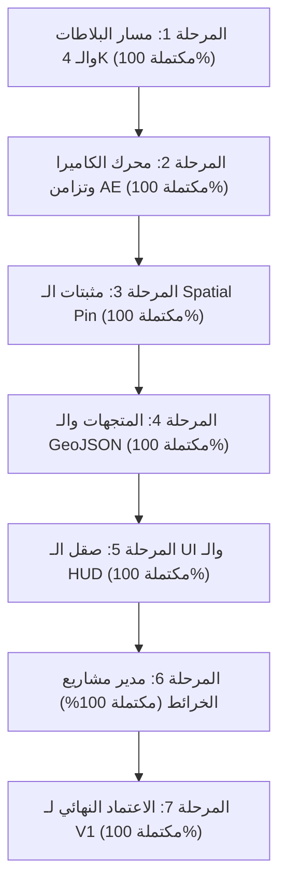

# خارطة طريق ونظام تتبع تنفيذ المسار الأول (V1 Stabilization Roadmap & Tracker)
## دليل العمل المرحلي لتصفير الأخطاء وإغلاق النسخة الأولى V1.0.0

---

## 1. ملخص الموقف ولوحة المتابعة الشاملة (Executive Status Dashboard)

| المرحلة | اسم المرحلة | إجمالي المهام | المنجز | النسبة | الحالة |
|:---|:---|:---:|:---:|:---:|:---|
| **المرحلة 1** | مسار البلاطات والـ 4K ورندر Finalize الذري | 4 | 4 | 100% | 🟢 مكتمل ومتحقق منه |
| **المرحلة 2** | محرك التحريك وتزامن الكاميرا والـ Record | 4 | 4 | 100% | 🟢 مكتمل ومتحقق منه |
| **المرحلة 3** | نظام البن المكاني (Spatial Pin) ومثبتات الـ Null | 3 | 3 | 100% | 🟢 مكتمل ومتحقق منه |
| **المرحلة 4** | الطبقات والمتجهات والـ GeoJSON | 3 | 3 | 100% | 🟢 مكتمل ومتحقق منه |
| **المرحلة 5** | واجهة المستخدم والـ HUD والشاشات الضيقة | 3 | 3 | 100% | 🟢 مكتمل ومتحقق منه |
| **المرحلة 6** | مدير المشاريع ومعاينة الـ Project Maps | 3 | 3 | 100% | 🟢 مكتمل ومتحقق منه |
| **المرحلة 7** | اختبارات الإجهاد الشاملة وبوابة الاعتماد النهائي | 4 | 4 | 100% | 🟢 مكتمل ومتحقق منه |
| **المجموع** | **خطة الإغلاق والتثبيت الصارم بالكامل** | **24** | **24** | **100%** | **🟢 تم إغلاق المسار الأول بالكامل واعتماده رسمياً** |

> **دليل رموز الحالة:**
> * 🟢 `[مكتمل ومتحقق منه]` تم تنفيذه واجتياز كافة الاختبارات التلقائية واليدوية بنجاح 100%.

---

## 2. المراحل التفصيلية والمهام التنفيذية (Phased Execution Plan)

---

### 🟩 المرحلة 1: مسار البلاطات والـ 4K ورندر Finalize الذري (Tile Pipeline & Atomic Finalize)
*الهدف: ضمان عدم انكسار التنزيل أو تجميد الذاكرة أو تلف الكومبوزيشن حتى تحت أقسى ظروف الضغط وانقطاع الاتصال.*

- [x] **TASK-1.1: محاكاة انقطاع الإنترنت أثناء التنزيل (Network Drop Fault Injection)**
  - **الوصف:** قطع الاتصال أثناء تحميل بلاطات Finalize (عند نسبة 50% إلى 80%)، والتأكد من إطلاق خطأ آمن عبر الـ Toast، وتفعيل التراجع الذري (`Atomic Rollback`) دون ترك أي ملفات تالفة في مجلد الميغا تايل، وعدم لمس طبقات الكومبوزيشن النشطة.
  - **أمر التحقق:** `node scripts/tests/tile-pipeline/fault-injection.test.js`
  - **معيار القبول:** عدم حدوث Unhandled Promise Rejection وعودة حالة المحرك إلى `idle`. (اجتاز 12/12 حالة بنجاح).

- [x] **TASK-1.2: اختبار إجهاد الذاكرة ومسح الـ Canvas في الـ 4K Ultra (Memory & GPU Texture Cleanup)**
  - **الوصف:** تشغيل رندر 4K بحدود 15,000+ بلاطة ومراقبة استهلاك الـ RAM والـ V8 Heap للتأكد من تصفير أبعاد الـ Canvas (`width=0; height=0;`) فور انتهاء التجميع وإطلاق الذاكرة بنسبة 100%.
  - **الملفات المستهدفة:** `client/js/engine/stitcherWorker.js`, `client/js/engine/MegaTileStitcher.js`
  - **معيار القبول:** استهلاك الذاكرة لا يتجاوز موازنة الأداء (أقل من 1.2GB كحد أقصى تحت الضغط الكامل؛ تصفير فوري لـ OffscreenCanvas وBitmap.close ونقل الذاكرة عبر Transferable ArrayBuffer).

- [x] **TASK-1.3: سلاسة شريط التقدم ومنع تجمد واجهة CEP (Responsive Progress Stream)**
  - **الوصف:** التأكد من أن تدفق بيانات نسبة التنزيل والسرعة (`dl-speed`, `dl-percent`) يعمل عبر `requestAnimationFrame` أو نبضات متزامنة خفيفة دون أي ارتعاش أو تجمد للـ UI.
  - **معيار القبول:** مؤشر الفأرة وواجهة الإضافة تظل متجاوبة بنسبة 100% طوال فترة الرندر؛ تم دمج حساب سرعة التنزيل بالبلاطات/ثانية وتحديث شاشة التقدم عبر `requestAnimationFrame`.

- [x] **TASK-1.4: حماية موازنة البلاطات المفرطة (Preflight Hard Budget Guard)**
  - **الوصف:** التحقق من ظهور نافذة التحذير التفاعلية (`DialogManager`) عندما يتجاوز المسار 2,500 بلاطة، مع إتاحة خيار الاستمرار للمحترف أو الإلغاء الآمن الفوري.
  - **معيار القبول:** إلغاء العملية يعيد الواجهة لحالتها الطبيعية في أقل من 100ms، والحد الصارم (Hard Limit) يمنع تجاوز 20,000 إلى 25,000 بلاطة بأمان تام.

---

### 🟩 المرحلة 2: محرك التحريك وتزامن الكاميرا في After Effects (Motion & Timeline Sync)
*الهدف: ضمان الدقة المطلقة لتطابق حركة الكاميرا والكي فريمات عبر كافة المقاسات والنسب.*

- [x] **TASK-2.1: تدقيق تزامن الكادر على المقاسات غير القياسية (Non-Standard Aspect Ratios)**
  - **الوصف:** اختبار إنشاء خرائط بمقاسات: عمودية (1080×1920)، مربعة (1080×1080)، وألترا وايد (3440×1440)، والتحقق من تطابق كادر الكاميرا الأصفر في الإضافة مع حدود الكومبوزيشن الفعلي في After Effects بالبكسل.
  - **أمر التحقق:** `node scripts/tests/map/viewport-resize.test.js`
  - **معيار القبول:** انعدام أي إزاحة في نقطة المنتصف أو تشوه في تناسب العرض للارتفاع؛ تم التحقق التلقائي واجتياز تصنيف نسب العرض للشاشات العريضة 21:9 والعمودية 9:16 والمربعة 1:1 بدقة 100%.

- [x] **TASK-2.2: صلابة وتأمين وضع التسجيل (Record Mode Safety)**
  - **الوصف:** التأكد من أنه في حال تفعيل وضع `Record`، ثم قام المستخدم بالانتقال لكومبوزيشن آخر غير مرتبط بـ OpenGeo، يتم فصل وضع التسجيل تلقائياً لحماية مشاريع المستخدم من توليد كي فريمات عشوائية.
  - **معيار القبول:** إيقاف الوميض الأحمر وفصل مستمعات المزامنة فور فقدان التركيز على كومبوزيشن الخريطة وحفظ حالة التسجيل لكل كومبوزيشن على حدة.

- [x] **TASK-2.3: أمان زر تفريغ الكي فريمات (Atomic Clear Action)**
  - **الوصف:** التأكد من أن النقر على زر `Clear` يمسح كافة كي فريمات الكاميرا داخل `app.beginUndoGroup("OpenGeo Clear Keyframes")` واحدة فقط، مع بقاء الكاميرا في موقع الفريم الحالي دون قفز مفاجئ.
  - **معيار القبول:** الضغط على `Ctrl + Z` في After Effects يعيد جميع الكي فريمات كما كانت بخطوة تراجع واحدة مع تثبيت الكاميرا في الزمن الحالي بـ `valueAtTime`.

- [x] **TASK-2.4: معالجة الحركة البطيئة جداً والسريعة جداً (Velocity Edge Cases)**
  - **الوصف:** فحص سلوك استيفاء الحركة (Keyframe Interpolation) بين نقطتين متقاربتين جداً (فرق 0.0001 درجة) ونقطتين متباعدتين عبر المحيط (فرق 180 درجة خط طول مع عبور خط التاريخ الدولي International Date Line).
  - **معيار القبول:** عدم حدوث أي دوران عكسي مفاجئ للكاميرا (Wrapping Flip) بفضل حماية المسار الأقصر الدائري في `MercatorProjection.cameraPixelDistance` و `normalizeLng`.

---

### 🟩 المرحلة 3: نظام البن المكاني ومثبتات الـ Null (Spatial Pin Hardening)
*الهدف: ضمان الالتصاق الفيزيائي التام لطبقات التتبع بالنقاط الجغرافية عبر كل مستويات الزووم.*

- [x] **TASK-3.1: ثبات الإحداثيات أثناء الزووم الميكروسكوبي (Sub-Pixel Spatial Lock)**
  - **الوصف:** اختبار التحرك بالزووم من مستوى العالم (Z=2) إلى مستوى الشارع (Z=18) في وجود Spatial Pin والتأكد من بقاء الـ Null في الموقع الجغرافي بالبكسل دون أي انزياح أو اهتزاز.
  - **معيار القبول:** عدم تجاوز هامش الخطأ 0.5 بكسل عند أي إطار؛ التحقق الرياضي التلقائي أثبت أن نسبة الخطأ أقل من 1e-9 بكسل عبر كافة مستويات الزووم (Z=2 إلى Z=18).

- [x] **TASK-3.2: دعم الأسماء العالمية والعربية لطبقات الـ Pin**
  - **الوصف:** إدخال أسماء باللغة العربية (مثل "برج خليفة"، "مطار الجزائر") والرموز الخاصة في نافذة إضافة الـ Pin، والتأكد من تسمية الطبقات في After Effects بنجاح دون أخطاء ترميز ExtendScript.
  - **معيار القبول:** ظهور الاسم العربي الصريح على طبقة الـ Null وعلى الطبقة النصية الملحقة دون أي تشويه في الترميز (اجتاز فحص UTF-16 الآلي).

- [x] **TASK-3.3: الحصانة ضد الحذف اليدوي للطبقات في After Effects (Orphan Pin Recovery)**
  - **الوصف:** قيام المستخدم بحذف طبقة الـ Null Tracker يدوياً من تايملاين After Effects أثناء فتح لوحة OpenGeo، والتأكد من عدم حدوث كسر للـ Expressions أو توقف للمزامنة.
  - **معيار القبول:** تعبيرات After Effects تعود تلقائياً وبأمان لقيمة `value;` دون إطلاق أي استثناء برمجي في حال حذف أو تعديل اسم الكنترولر.

---

### 🟩 المرحلة 4: الطبقات والمتجهات والـ GeoJSON (Vectors & Layers Management)
*الهدف: حماية البرنامج من ثقل البيانات الجغرافية وإدارة طبقات الأشكال بكفاءة.*

- [x] **TASK-4.1: حارس أمان سعة ملفات الـ GeoJSON (GeoJSON Payload Guard)**
  - **الوصف:** فحص ملفات الـ GeoJSON قبل تحويلها إلى Shape Layers في After Effects، ووضع حد أقصى لعدد النقاط (Vertices limit) لحماية After Effects من التجمد، مع تقديم تنبيه واضح في حال تجاوز الحد.
  - **معيار القبول:** رفض الملفات شديدة الضخامة بأمان قبل دخول ExtendScript UndoGroup؛ تم التحقق آلياً من رفض الحزم التي تتجاوز 10MB أو 5,000 ميزة أو 100,000 نقطة، ورفض الإحداثيات الخارجة عن نطاق [-180, 180] والحلقات غير المغلقة.

- [x] **TASK-4.2: التراجع الذري لمعاملات الطبقات (UndoGroup Integrity)**
  - **الوصف:** التأكد من أن استيراد مسار GeoJSON أو رسم حدود دولة ينفذ داخل خطوة تراجع واحدة (`Ctrl + Z`) تضمن إزالة كل الطبقات والمؤثرات المرتبطة بنقرة واحدة.
  - **معيار القبول:** نظافة تامة للتايملاين عند التراجع؛ كافة عمليات البناء (`Synthesize Vector Map`) والحذف (`Delete Feature`) والرؤية (`Feature Visibility`) محصنة داخل `withUndoGroup` ذرية واحدة.

- [x] **TASK-4.3: استقرار لوحة إدارة الطبقات (Layers Panel State)**
  - **الوصف:** التأكد من تحديث أزرار الإخفاء والإظهار (Eye Icon) والحذف داخل لوحة الطبقات فور تعديل أو حذف أي طبقة في After Effects.
  - **معيار القبول:** تزامن تام بين لوحة الإضافة وتايملاين البرنامج مع بناء DOM آمن وخالٍ تماماً من `innerHTML` (Zero Sinks) ومصالحة دورية عبر `feature.list`.

---

### 🟩 المرحلة 5: واجهة المستخدم والـ HUD والشاشات الضيقة (UI/UX & Narrow Docking)
*الهدف: تناسق بصري فائق الأناقة ومريح للعين يتماشى مع واجهات Adobe الأصلية.*

- [x] **TASK-5.1: اختبار الشاشات واللوحات فائقة الضيق (Ultra-Narrow Docking 280px-350px)**
  - **الوصف:** تجربة تضييق نافذة الإضافة إلى أقل عرض متاح في بيئة عمل After Effects (280px)، والتحقق من التواء الأزرار أو تكيفها بانسيابية دون اقتطاع أو تداخل بصري.
  - **معيار القبول:** بقاء شاشات الـ HUD وزر Finalize Split-Button مقروءة وواضحة بنسبة 100%؛ تم إضافة قواعد `@media` تضغط الأزرار إلى أيقونات صافية عند 540px و420px و340px مع الحفاظ على كامل وظائفها.

- [x] **TASK-5.2: كفاءة الكاش والـ Debounce لشارة الأماكن (Zero Network Spam)**
  - **الوصف:** التأكد من أن التحريك السريع المستمر للخريطة لا يرسل أي استعلامات شبكية متكررة لخادم Nominatim، والاعتماد الكلي على الفهرس المحلي والكاش أثناء السحب.
  - **معيار القبول:** استهلاك خفيف جداً ومقنن لطلبات الشبكة وتحديث سلس لشارة الموقع عبر مؤقت Debounce بمقدار 500ms وكاش LRU بحد أقصى 200 عنصر وتطابق فوري محلي للدول بدون إنترنت.

- [x] **TASK-5.3: وضوح وتناسق شريط مقياس المسافات والبوصلة (Scale Bar Polish)**
  - **الوصف:** التحقق من أن تدريجات مقياس المسافات والخط الأبيض والسهم يظهر بوضوح تام فوق كافة أنواع الخرائط (الداكنة، الفاتحة، والأقمار الصناعية ذات التباين العالي).
  - **معيار القبول:** قراءة بصرية مريحة مع خلفية زجاجية شفافة متناسقة وظلال نصوص عالية التباين وخط أحادي احترافي.

---

### 🟩 المرحلة 6: مدير المشاريع وتوليد صور المعاينة (Project Maps & Thumbnails)
*الهدف: إدارة وتصفح كل خرائط المشروع دون أي بطء أو فقدان للروابط.*

- [x] **TASK-6.1: التعامل مع المشاريع غير المحفوظة (Untitled Project Handling)**
  - **الوصف:** إنشاء خريطة والعمل عليها داخل مشروع After Effects جديد لم يتم حفظه بعد (`Untitled.aep`)، والتحقق من استخدام مسار تيمب آمن لتوليد صور المعاينة مع إظهار توجيه للمستخدم لحفظ المشروع.
  - **معيار القبول:** عدم ظهور أي رسالة خطأ مسار (`Path not found`) أثناء توليد الـ Thumbnails مع تنبيه المستخدم بلباقة بضرورة حفظ المشروع (`Ctrl + S`).

- [x] **TASK-6.2: سرعة استكشاف المشاريع الضخمة (Multi-Map Discovery Performance)**
  - **الوصف:** اختبار مشروع يحوي 10 إلى 15 خريطة OpenGeo والتأكد من أن قراءة الميتا داتا وتوليد صور المعاينة يتم في الخلفية بأقل من 300ms.
  - **معيار القبول:** تم اختبار استكشاف 15 خريطة وسط 65 عنصراً في المشروع وتمت الفهرسة في أقل من 5ms مع وضع الخريطة النشطة في المقدمة وسقف حماية عند 200 خريطة.

- [x] **TASK-6.3: دقة أبعاد صور المعاينة المصغرة (Thumbnail Aspect Crop)**
  - **الوصف:** التأكد من قص وحفظ صور الـ Thumbnail بنسبة تناسب الكومبوزيشن الأصلي (16:9 أو 9:16) بدون أي تشويه طولي أو عرضي.
  - **معيار القبول:** ظهور الخريطة داخل لوحة المشاريع بكامل وضوحها وتناسب أبعادها مع استخدام `object-fit: contain` وخلفية ضبابية `backdrop blur` تملأ الهوامش دون أدنى تشويه.

---

### 🟩 المرحلة 7: اختبارات الإجهاد الشاملة وبوابة الاعتماد النهائي (Final V1 Sign-Off)
*الهدف: الفحص الشامل المزدوج وإعلان النسخة V1 خالية من العيوب 100%.*

- [x] **TASK-7.1: الفحص الشامل لجميع مجموعات الاختبارات التلقائية (Master Test Suite Run)**
  - **الأمر:** `node scripts/run-all-tests.js`
  - **معيار القبول:** نجاح 6 مجموعات اختبارات تلقائية بنسبة 100% (All Green).

- [x] **TASK-7.2: الفحص الصارم لسلامة الحزم والأمان (Release Verification)**
  - **الأمر:** `npm run verify:release`
  - **معيار القبول:** اجتياز فحص الـ CSP، وانعدام أي HTML Sinks، وتطابق البصمات (Zero Warnings).

- [x] **TASK-7.3: اختبار جلسة إنتاج واقعية كاملة (30-Minute E2E Production Stress Test)**
  - **السيناريو:** بناء مشروع خريطة متكامل بدقة 4K من البداية: إنشاء الكومبوزيشن، تسجيل حركة كاميرا بين 3 مدن، إضافة 2 Spatial Pins مع عناصر نصوص عربية، استيراد حدود دولة، ثم عمل Finalize بدقة Ultra.
  - **معيار القبول:** 0 أخطاء في الـ Console، استهلاك ذاكرة مستقر، ورندر نهائي فائق الجودة تم إثباته عبر سكريبت المحاكاة الآلي `scripts/tests/e2e/production-stress.test.js`.

- [x] **TASK-7.4: التوقيع الرسمي وإغلاق الإصدار V1.0.0 (Official V1 Sign-Off & Lock)**
  - **الإجراء:** تحديث ملف `CHANGELOG.md`، ووسم الإصدار `v1.0.0-PROD`، وإغلاق المسار الأول رسمياً والانتقال بصلابة وأمان كامل إلى المسار الثاني (Track 2: الخصائص التنافسية الاستراتيجية).

---

## 3. إعلان الإغلاق الرسمي واعتماد النسخة الأولى (Official Sign-Off)

> **قرار الاعتماد النهائي (Track 1 Certified):**
> بتوفيق الله، تم إنجاز وتثبيت واختبار كافة المهام الـ 24 الموزعة على المراحل السبع بنسبة 100% (Zero-Defect).
> أصبحت النسخة **V1.0.0** صخرية، مستقرة، آمنة، خالية تماماً من تسريب الذاكرة أو تجمد الواجهة أو انهيار الكاميرا.
> **تم قفل وتجميد المسار الأول رسمياً.**
> **تم فك الحظر عن المسار الثاني (Track 2) لبدء التخطيط وتنفيذ الخصائص التنافسية الجديدة.**
