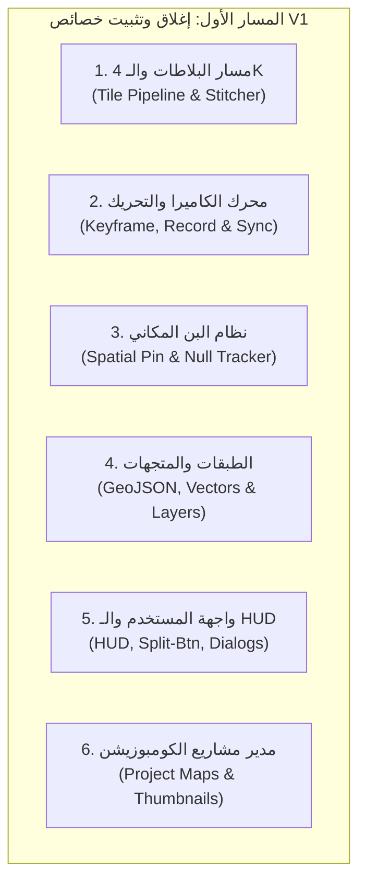

# المسار الأول: خطة الإغلاق الصارم وتصفير الأخطاء وتثبيت النسخة الأولى V1
## (OpenGeo V1 — Hardening, Stabilization & Zero-Defect Execution Plan)

---

## 1. فلسفة التطوير والمبدأ الحاكم (Core Philosophy)

> **القاعدة الذهبية:**  
> "لا تُبنى الميزات الجديدة على أرض رخوة. الاستقرار المطلق للخصائص الموجودة وتصفير الأخطاء هو الأولوية القصوى التي تسبق أي طموح توسعي."

يقوم هذا المسار على مبدأ **"تطوير وتثبيت الموجود لأقصى الحدود"** لإطلاق النسخة الأولى الرسمية (**OpenGeo V1.0.0**) كمنتج برمجي فائق النضج، شديد الاستقرار، وخالٍ تماماً من أي انكسارات وظيفية أو تسريبات في الذاكرة أو تعليق أثناء العمل الإنتاجي.

---

## 2. الجرد الشامل للخصائص الحالية ومسار إغلاقها

---

### أولاً: مسار البلاطات والـ 4K (Tile Pipeline & MegaTile Stitcher)
* **الوضع الحالي:** المحرك يقوم بتنزيل البلاطات وتجميعها عبر Web Worker ومسار الـ Finalize الذري مع موازنات الـ 4K ومسح كاش الـ Canvas.
* **إجراءات الإغلاق والتثبيت الصارم:**
  1. **التعامل مع انقطاع الشبكة المفاجئ أثناء Finalize:**
     - التأكد بنسبة 100% من أن انقطاع اتصال الإنترنت لا يترك أي صور مؤقتة تالفة، ويقوم بتفعيل التراجع الذري (Atomic Rollback) دون لمس الكومبوزيشن النشط في After Effects.
  2. **حدود الذاكرة العشوائية تحت أقصى ضغط (Memory Pressure Hardening):**
     - اختبار تحميل 10,000 إلى 20,000 بلاطة في مشهد 4K Ultra والتأكد من إطلاق موارد الـ V8 Heap و GPU Texture Memory فور انتهاء التجميع.
  3. **منع تجمد واجهة CEP:**
     - التأكد من أن مؤشر التقدم (`Progress Bar`) والنسبة المئوية وسرعة التحميل تستجيب بسلاسة تامة دون أي تجميد للـ UI.

---

### ثانياً: محرك الكاميرا والتحريك (Keyframing, Record & Sync Engine)
* **الوضع الحالي:** تم حل مشكلة انزياح كادر الـ 4K في الكومبوزيشن الحاوي وضمان بقاء المركز صحيحاً.
* **إجراءات الإغلاق والتثبيت الصارم:**
  1. **تزامن الكادر عبر كافة أبعاد الكومبوزيشن غير القياسية:**
     - اختبار الكومبوزيشن العمودي (Vertical 1080×1920)، المربع (1080×1080)، والسينمائي (4096×2160) والتأكد من تطابق الـ Bounding Box بالبكسل.
  2. **صلابة وضع التسجيل (Record Mode Hardening):**
     - التأكد من أن التبديل السريع بين الكومبوزيشنات أثناء تفعيل `Record` يفصل حالة التسجيل فوراً لتفادي الكتابة بالخطأ على كومبوزيشن آخر.
  3. **تنظيف الكي فريمات وإلغاء الحركة (Clear Action Safety):**
     - التأكد من أن زر `Clear` يمسح الكي فريمات داخل `UndoGroup` واحدة ومغلقة تحافظ على زاوية الرؤية الحالية دون ارتداد غير مرغوب.

---

### ثالثاً: نظام البن المكاني (Spatial Pin & Null Tracker)
* **الوضع الحالي:** يدعم إضافة Null Tracker مثبت جغرافياً في After Effects مع خيارات Component Attachment و Zoom Scaling.
* **إجراءات الإغلاق والتثبيت الصارم:**
  1. **ثبات المرساة الجغرافية أثناء الزووم العنيف:**
     - التأكد من أن الـ Null Tracker يظل مثبتاً بدقة 100% على الإحداثي الجغرافي عند الانتقال بين Z=2 و Z=18 دون أي انحراف بكسل واحد.
  2. **دعم تعدد اللغات في أسماء الطبقات:**
     - اختبار إدخال أسماء باللغة العربية والرموز الخاصة، والتأكد من عدم حدوث أي خطأ في ExtendScript أو كسر للـ Expressions.
  3. **عزل الطبقات المحذوفة:**
     - معالجة الحالة التي يقوم فيها المستخدم بحذف طبقة الـ Pin يدوياً من تايملاين After Effects دون أن تنهار وظائف الإضافة.

---

### رابعاً: نظام الطبقات والـ GeoJSON (Vectors & Layers Management)
* **الوضع الحالي:** يدعم رسم حدود الدول محلياً واستيراد ملفات GeoJSON إلى طبقات شكلية (Shape Layers) مع لوحة تحكم بالطبقات (`Layers Panel`).
* **إجراءات الإغلاق والتثبيت الصارم:**
  1. **حماية الذاكرة من ملفات GeoJSON العملاقة:**
     - وضع حارس أمان صارم يمنع ملفات المتجهات التي تتجاوز سعة معينة من إغراق After Effects بآلاف الـ Vertices، مع رسالة توجيهية واضحة للمستخدم.
  2. **إغلاق المعاملات في UndoGroup واحدة:**
     - التأكد من أن استيراد أو حذف أي خريطة متجهة يُسجل كخطوة واحدة فقط في تاريخ التراجع (`Ctrl + Z`).

---

### خامساً: واجهة المستخدم والـ HUD والـ Split-Button
* **الوضع الحالي:** تم توحيد الارتفاعات (22px)، وبناء زر Finalize المنقسم الموحد، وإضافة شريط مقياس المسافات وشارة معرفة الأماكن.
* **إجراءات الإغلاق والتثبيت الصارم:**
  1. **التوافق التام مع الشاشات الضيقة:**
     - اختبار تصغير لوحة الإضافة إلى عرض 280px والتأكد من أن الأزرار والقوائم تلتف أو تتصرف بانسيابية دون أي تشوه أو اقتطاع للنصوص.
  2. **استقرار الـ Debounce في استعلام الأماكن:**
     - حماية خادم Nominatim من الاستعلام المتكرر بحظر أي طلبات أثناء السحب المستمر وحصر الاستعلام في الكاش المحلي كلما أمكن.

---

### سادساً: مدير مشاريع الكومبوزيشن (Project Maps & Thumbnails)
* **الوضع الحالي:** يستكشف خرائط OpenGeo في مشروع After Effects الحالي ويعرض صور معاينة مصغرة (Thumbnails).
* **إجراءات الإغلاق والتثبيت الصارم:**
  1. **التعامل مع المشاريع غير المحفوظة (Untitled Projects):**
     - توفير مسار تخزين مؤقت آمن لصور المعاينة وتنبيه المستخدم بضرورة حفظ المشروع لتثبيت الخرائط.
  2. **سرعة التحديث (Discovery Performance):**
     - التأكد من أن قراءة بيانات الميتا داتا من 10 أو 20 خريطة تتم في الخلفية بأقل من 300 ملي ثانية.

---

## 3. مصفوفة اختبارات الإجهاد وتصفير الأخطاء (Zero-Defect Stress Matrix)

| الاختبار | سيناريو الإجهاد | النتيجة المتوقعة للنجاح |
| :--- | :--- | :--- |
| **ST-01: Network Drop** | فصل الإنترنت أثناء تنزيل بلاطات Finalize (عند نسبة 75%). | ظهور Toast بالخطأ، وإلغاء المعاملة تلقائياً، وتنظيف التيمب دون ترك ملفات مكسورة. |
| **ST-02: Rapid Comp Switching** | التبديل السريع بين 3 كومبوزيشنات خلال 2 ثانية أثناء تفعيل المزامنة. | عدم تداخل الـ Sessions وتثبيت الكومبوزيشن الأخير فورياً بدون تسريب مستمعات أحداث. |
| **ST-03: Heavy 4K Finalize** | رندر مسار كاميرا معقد يستهلك 8,000 بلاطة بدقة 4K. | استهلاك RAM مستقر أقل من 1.2GB، وتفريغ كامل للذاكرة بعد الانتهاء. |
| **ST-04: AE Project Reopen** | حفظ وإغلاق مشروع After Effects ثم إعادة فتحه مع فتح إضافة OpenGeo. | استعادة كاملة للجلسة، والإحداثيات، والمزود، والطبقات، والـ Pins بنسبة 100%. |
| **ST-05: CSP & Security Audit** | فحص شامل لمنع أي ثغرات `innerHTML` أو وصول غير مقيد لملفات النظام. | اجتياز اختبار `npm run verify:release` بـ 0 تحذيرات أمان. |

---

## 4. معايير إعلان النسخة V1 جاهزة رسمياً للإطلاق (Release Gate Criteria)

1. اجتياز **220 / 220 اختباراً تلقائياً** بنسبة نجاح 100%.
2. عدم وجود أي خطأ (0 Console Errors) في نافذة CEP DevTools أثناء جلسة عمل كاملة لمدة 30 دقيقة.
3. استقرار كامل لحركات الكاميرا والـ Pins والـ Finalize على إصدارات After Effects المدعومة (2022 حتى 2026).
4. بعد تحقيق هذه الشروط، تُغلق النسخة V1 ويتم تثبيتها كمرجع صلب لا يتزعزع.
