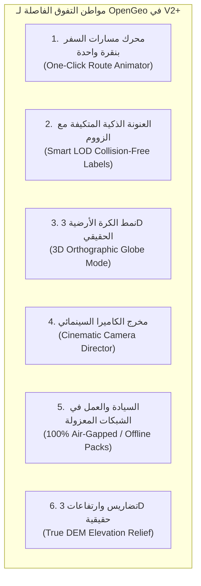

# المسار الثاني: استراتيجية الابتكارات المستقبلية والتفوق الساحق على GEOlayers
## (OpenGeo V2+ — Future Innovation & GEOlayers-Killer Blueprint)

---

## 1. المبدأ الحاكم للمسار الثاني (The Iron Law of Track 2)

> [!CAUTION]
> **قاعدة التجميد الإلزامي (Strict Deferral Gate):**  
> "هذه الوثيقة هي **مخطط مستقبلي مجمد بالكامل**. يمنع منعاً باتاً كتابة سطر كود واحد أو إدخال أي ميزة من ميزات هذا المسار إلى الكود المصدري حتى يتم إغلاق **المسار الأول (Track 1)** وإطلاق النسخة **OpenGeo V1.0.0** مستقرة ومصفّرة الأخطاء بنسبة 100%."

الهدف من هذا المسار هو توجيه التطوير المستقبلي نحو **ضرب نقاط ضعف GEOlayers 3 القاتلة** وتقديم حلول جذرية تجعل OpenGeo الخيار الأول عالمياً لصناع المحتوى والوثائقيات واستوديوهات الأخبار والموشن ديزاينرز.

---

## 2. دراسة مقارنة: نقاط ضعف GEOlayers 3 مقابل أسلحة OpenGeo المستقبلية



---

## 3. تفاصيل الأسلحة التنافسية الستة (The 6 Unfair Advantages)

### السلاح الأول: محرك مسارات السفر والرحلات بنقرة واحدة (One-Click Route & Flight Animator)
* **نقطة ضعف GEOlayers 3:**
  * بناء مسار سفر بسيط (طائرة تقلع من لندن وتهبط في دبي) يستغرق 15 دقيقة ويتطلب 10 خطوات يدوية معقدة بين إنشاء طبقات متجهة، تطبيق قوالب، ضبط Trim Paths يدوياً، وبرمجة تعبيرات لتدوير رأس الطائرة.
* **حل OpenGeo الثوري:**
  * نافذة تفاعلية منبثقة: يحدد المستخدم `نقطة الانطلاق (A)` و `نقطة الوصول (B)`.
  * بضغطة زر واحدة:
    1. حساب **المسار الجيوديسي الكروي الحقيقي (Great Circle Arc)** تلقائياً.
    2. إنشاء طبقة الشكل (Shape Layer) المنحنية بنعومة والمزودة بمؤثر توهج سينمائي (Glow Path).
    3. تحريك مسار الرسم تلقائياً عبر `Trim Paths` مع منحنى حركة ناعم (Ease In / Ease Out).
    4. ربط أيقونة وسيلة النقل (طائرة، سيارة، سفينة، نقطة نبضية) لتدور وتتبع اتجاه المسار بدقة.
    5. إضافة عداد مسافة حي ومتحرك (`0 km ➔ 5,470 km`) كخيار جاهز.

---

### السلاح الثاني: العنونة الذكية المتكيفة مع الزووم (Zoom-Adaptive Smart LOD Labels)
* **نقطة ضعف GEOlayers 3:**
  * فوضى التسميات (Label Overlap Chaos): إذا وضع المستخدم أسماء 15 مدينة، ثم ابتعد بالزووم لرؤية القارة، تتراكم النصوص فوق بعضها وتتحول الشاشة إلى كتلة سوداء مشوهة، مما يجبر المصمم على عمل كي فريمات يدوية للشفافية.
* **حل OpenGeo الثوري:**
  * **نظام التسميات الذكي الهرمي (LOD Hierarchy):**
    * تصنيف التسميات جغرافياً: `Continent`, `Country`, `State`, `Capital`, `City`, `Town`.
    * كل فئة تمتلك نطاق زووم آلي للظهور والاختفاء (`Zoom Visibility Thresholds`):
      - عند $Z \le 4$: تظهر فقط أسماء القارات والدول الكبرى.
      - عند $5 \le Z \le 9$: تظهر العواصم وتتلاشى أسماء القارات بنعومة.
      - عند $Z \ge 10$: تظهر المدن والأحياء والمعالم التفصيلية.
    * محرك حظر التداخل (Collision Avoidance): في حال اقتراب نقطتين، يتم إخفاء التسمية الأقل أهمية تلقائياً لمنع التداخل البصري.

---

### السلاح الثالث: نمط الكرة الأرضية ثلاثية الأبعاد (True 3D Orthographic Globe Mode)
* **نقطة ضعف GEOlayers 3:**
  * الإضافة محبوسة ومقيدة في **إسقاط ميركاتور المسطح (2D Flat Mercator)**. لا يمكنها إظهار كوكب الأرض ككرة فلكية واقعية، وتعتمد على حلول ترقيعية خارجية (مثل CC Sphere) التي تكسر كل الإحداثيات والكي فريمات.
* **حل OpenGeo الثوري:**
  * توفير خيار تحويل العرض إلى **الإسقاط الهجائي الكروي (Orthographic Spherical Projection)**.
  * إظهار كوكب الأرض ككرة تدور في الفضاء مع توهج الغلاف الجوي (Atmosphere Glow)، وظلال الليل والنهار، مع بقاء كافة الـ Pins والمسارات مثبتة مكانها جغرافياً دون أي انكسار!

---

### السلاح الرابع: مخرج الكاميرا السينمائي (Cinematic Camera Director)
* **نقطة ضعف GEOlayers 3:**
  * حركة الكاميرا الافتراضية بين الكي فريمات ميكانيكية وخطية، وتتطلب من المصمم ساعات من العمل الشاق داخل محرر المنحنيات (Graph Editor) لضبط الانسيابية والدوران.
* **حل OpenGeo الثوري:**
  * مكتبة أنماط حركة كاميرا سينمائية جاهزة بنقرة واحدة:
    1. **الهبوط الحلزوني للقمر الصناعي (Orbital Satellite Dive):** دوران بانورامي دائري متدرج أثناء الهبوط من الفضاء إلى المدينة.
    2. **التحليق السينمائي المنخفض (Drone Fly-By):** تحليق أمامي مائل بزاوية Pitch حادة لإبراز معالم المدينة.
    3. **القفزة القارية المنحنية (Trans-Continental Arc Jump):** صعود الكاميرا بالزووم عند منتصف الرحلة ثم هبوطها بنعومة عند نقطة الوصول.

---

### السلاح الخامس: العمل في البيئات المعزولة كلياً (100% Air-Gapped & Offline Sovereignty)
* **نقطة ضعف GEOlayers 3:**
  * تعتمد بشدة على خوادم أجنبية وتراخيص aescripts المرتبطة بالإنترنت، وتفشل تماماً في استوديوهات الأخبار والمؤسسات الدفاعية والشبكات المغلقة (Air-Gapped Workstations).
* **حل OpenGeo الثوري:**
  * دعم كامل لمعايير حزم الخرائط المحلية المنعزلة:
    * قارئ مدمج لملفات **MBTiles** و **PMTiles** للعمل بدون إنترنت نهائياً.
    * خوادم بلاطات محلية داخلية (Localhost Tile Server) مدمجة في المحرك.
    * صفر مكالمات خارجية وصفر تتبع، مع حفظ تام لأسرار مشاريع العملاء والاستوديوهات.

---

### السلاح السادس: التضاريس والارتفاعات الحقيقية (True DEM 3D Terrain & Shaded Relief)
* **نقطة ضعف GEOlayers 3:**
  * تعتمد على صور تضاريس مسطحة مرسومة بالظلال (Fake Shading) دون أي بيانات ارتفاعات فيزيائية حقيقية.
* **حل OpenGeo الثوري:**
  * دمج بيانات الارتفاع الرقمية مفتوحة المصدر (SRTM / Copernicus DEM 30m).
  * توليد خرائط تظليل تضاريس ثلاثية الأبعاد تفاعلية وحقيقية (Dynamic Shaded Relief) تتيح للمصمم التحكم في زاوية سقوط ضوء الشمس وارتفاع الجبال داخل After Effects.

---

## 4. خطة الانتقال المستقبلي والتنفيذ المرحلي (Post-V1 Execution Roadmap)

عند فتح هذا المسار رسمياً بعد نجاح V1، سيتم تنفيذ الخصائص حسب الأولوية الإنتاجية التالية:

```
[ المرحلة 1: المسارات والرحلات (Route & Flight Animator) ]
                   │
                   ▼
[ المرحلة 2: العنونة الذكية (Smart LOD Labels & Callouts) ]
                   │
                   ▼
[ المرحلة 3: مخرج الكاميرا السينمائي (Cinematic Director) ]
                   │
                   ▼
[ المرحلة 4: نمط الكرة الأرضية 3D وحزم الـ MBTiles المحلية ]
                   │
                   ▼
[ الإطلاق الكبير: OpenGeo V2 — The Complete Geospatial Studio ]
```

---

> [!NOTE]
> **التزام الحوكمة البرمجية:**  
> هذا الملف محفوظ كمرجع استراتيجي دائم في مجلد `docs/ideas/`. لن يتم المساس بالكود الأساسي لتنفيذ هذه الأفكار إلا بعد اعتماد وتوقيع إغلاق النسخة الأولى V1 بالكامل.
