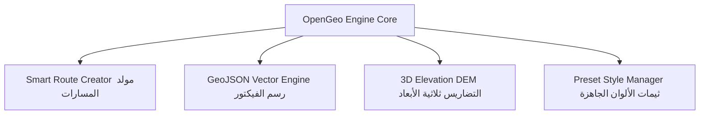

# الرؤية المستقبلية وخارطة الطريق المشروعة: OpenGeo Engine 🌍🚀
*(The Ultimate Open-Source Map Engine for After Effects)*

**حالة المشروع:** مفتوح المصدر (Open-Source Vision)  
**تاريخ التوثيق:** 2026-08-07  
**الهدف الاستراتيجي:** بناء أقوى محرك خرائط مفتوح المصدر ومجاني لمصممي الموشن جرافيكس والإنفوجرافيك عالمياً، مع التغلب على قيود الملحقات التجارية الصافية.

---

## 🌐 1. الرؤية العامة للتطوير (Open-Source Vision)

يهدف مشروع **OpenGeo** إلى تمكين المصممين وصناع المحتوى حول العالم من تحريك الخرائط بدقة فائقة 4K وبسرعة أداء خرافية تعتمد على Node.js والهيكلية الموديلارية النظيفة. الإضافة ستكون مجانية ومفتوحة المصدر لفتح آفاق الإبداع والمساهمات البرمجية من المجتمع العالمي.

---

## 🗺️ 2. توسيع مصادر الخرائط المجانية عالية الجودة (Tile Provider Expansion)

توسيع مكتبة المزودين لدعم خرائط متخصصة ومجانية تناسب كافة أنواع المشاهد الفنية:

1. **CartoDB (Positron & Dark Matter):**
   - خرائط أنيقة ومبسطة باللون الداكن والفاتح، تعتبر الخيار الأول لمصممي الأخبار والانفوجرافيك لإبراز البيانات والرسومات.
2. **Stadia / Stamen Maps:**
   - **Stamen Terrain:** خرائط تضاريس وجبال ملونة بأسلوب رائع.
   - **Stamen Toner:** خرائط أبيض وأسود عالية التباين تمنح مظهراً سينمائياً حديثاً.
3. **USGS Topo & Imagery:**
   - صور أقمار صناعية وتضاريس عالية الدقة مجانية من الهيئة الجيولوجية الأمريكية.
4. **دعم السيرفرات الخاصة (Custom XYZ Tile Template):**
   - إضافة واجهة تمكّن المستخدم من إدخال أي رابط سيرفر خرائط خاص:  
     `https://my-custom-server.com/tiles/{z}/{x}/{y}.png`

---

## 📐 3. المحرك المتجه: تحويل GeoJSON و SVG إلى Shape Layers

تحويل ملفات الخرائط المتجهة إلى طبقات أشكال فكتور حقيقية داخل After Effects:

* **Vector Geometry Engine:**
  - تحويل حدود الدول والمحافظات والمسارات إلى **Shape Layers** ناعمة لا تفقد دقتها كلياً مع الزوم.
* **تحريك المسارات (Animated Path Tracing):**
  - إضافة تأثير `Trim Paths` تلقائياً على الطرقات ومسارات الطيران لجعل الخطوط ترسم نفسها بنعومة وفخامة على الخريطة.
* **تظليل المناطق (Dynamic Region Highlighting):**
  - إمكانية اختيار أي دولة (مثل الجزائر، السعودية، أو فرنسا) بنقرة زر وتظليلها بلون مميز مع حدود مضيئة.

---

## 🛸 4. الخصائص الخارقة القادمة (Advanced Feature Roadmap)

### 1. مُولّد المسارات المتحركة الذكي (Smart Route & Flight Creator)
- تحديد أي نقطتين جغرافيين (مثل: الجزائر ✈️ باريس).
- رسم قوس انحناء 3D ذكي بين المدينتين مع إضافة أيقونة طائرة/سيارة تتجه تلقائياً نحو الحركة (`Auto-Orient`).

### 2. مكتبة الحدود الجغرافية المدمجة (Integrated Boundary Library)
- دمج قاعدة بيانات خفيفة داخل الإضافة تتيح استدعاء حدود أي دولة في العالم ورسمها في After Effects بنقرة زر واحدة دون الحاجة للبحث في الإنترنت.

### 3. نظام التضاريس ثلاثية الأبعاد (3D Elevation / DEM Maps)
- قراءة بلاطات الارتفاع الرمادية (`Mapbox Terrain-RGB`) وتطبيق تأثير الـ Displacement لإعطاء الجبال تجسيماً 3D حقيقياً داخل AE.

### 4. مدير الثيمات والألوان الجاهزة (Preset Style Manager)
- تطبيق ثيمات بصرية بضغطة زر واحدة:
  - **Cyberpunk Dark:** خرائط نيون مستقبليّة.
  - **Broadcast News:** خرائط القنوات الإخبارية الاحترافية.
  - **Vintage Antique:** خرائط ورقية تاريخية دافئة.
  - **Golden Luxury:** خرائط ذهبية فاخرة للوثائقيات.

---

## 🏗️ 5. الاستمرارية الهندسية (Architectural Standards)

تلتزم الإضافة دائماً بالقواعد المعمارية الصارمة التي تم تأسيسها:
- **Separation of Concerns:** تقطِيع الكود إلى وحدات مستقلة في الـ Client (`SyncManager`, `ExportManager`) والـ Host (`host/modules/`).
- **Node.js High-Speed I/O:** معالجة الصور والتخزين الثنائي المباشر بدلاً من CEP.
- **Smart Tile Reduction:** تطبيق خوارزمية الدمج والتصفية للحفاظ على عدد بلاطات منخفض جداً (~300 بلاطة فقط لكل مشهد).

---

> [!TIP]
> **ملاحظة:** تم توثيق هذا الملف في مجلد `/docs` كوثيقة مرجعية استراتيجية لمستقبل مشروع **OpenGeo**.
