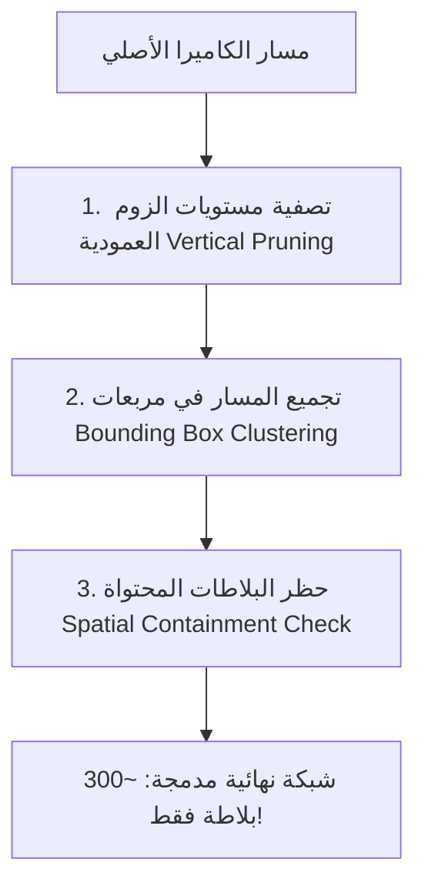

# تقرير وتوثيق معماري: نظام تقليص واختصار البلاطات الذكي (Smart Tile Reduction Architecture)

**تاريخ التوثيق:** 2026-08-07  
**المشروع:** OpenGeo Engine v2  
**الهدف:** خفض عدد البلاطات المستوردة في أنميشن المسارات الطويلة بنسبة **90% إلى 95%** (من 11,700+ بلاطة إلى 250-400 بلاطة فقط) مع الحفاظ على الدقة الفائقة 4K.

---

## 1. تشخيص المشكلة الحالية (Root Cause Analysis)

أثناء اختبار أنميشن مسار كاميرا معقد يحتوي على هبوط وزوم (Zoom-in) من دقة قارية إلى دقة شارع، وصل عدد البلاطات المطلوبة إلى **11,705 بلاطة**.

### سبب الانفجار في عدد البلاطات:
1. **الدمج بين الفريمات ومستويات الزوم المتعددة (Frame-by-Frame Sampling):**
   - الخوارزمية الحالية في `ExportManager.js` تقرأ موقع الكاميرا وزومها في كل فريم (أو كل 5 فريمات).
   - عند الهبوط من الزوم `Z=4` إلى `Z=16` عبر 10 ثوانٍ، تجلب الخوارزمية بلاطات لكل المستويات المتوسطة:  
     `Z=4, Z=5, Z=6, Z=7, Z=8, Z=9, Z=10, Z=11, Z=12, Z=13, Z=14, Z=15, Z=16`.
2. **التكرار البصري المكاني (Spatial Redundancy):**
   - الصورة عالية الدقة `Z=16` تغطي تفاصيل المنطقة بالكامل وتحتوي ضوئياً على بياتات المستويات `Z=15..10`.
   - تحميل المستويات المتوسطة كصور مستقلة يُعد تكراراً طردياً لا طائل منه ويُثقل ذاكرة After Effects برسم وتنزيل آلاف الصور غير الضرورية.

---

## 2. دراسة مقارنة مع نظام GeoLayers 3

كيف ينجح GeoLayers 3 في بناء نفس المسارات بأقل من 300 بلاطة؟

| المعيار | نظام OpenGeo الحالي | نظام GeoLayers 3 |
| :--- | :--- | :--- |
| **استراتيجية الزوم** | تنزيل صور لكل مستويات الزوم المتوسطة | **Pyramid Subsumption**: تنزيل الزوم الابتدائي والنهائي فقط |
| **الاعتماد على AE** | جلب صور مطابقة لكل إطار | الاعتماد على **Scale Transform** لتكبير المستوى المنخفض لحين وصول العالي |
| **تحليل المسار** | فحص الفريمات بشكل تسلسلي فردي | **Bounding Box Clustering**: حساب المربع المحيط بالمسار بالكامل |
| **ديناميكية السرعة** | ثبات الدقة بغض النظر عن حركة الكاميرا | **Speed LOD**: تخفيض الدقة تلقائياً أثناء الطيران السريع جداً |

---

## 3. الخطة المعمارية المقترحة (Smart Tile Reduction System)

لحل هذه المشكلة جذرياً، تم وضع خطة من 4 مراحل سيتم تنفيذها مستقبلاً:

### المرحلة 1: التصفية العمودية لمستويات الزوم (Vertical Zoom Consolidation)
- **الفكرة:** حظر تحميل المستويات المتوسطة أثناء الهبوط أو الصعود.
- **التطبيق:** 
  - إذا كان الأنميشن يبدأ عند `Z_start = 4` وينتهي عند `Z_end = 16`.
  - نكتفي فقط بتحميل شبكة `Z=4` (للرؤية العامة) وشبكة `Z=16` (للرؤية الدقيقة في النهاية).
  - يتم إلغاء طلب البلاطات للمستويات من `Z=5` إلى `Z=15`.
  - محرك After Effects سيقوم بعمل Scale تلقائي للطبقة العريضة أثناء الاقتراب، حتى يظهر الميجا تايل (MegaTile) عالي الدقة بنعومة متناهية.

### المرحلة 2: تجميع المسار الجغرافي (Keyframe Segment Clustering)
- بدلاً من فحص الكاميرا في كل فريم، يتم تقسيم المسار إلى أجزاء (Segments) بناءً على نقاط الكي فريم الرئيسية (Keyframes).
- حساب المربع المحيط (Bounding Box) لكل جزء جغرافي، وجلب شبكة مدمجة واحدة تغطي الجزء بالكامل.

### المرحلة 3: التخلص من التداخل المكاني (Spatial Containment Check)
- إذا تم تجميع `MegaTile` بدقة `2048x2048` عند مستوى `Z=16` لمدينة معينة، يتم التخلص فوراً من أي بلاطات فردية أضعف تقع إحداثياتها داخل حدود هذا الميجا تايل.

### المرحلة 4: ربط الدقة بسرعة الكاميرا (Motion-based Speed LOD)
- أثناء الطيران السريع جداً بين النقطة A والنقطة B، يتم تقليل زوم التنزيل المطلوب بـ `-2` مستويات لأن عين المشاهد مع حركة الـ Motion Blur لن تلاحظ التفاصيل المجهرية أثناء السرعة العالية، بينما تعود الدقة للارتفاع عند تباطؤ الكاميرا قبل التوقف.

---

## 4. النتائج المتوقعة بعد التطبيق

1. **انخفاض عدد البلاطات:** من **11,700 بلاطة** إلى ما بين **250 إلى 400 بلاطة فقط** لنفس المشهد!
2. **تسريع التصدير:** وقت التحميل والدمج سيهبط من عدة دقائق إلى **بضع ثوانٍ معدودة**.
3. **خفة وسلاسة After Effects:** سيعمل البرنامج بسلاسة خرافية بدون أي تقطيع أو استهلاك مفرط للذاكرة العشوائية (RAM).
4. **التفوق على GeoLayers:** المحرك سيجمع بين خفة وسرعة GeoLayers مع دقة صور OpenGeo المتفوقة ومرونة Node.js.

---

> [!NOTE]
> **حالة الملف:** تم حفظ هذا التقرير كمرجع معماري رسمي للمشروع في مجلد `/docs`. سنعود لتنفيذ هذه الخوارزمية في المراحل القادمة عند التركيز على تحسين الأداء النهائي.
