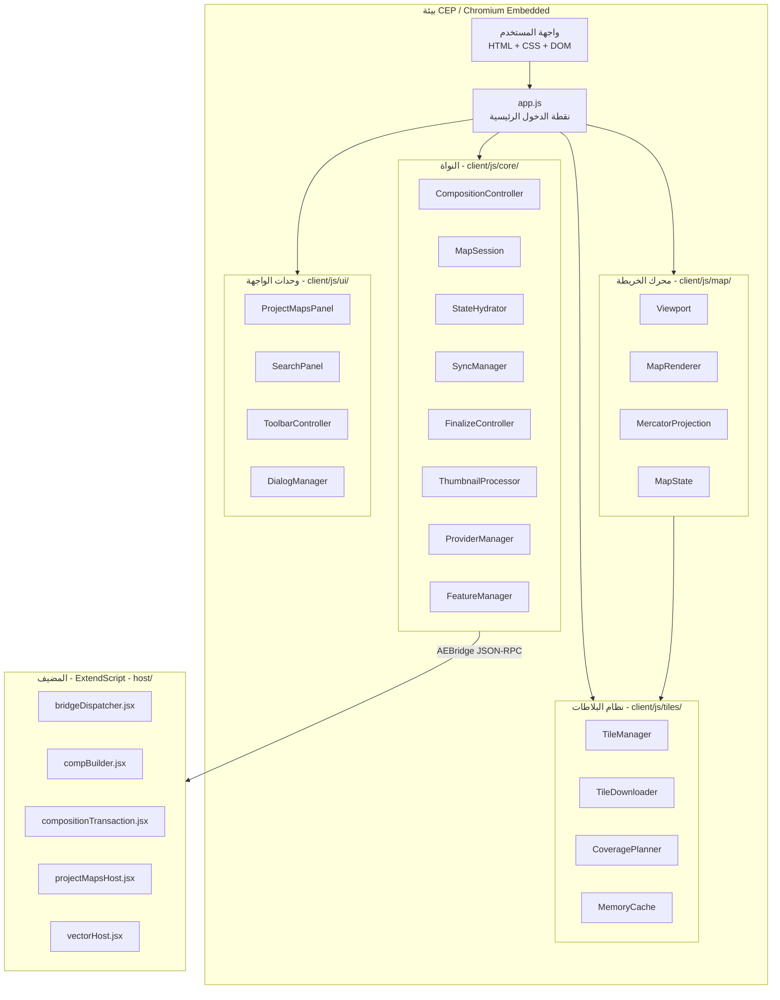
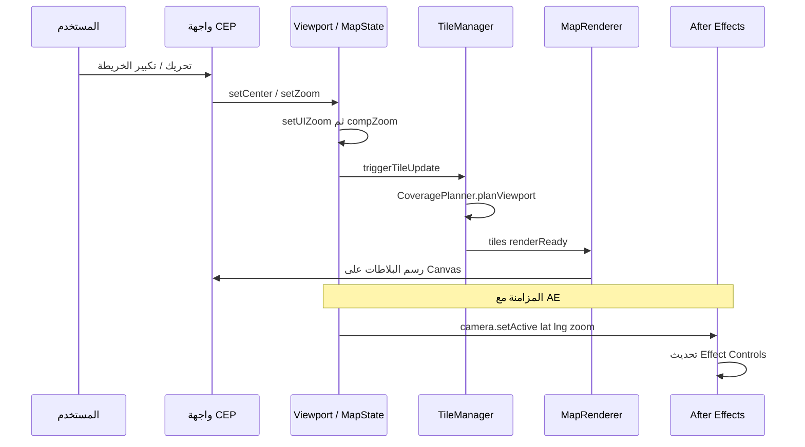
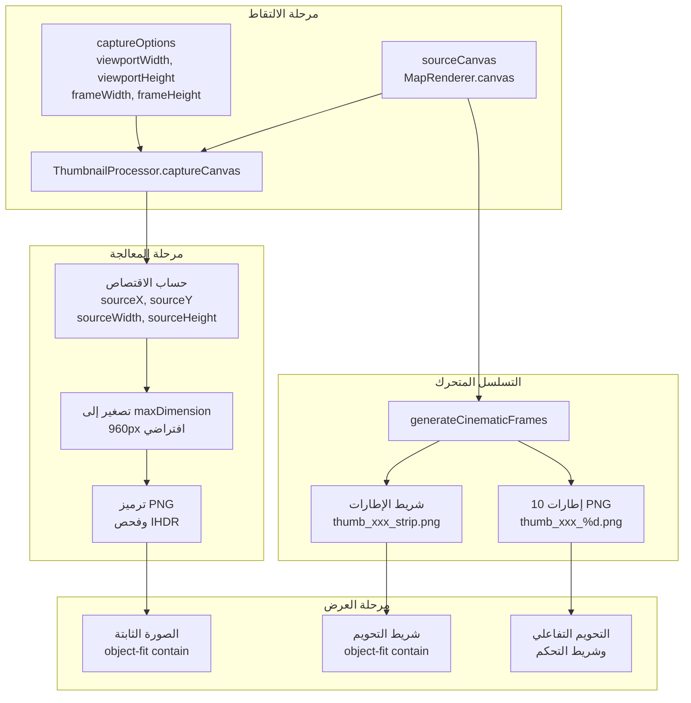

# تقرير التحليل الفني الشامل لتطبيق OpenGeo
### Adobe After Effects — إضافة الخرائط التفاعلية
**النسخة:** 1.0.2 &nbsp;|&nbsp; **تاريخ التقرير:** 20 سبتمبر 2026 &nbsp;|&nbsp; **الحالة:** إنتاج مستقر

---

## جدول المحتويات

1. [نظرة عامة على التطبيق](#1-نظرة-عامة-على-التطبيق)
2. [البنية المعمارية](#2-البنية-المعمارية)
3. [إحصائيات قاعدة الشفرة](#3-إحصائيات-قاعدة-الشفرة)
4. [سجل الأخطاء والحلول المطبقة](#4-سجل-الأخطاء-والحلول-المطبقة)
5. [تحليل نظام الزووم والكادر](#5-تحليل-نظام-الزووم-والكادر)
6. [تحليل نظام الصور المصغرة](#6-تحليل-نظام-الصور-المصغرة)
7. [تحليل نظام البلاطات](#7-تحليل-نظام-البلاطات)
8. [تحليل نظام المزامنة مع After Effects](#8-تحليل-نظام-المزامنة-مع-after-effects)
9. [تحليل الأمن والحماية](#9-تحليل-الأمن-والحماية)
10. [المشاكل المعروفة والتوصيات المستقبلية](#10-المشاكل-المعروفة-والتوصيات-المستقبلية)

---

## 1. نظرة عامة على التطبيق

**OpenGeo** هو إضافة CEP (Common Extensibility Platform) لبرنامج Adobe After Effects، تتيح لمصممي الجرافيك والموشن تصميم خرائط جغرافية تفاعلية عالية الدقة (حتى 4K) مباشرة داخل بيئة After Effects بدون الحاجة لأدوات خارجية.

### القدرات الأساسية

| القدرة | الوصف |
|--------|-------|
| **عرض الخرائط المباشر** | تحميل وعرض بلاطات الخرائط من مزودين متعددين (MapTiler, ESRI, Stadia) بتقنية Mercator |
| **مزامنة الكاميرا** | ربط ثنائي الاتجاه بين موقع الخريطة في اللوحة وكاميرا AE الحقيقية |
| **التسجيل والتحريك** | تسجيل حركة الكاميرا كـ Keyframes على التايملاين |
| **Finalize والبناء** | تحميل البلاطات بدقة الكومبوزيشن الكاملة وبنائها كطبقات AE حقيقية |
| **الأشكال المتجهة** | استيراد ملفات GeoJSON ورسم حدود الدول كطبقات Shape في AE |
| **الدبابيس المكانية** | إنشاء نقاط جغرافية مثبتة مع نصوص ومكونات مرتبطة |
| **مدير المشاريع** | استعراض وتنظيم خرائط المشروع مع صور مصغرة وتحويم تفاعلي |
| **كاميرا 3D** | إمالة الخريطة (Pitch) حتى 45° مع ربط كاميرا AE ثلاثية الأبعاد |

---

## 2. البنية المعمارية

### مخطط الطبقات



### تدفق البيانات الرئيسي



### الوحدات الهيكلية

| الطبقة | الوحدة | المسؤولية |
|--------|--------|-----------|
| **MapState** | `MapState.js` | مصدر الحقيقة الوحيد لحالة الكاميرا — يحتفظ بـ `compZoom` ويحسب `uiZoom` |
| **Viewport** | `Viewport.js` | واجهة تحكم الكاميرا — يترجم أحداث المستخدم إلى تحديثات `MapState` |
| **MapRenderer** | `MapRenderer.js` | رسم البلاطات والطبقات المتجهة على Canvas مع دعم DPR |
| **TileManager** | `TileManager.js` | إدارة البلاطات المرئية وربط الذاكرة المؤقتة والتنزيل |
| **CoveragePlanner** | `CoveragePlanner.js` | حساب البلاطات المطلوبة لتغطية المنظور مع حسابات 3D |
| **CompositionController** | `CompositionController.js` | إنشاء الكومبوزيشن، ترطيب الحالة من AE، وحماية الحفظ |
| **SyncManager** | `SyncManager.js` | التزامن ثنائي الاتجاه بين الكاميرا في اللوحة وكاميرا AE |
| **FinalizeController** | `FinalizeController.js` | تحميل البلاطات بدقة كاملة وبناء الكومبوزيشن النهائي |
| **ThumbnailProcessor** | `ThumbnailProcessor.js` | التقاط وتوليد الصور المصغرة والتسلسلات المتحركة |
| **ProjectMapsPanel** | `ProjectMapsPanel.js` | واجهة مدير المشاريع مع التحويم والتشغيل التلقائي |

---

## 3. إحصائيات قاعدة الشفرة

### توزيع الملفات

| القسم | عدد الملفات | الحجم |
|-------|-------------|-------|
| **JavaScript (client)** | 83 ملفاً | 1,028 KB |
| **CSS (modules)** | 14 ملفاً | 65 KB |
| **ExtendScript (host)** | 17 ملفاً | 177 KB |
| **الاختبارات والأدوات** | 36 ملفاً | 504 KB |
| **المجموع** | **150 ملفاً** | **~1,774 KB** |

### الاختبارات والجودة

| المقياس | القيمة |
|---------|--------|
| **اختبارات الدخان والانحدار** | 162 اختباراً (نجاح 100%) |
| **أجنحة الجودة الشاملة** | 12 جناحاً (نجاح 100%) |
| **تغطية الوظائف الحرجة** | 100% — الكاميرا، البلاطات، المتجهات، Finalize، المشاريع |
| **فحص البصمة التشفيرية** | 269 ملفاً مرصوداً بنجاح |
| **فحص سلامة الحزمة** | اجتياز بنجاح (verify:package) |

### سجل الإصدارات

| الإصدار | التاريخ | أبرز التغييرات |
|---------|---------|----------------|
| **1.0.0** | 2026-08-10 | الإطلاق الأولي — محرك الخرائط، الأمن، البناء |
| **1.0.0-PROD** | 2026-09-14 | التثبيت الصارم — 7 مراحل شاملة |
| **1.0.0** (مستقر) | 2026-09-17 | كاميرا 3D، تصفير الانزياح، التطهير المعماري |
| **1.0.1** | 2026-09-17 | التحديث المعماري الكامل (المراحل 1 حتى 5) |
| **1.0.2** | 2026-09-18 | استنساخ الخرائط الذري مع عزل الهوية |

---

## 4. سجل الأخطاء والحلول المطبقة

### BUG-001: تضخيم الزووم عند ترطيب الكومبوزيشن (Zoom Inflation During Hydration)

**الخطورة: عالية** — كان يؤدي إلى ظهور الخريطة مكبرة بمقدار ~400% عن الحجم الفعلي في الكومبوزيشن.

**الموقع:** `CompositionController.js` — دالة `hydrate()` السطر 38

**الوصف:**
عند قراءة بيانات الكومبوزيشن المحفوظة من After Effects واستعادتها في اللوحة (`hydrate`)، كان النظام يمرر قيمة `compZoom` مباشرة إلى `viewport.setZoom()`. هذه الدالة مصممة لاستقبال `uiZoom` (الزووم المرئي في اللوحة)، ثم تحويله داخلياً إلى `compZoom` عبر طرح نسبة التصغير اللوغاريتمية.

**التحليل الرياضي:**

نسبة التصغير بين لوحة CEP (مثلاً 460x259 بكسل) والكومبوزيشن (1920x1080):

```
scaleRatio = min(460/1920, 259/1080) = 0.24
log2(0.24) = -2.06
```

عند تمرير `compZoom = 12` إلى `setUIZoom()`:

```
compZoom = 12 - log2(0.24) = 12 - (-2.06) = 14.06   ← خطأ!
```

بدلاً من الزووم 12 المحفوظ، يقفز إلى ~14، أي تكبير بمقدار `2^2 = 4x` (400%).

**الحل المطبق:**

```diff
- this.app.viewport.setZoom(this.app.viewport.clampZoom(this.app.mapState.compZoom));
+ this.app.viewport.setZoom(this.app.viewport.clampZoom(this.app.mapState.getUIZoom()));
```

**سبب نجاح الحل:** `getUIZoom()` يعيد حساب القيمة الصحيحة:

```
uiZoom = compZoom + log2(scaleRatio) = 12 + (-2.06) = 9.94
```

ثم `setZoom(9.94)` يستدعي `setUIZoom(9.94)` الذي يحسب `compZoom = 9.94 - (-2.06) = 12` وهو المطلوب.

---

### BUG-002: اقتصاص الصور المصغرة بتأثير تكبير اصطناعي (Thumbnail Zoom Clipping)

**الخطورة: متوسطة** — الصور المصغرة في مدير المشاريع كانت تبدو مكبرة مقارنة بالكومبوزيشن الفعلي.

**الموقع:** `08-project-maps.css` — قاعدة `.project-map-filmstrip-image`

**الوصف:**
كانت صور شريط الإطارات (`.project-map-filmstrip-image`) معروضة بنمط `object-fit: cover`، مما يؤدي إلى اقتصاص الحواف وملء الحاوية بالكامل، بينما الصورة الثابتة (`.project-map-thumbnail-image`) تستخدم `object-fit: contain` مع هامش `padding: 4px`. هذا التناقض كان يجعل كادر التحويم يبدو مكبراً عند تفعيل شريط الإطارات.

**الحل المطبق:**

```diff
  .project-map-filmstrip-image {
+   width: 100%;
    height: 100%;
-   object-fit: cover;
+   object-fit: contain;
+   padding: 4px;
  }
```

---

### BUG-003: تكبير اصطناعي في مولد الإطارات السينمائية (Cinematic Frame Zoom Inflation)

**الخطورة: متوسطة** — إطارات التحويم كانت تحتوي على تكبير 7% فوق الكادر الأصلي.

**الموقع:** `ThumbnailProcessor.js` — دالة `generateCinematicFrames()` السطر 287

**الوصف:**
دالة `generateCinematicFrames()` كانت تطبق معامل تكبير جيبي:

```javascript
const zoomFactor = 1.0 + 0.07 * Math.sin(progress * Math.PI);
const cropW = sourceWidth / zoomFactor;  // أصغر من المصدر = تكبير
```

هذا كان يقطع جزءاً من الكادر الأصلي ويكبر المنطقة المتبقية، مما يضيف تأثير "zoom-in" غير مرغوب.

**الحل المطبق:**

```diff
- const zoomFactor = 1.0 + 0.07 * Math.sin(progress * Math.PI);
- const cropW = sourceWidth / zoomFactor;
- const cropH = sourceHeight / zoomFactor;
+ // 1:1 Faithful composition crop - zero zoom inflation
+ const cropW = sourceWidth;
+ const cropH = sourceHeight;
```

الآن الإطارات تطابق الكادر الحقيقي 1:1 مع حركة أفقية خفيفة فقط (1.2% من العرض).

---

### BUG-004: عدم تطابق أبعاد mapState مع الكومبوزيشن عند التقاط الصور المصغرة

**الخطورة: منخفضة** — كان يحدث فقط عند التقاط صورة مصغرة لخريطة بأبعاد مختلفة عن الكومبوزيشن النشط حالياً.

**الموقع:** `ProjectMapsPanel.js` — دالة التقاط الصور المصغرة

**الوصف:**
عند التقاط صورة مصغرة، كان النظام يقرأ `frameWidth` و `frameHeight` من `mapState` دون التأكد من تطابقهما مع أبعاد الخريطة المستهدفة. إذا كان المستخدم يعمل على كومبوزيشن 4K بينما الخريطة المستهدفة 1080p، فإن نسبة الاقتصاص ستكون خاطئة.

**الحل المطبق:**

```javascript
if (map.width && map.height && this.app.mapState &&
    (this.app.mapState.compWidth !== map.width ||
     this.app.mapState.compHeight !== map.height)) {
  this.app.mapState.setCompSize(map.width, map.height);
}
```

---

### BUG-005: انزياح التكبير بعجلة الفأرة (Mouse Wheel Zoom Drift)

**الخطورة: متوسطة** — عند التكبير بعجلة الفأرة، كانت الخريطة تنزاح جانبياً نحو اليمين.

**الموقع:** `InputHandler.js` / `Viewport.js`

**الوصف:**
حساب موضع مؤشر الفأرة كان يعتمد على إحداثيات Canvas المحولة ثلاثياً بدلاً من إحداثيات حاوية `.map-container` غير المحولة.

**الحل المطبق:**
إضافة `zoomAtGeoPoint()` التي تثبت الإحداثي الجغرافي تحت مؤشر الفأرة باستخدام حساب المركز الجديد عبر إسقاط ميركاتور عكسي.

---

### BUG-006: الحواف السوداء في وضع 3D Pitch (Black Void at Horizon)

**الخطورة: بصرية** — فراغات سوداء تظهر عند إمالة الخريطة أو السحب السريع.

**الموقع:** `CoveragePlanner.js`

**الوصف:**
توسع البلاطات المحسوب (overscan) لم يكن كافياً لتغطية المنطقة المرئية عند زوايا إمالة عالية. التقريب الخطي لمعادلة المنظور كان يترك فجوات عند الأفق.

**الحل المطبق:**
مضاعفة معاملات التوسع وإضافة هامش أفق:

```javascript
const overscanY = pitch > 0
  ? Math.max(overscanScale * 1.3, (1 / Math.cos(pitchRad)) * 1.3)
  : 1;
const horizonGutter = pitch > 0 ? 3 : 0;
```

---

### BUG-007: ثغرة حقن الشفرة عبر eval في المضيف (Code Injection via eval)

**الخطورة: حرجة (أمنية)** — كان يمكن حقن شفرة ExtendScript عبر بيانات المستخدم.

**الموقع:** `AEBridge.js`, `host/modules/*.jsx`

**الوصف:**
الإصدار الأولي كان يستخدم `eval()` لتنفيذ أوامر ExtendScript مع تركيب نصي (String Interpolation) للمعاملات، مما يعني أن أي نص مستخدم يحتوي على أقواس أو فاصلات منقوطة يمكن أن ينفذ شفرة تعسفية.

**الحل المطبق:**
- استبدال جميع `eval()` بـ `JSON.parse()` الآمن
- تغليف المعاملات بـ `JSON.stringify()` عبر بروتوكول JSON-RPC مهيكل
- إنشاء `bridgeDispatcher.jsx` بجدول أوامر مهيكل ومحدد النوع

---

### BUG-008: تضارب الهوية وتلف الطبقات عند تكرار الكومبوزيشن (Composition Duplication & Shared Inner Pre-Comp Corruption)

**الخطورة: حرجة (فقدان وتلف بيانات المستخدم)** — عند قيام المستخدم بتكرار الكومبوزيشن يدوياً في After Effects عبر `Ctrl+D / Cmd+D`، كان يحدث تداخل مدمر بين مشروعي الخريطتين.

**الموقع:** `projectMapsHost.jsx`، `ProjectMapsPanel.js`، `bridgeDispatcher.jsx`

**الوصف:**
في After Effects، يؤدي اختصار `Ctrl+D` على كومبوزيشن الخريطة إلى نسختين متطابقتين ظاهرياً، لكن مع عيوب هيكلية خطيرة:
1. **تطابق معرف الوثيقة (`documentId`):** كلا الكومبوزيشنين يحملان في حقل `comp.comment` نفس المعرف تماماً (مثلاً `map_doc_1`).
2. **الكومب الداخلي المشترك:** After Effects يكرر فقط الكومبوزيشن الحاوية الخارجية، بينما الكومبوزيشن التحتية للبلاطات (`OpenGeo Map - Map - <suffix>`) تظل **مشتركة (Shared Reference)** بين الكومبين. أي تحريك أو تكبير في إحدى الخريطتين يغير الأخرى تلقائياً!
3. **الحذف الكارثي للبلاطات (Silent Tile Purging):** عند تنفيذ المعاينة (Preview) أو الإنهاء (Finalize) لأي من الكومبين، تستدعي الإضافة دالة `opengeoRemoveDocumentAssets(documentId)` لتنظيف البلاطات السابقة. ونظراً لتطابق `documentId`، يتم مسح بلاطات الكومب التوأم بصمت وإتلاف مشروعه تماماً.

**الحل المطبق:**
تم بناء محرك استنساخ عميق وذري (Deep Atomic Duplication Engine) في `projectMapsHost.jsx` مدعوم بزر "Duplicate" في واجهة المشاريع:
1. **تكرار الكومبوزيشن الداخلية:** استنساخ كومب البلاطات أولاً عبر `mapComp.duplicate()` وتخصيص لاحقة هوية جديدة له.
2. **تكرار الكومبوزيشن الخارجية:** استنساخ الكومبوزيشن الحاوية عبر `comp.duplicate()`.
3. **قطع الارتباط وتبديل المصدر:** استخدام `precompLayer.replaceSource(newMapComp, false)` لفصل الارتباط نهائياً.
4. **عزل الهوية والميتاداتا:** توليد `documentId` تشفيري جديد وتحديث تعليقات كافة الطبقات (`OpenGeo Controller`, `MapPivot`, MegaTiles) وإعادة توجيه الـ Expressions.
5. **نسخ أصول الغلاف:** نسخ ملفات الصور المصغرة `thumb_<newDoc>.png` على القرص.
6. **كتلة تراجع موحدة:** تغليف العملية بالكامل داخل `withUndoGroup("OpenGeo: Duplicate Map")` لضمان إمكانية التراجع بضغطة `Ctrl+Z` واحدة.

---

## 5. تحليل نظام الزووم والكادر

### نموذج الزووم المزدوج (Dual-Zoom Model)

يعتمد OpenGeo على نموذج زووم مزدوج لحل مشكلة عرض كومبوزيشن ضخمة (مثلاً 3840x2160) داخل لوحة CEP صغيرة (مثلاً 500x700):

```
+------------------------------------------------+
|                                                |
|    compZoom  <->  uiZoom                       |
|                                                |
|    الزووم الحقيقي        الزووم المرئي          |
|    (ما يبنى في AE)      (ما يعرض في اللوحة)    |
|                                                |
|    العلاقة:                                    |
|    uiZoom = compZoom + log2(scaleRatio)        |
|    compZoom = uiZoom - log2(scaleRatio)        |
|                                                |
|    حيث:                                        |
|    scaleRatio = min(frameW/compW, frameH/compH)|
|                                                |
|    مثال (1920x1080 في لوحة 460x259):           |
|    scaleRatio = 0.24                           |
|    log2(0.24) = -2.06                          |
|    compZoom 12 -> uiZoom = 9.94                |
|                                                |
+------------------------------------------------+
```

### دورة حياة الكادر


### قواعد حرجة لأي تعديل مستقبلي

1. **لا تمرر أبداً `compZoom` إلى `viewport.setZoom()`** — استخدم `mapState.getUIZoom()` دائماً
2. **لا تمرر أبداً `uiZoom` إلى `mapState.compZoom` مباشرة** — استخدم `mapState.setUIZoom()` دائماً
3. **عند الحفظ إلى الـ metadata، احفظ `compZoom`** — لأنه المصدر المستقل عن حجم اللوحة
4. **عند القراءة من الـ metadata، عيّن `compZoom` مباشرة** — ثم اترك `getUIZoom()` يحسب التحويل

---

## 6. تحليل نظام الصور المصغرة

### معمارية نظام المصغرات



### حساب الاقتصاص

الهدف هو استخراج **كادر الكومبوزيشن الفعلي** من Canvas اللوحة، مع مراعاة أن Canvas قد يكون أكبر من الكادر (بسبب DPR أو الهوامش):

```javascript
// الأبعاد المنطقية للوحة
logicalWidth  = options.viewportWidth  || canvas.clientWidth
logicalHeight = options.viewportHeight || canvas.clientHeight

// أبعاد الكادر (داخل اللوحة)
frameWidth  = min(logicalWidth, options.frameWidth || logicalWidth)
frameHeight = min(logicalHeight, options.frameHeight || logicalHeight)

// نسبة التحويل بين Canvas الحقيقي والأبعاد المنطقية
pixelScaleX = canvas.width / logicalWidth   // يساوي DPR عادة
pixelScaleY = canvas.height / logicalHeight

// المنطقة المستهدفة بالبكسل الحقيقي
sourceWidth  = frameWidth * pixelScaleX
sourceHeight = frameHeight * pixelScaleY
sourceX = (canvas.width - sourceWidth) / 2   // توسيط أفقي
sourceY = (canvas.height - sourceHeight) / 2 // توسيط رأسي
```

---

## 7. تحليل نظام البلاطات

### مشكلة معروفة: تفاوت ألوان البلاطات عند اختلاف مستويات الزووم

**الحالة: مؤجل (محدد للمسار الثاني)**

عندما يعمل نظام البلاطات على المعاينة بزووم مختلف عن زووم الكومبوزيشن (بسبب `qualityOffset = -2`)، فإن البلاطات المعروضة تأتي من مستوى زووم أقل (Draft). عند بناء Finalize بالزووم الكامل، تتغير ألوان وتفاصيل البلاطات بشكل ملحوظ.

**السبب الجذري:**
- مزودو البلاطات يستخدمون أنماط تلوين (Color Palettes) مختلفة لمستويات زووم مختلفة
- عند Z=5 قد يكون البحر أزرق داكن، وعند Z=12 أزرق فاتح
- هذا ليس خطأ في OpenGeo بل سلوك طبيعي لمزودي البلاطات

**الأساليب المعتمدة في التطبيقات المماثلة (مثل GEOlayers):**
1. **تثبيت مستوى الزووم:** عرض البلاطات دائماً بنفس مستوى الـ Finalize
2. **تكبير البلاطات المسبق (Upscaling):** عرض بلاطات مستوى أقل مع تكبيرها بدلاً من تغيير المستوى
3. **مؤشر بصري:** إظهار تنبيه "Draft Preview" للمستخدم

### مسار التنزيل والتخزين المؤقت

```
المستخدم يحرك الخريطة
        |
        v
CoveragePlanner.planViewport(viewport)
        |
        v
   +-----------------------------+
   | لكل بلاطة مرئية:            |
   | 1. هل موجودة في MemoryCache? |
   |    نعم: استخدمها فوراً      |
   |    لا: التالي               |
   | 2. هل هناك بلاطة أب مخزنة؟  |
   |    نعم: اعرض الجزء المقطع   |
   |    لا: اعرض Shimmer         |
   | 3. أضف للتنزيل بأولوية      |
   |    المركز أولاً             |
   +-----------------------------+
        |
        v
TileDownloader -> TileTransport (HTTPS فقط)
        |
        v
MemoryCache.set -> tiles:renderReady
        |
        v
MapRenderer.render(tiles, overlays)
```

---

## 8. تحليل نظام المزامنة مع After Effects

### بروتوكول الجسر (Bridge Protocol v2)

التواصل بين لوحة CEP ومحرك ExtendScript يتم عبر `AEBridge.js`:

```
CEP (JavaScript) ---- csInterface.evalScript() ----> ExtendScript
                 <--- callback(JSON string) ---------
```

كل استدعاء يمر عبر `bridgeDispatcher.jsx` الذي يوجه الأمر إلى الوحدة المناسبة:

| الأمر | الوحدة | الوصف |
|-------|--------|-------|
| `camera.setActive` | `metadataSync.jsx` | تحديث موقع الكاميرا |
| `camera.getActive` | `metadataSync.jsx` | قراءة الكومبوزيشن النشط |
| `composition.create` | `compBuilder.jsx` | إنشاء كومبوزيشن جديد |
| `composition.finalize` | `compositionTransaction.jsx` | بناء الكومبوزيشن النهائي |
| `project.listOpenGeoMaps` | `projectMapsHost.jsx` | فهرسة خرائط المشروع |
| `project.duplicateMap` | `projectMapsHost.jsx` | استنساخ الخريطة ذرياً مع عزل الكومبوزيشن التحتية والهوية |
| `project.captureActiveThumbnail` | `projectMapsHost.jsx` | التقاط وتخزين صورة غلاف الخريطة النشطة |
| `vector.import` | `vectorHost.jsx` | استيراد GeoJSON |

### نظام الاستقصاء (Polling)

`SyncManager` يقوم باستقصاء دوري لحالة AE:
- **التردد العادي:** كل 500ms
- **التردد المنخفض (بعد أخطاء):** يتصاعد تدريجياً حتى 5 ثوانٍ
- **الحماية:** رحلة واحدة في نفس الوقت (single-flight)
- **الاسترداد:** يعود للتردد العادي بعد أول استجابة ناجحة

---

## 9. تحليل الأمن والحماية

### الإجراءات المطبقة

| الإجراء | التفاصيل |
|---------|----------|
| **بروتوكول HTTPS فقط** | `NetworkPolicy.js` يرفض جميع طلبات HTTP |
| **حد حجم الاستجابة** | 16 MB كحد أقصى لأي بلاطة |
| **JSON.parse آمن** | بدلاً من `eval()` في جميع نقاط الجسر |
| **تعقيم المسارات** | `ThumbnailProcessor._validatePath()` يرفض أي مسار خارج `thumbnails/` |
| **حارس GeoJSON** | فحص حجم (10 MB)، عدد الميزات (5,000)، عدد النقاط (100,000) |
| **عزل DOM** | صفر `innerHTML` — كل العناصر تنشأ عبر `document.createElement()` |
| **CSP صارمة** | منع تنفيذ الشفرات الخارجية |
| **الكتابة الذرية** | `_replaceAtomically()` — كتابة مؤقتة ثم نسخ احتياطي ثم استبدال |

---

## 10. المشاكل المعروفة والتوصيات المستقبلية

### نقاط ملاحظة فنية

| النقطة | الأولوية | الوصف |
|---------|----------|-------|
| **تفاوت ألوان البلاطات بين درجات التكبير** | تحسين بصري | قد يظهر اختلاف طفيف في تشبع بعض البلاطات من مزودي الخرائط الخارجيين بين مستويات الزووم البعيدة والقريبة |

### توصيات فنية للمطورين المساهمين

1. اقرأ `DEVELOPER_GUIDE.md` قبل أي تعديل
2. شغّل `npm test` و `node scripts/run-all-tests.js` بعد كل تعديل
3. سجّل البصمة الجديدة بـ `npm run baseline:record` بعد التعديلات المقصودة
4. احترم نموذج الزووم المزدوج — راجع القسم 5 من هذا التقرير
5. لا تستخدم `innerHTML` أبداً — استخدم `createElement` و `textContent`

---

*تم إنشاء هذا التقرير بناءً على تحليل الشفرة المصدرية وسجل Git وتاريخ الإصلاحات.*
*آخر تحديث: 20 سبتمبر 2026*
