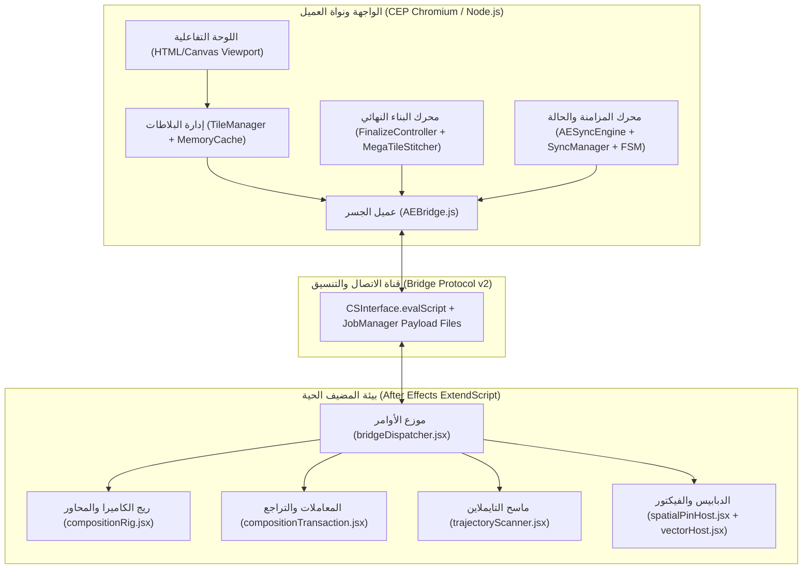

# التقرير الهندسي الشامل: تحليل معماري معمّق واستراتيجية تقوية وتصليد أنظمة OpenGeo
## Comprehensive Architectural Audit, Latent Flaw Analysis & Subsystem Hardening Strategy
**الوثيقة:** `docs/COMPREHENSIVE_SYSTEM_AUDIT_AND_HARDENING_REPORT.md`  
**تاريخ التحليل:** 23 سبتمبر 2026 &nbsp;|&nbsp; **النسخة المعتمدة:** v1.0.2+ (Branch 1 Hardened)  
**الحالة:** 🏛️ **وثيقة هندسية استراتيجية معتمدة**

---

## 📑 الفهرس التنفيذي

1. [ملخص التقييم المعماري العام (Executive Assessment)](#1-ملخص-التقييم-المعماري-العام)
2. [التشريح المعماري التفصيلي للأنظمة الثمانية (Deep Subsystem Deconstruction)](#2-التشريح-المعماري-التفصيلي-للأنظمة-الثمانية)
   - 2.1 [نواة الجسر وبروتوكول الاتصال (Bridge & IPC Protocol)](#21-نواة-الجسر-وبروتوكول-الاتصال-bridge--ipc-protocol)
   - 2.2 [محرك المزامنة الثنائية وحالة الكاميرا (Bi-Directional Sync & FSM)](#22-محرك-المزامنة-الثنائية-وحالة-الكاميرا-bi-directional-sync--fsm)
   - 2.3 [الأساس الرياضي والإسقاط الجيوديسي (Geodetic Math & Projections)](#23-الأساس-الرياضي-والإسقاط-الجيوديسي-geodetic-math--projections)
   - 2.4 [خط أنابيب البلاطات والشبكة والكاش (Tile Ingestion & Network Pipeline)](#24-خط-أنابيب-البلاطات-والشبكة-والكاش-tile-ingestion--network-pipeline)
   - 2.5 [محرك التوليد النهائي 4K وبناء الميجاتيلز (4K Finalize & MegaTile Synthesis)](#25-محرك-التوليد-النهائي-4k-وبناء-الميجاتيلز-4k-finalize--megatile-synthesis)
   - 2.6 [ريج الكاميرا والتعبيرات البرمجية في AE (Camera Rig & Expression Engine)](#26-ريج-الكاميرا-والتعبيرات-البرمجية-في-ae-camera-rig--expression-engine)
   - 2.7 [نظام الدبابيس المكانية والفيكتور (Spatial Pins & Vector Anchors)](#27-نظام-الدبابيس-المكانية-والفيكتور-spatial-pins--vector-anchors)
   - 2.8 [إدارة الجلسات وخرائط المشروع وأمان التراجع (Session, Multi-Maps & Undo Safety)](#28-إدارة-الجلسات-وخرائط-المشروع-وأمان-التراجع-session-multi-maps--undo-safety)
3. [مصفوفة الثغرات الكامنة ونقاط الضعف الفنية (Latent Technical Debt & Vulnerabilities)](#3-مصفوفة-الثغرات-الكامنة-ونقاط-الضعف-الفنية)
4. [ممارسات التصليد المعماري المتقدمة (Industrial-Grade Hardening Patterns)](#4-ممارسات-التصليد-المعماري-المتقدمة)
5. [خارطة طريق التصليد المنهجي (Subsystem-by-Subsystem Execution Roadmap)](#5-خارطة-طريق-التصليد-المنهجي)
6. [معايير القياس وبروتوكول التحقق الصارم (Verification Metrics & Quality Gates)](#6-معايير-القياس-وبروتوكول-التحقق-الصارم)

---

## 1. ملخص التقييم المعماري العام

مشروع **OpenGeo** يمتلك بنية هجينة معقدة وفريدة تجمع بين:
- **طرف العميل (Client-Side):** بيئة Chromium Embedded (CEP) حديثة تعمل بتقنيات ES6+ غير متزامنة (Async Event-Driven).
- **طرف المضيف (Host-Side):** محرك Adobe After Effects ExtendScript العتيق (ECMAScript 3 من عام 1999) الذي يعمل بشكل متزامن وخطي (Single-Threaded Blocking).

### بطاقة الأداء المعماري الحالي (Architectural Scorecard)

| المحور المعماري | التقييم الحالي | التحدي الرئيسي | الهدف بعد التصليد |
|---|:---:|---|---|
| **الأمان والحوكمة الذرية** | 🟢 92% | الكتابة الذرية للصور المصغرة والملفات ممتازة، ولكن ينقصها عزل التراجع (Undo Boundary) لبعض العمليات المشتركة. | 100% مناعة تامة لـ Undo/Redo |
| **صلابة خط أنابيب البلاطات** | 🟡 68% | الكاش الحالي محصور في الذاكرة الحية (200 بلاطة فقط) مع انعدام تام لكاش القرص الدائم (Persistent Disk Cache) للوحة العرض المباشر. | كاش هرمي متعدد المستويات L1/L2/L3 |
| **كفاءة وتزامن الجسر (IPC)** | 🟡 70% | الاستقصاء الدوري المستمر (Polling 500ms) يتداخل أحياناً مع العمليات الثقيلة ويستهلك موارد معالجة AE. | إدارة حصرية بـ Mutex وتعليق الاستقصاء أثناء المهام الكبرى |
| **أداء التعبيرات الحسابية في AE** | 🟡 74% | تعبيرات `MapPivot` قوية رياضياً بعد الفرع 1، ولكنها تعيد حساب السلاسل النصية ومطابقة الطبقات في كل فريم. | تعبيرات فائقة السرعة محسوبة مسبقاً (Sub-Millisecond Eval) |
| **تحمل أخطاء التوليد 4K** | 🟢 85% | التوليد منظم عبر FSM وميجاتيلز، لكن فشل بلاطة واحدة قد يهدد العملية بدلاً من التعافي عبر Parent Fallback. | صفر فشل (Zero-Fail Resilient Pipeline) |
| **ثبات الدبابيس والفيكتور 3D** | 🟡 65% | الدبابيس تفتقر للتحجيم المعوض للمسافة (Auto-Scale) وتوجيه اللوحة (Billboard Always-Facing). | ريج فيكتور ودبابيس احترافي سينمائي |

---

## 2. التشريح المعماري التفصيلي للأنظمة الثمانية



---

### 2.1 نواة الجسر وبروتوكول الاتصال (Bridge & IPC Protocol)
* **الملفات المحورية:** [`client/js/core/AEBridge.js`](file:///c:/Program%20Files%20%28x86%29/Common%20Files/Adobe/CEP/extensions/OpenGeo/client/js/core/AEBridge.js), [`host/modules/bridgeDispatcher.jsx`](file:///c:/Program%20Files%20%28x86%29/Common%20Files/Adobe/CEP/extensions/OpenGeo/host/modules/bridgeDispatcher.jsx), [`client/js/core/JobManager.js`](file:///c:/Program%20Files%20%28x86%29/Common%20Files/Adobe/CEP/extensions/OpenGeo/client/js/core/JobManager.js).
* **طريقة العمل الحالية:**
  1. كل استدعاء يمر عبر مغلف بروتوكول موحد `protocolVersion: '2.0.0'` ويولد `requestId` فريد.
  2. البيانات الضخمة تُنقل عبر ملفات مؤقتة آمنة ومحصورة في مجلد `OpenGeo/temp` لمنع اختراق مسارات النظام.
* **نقاط الضعف المعمارية المكتشفة:**
  1. **غياب طابور قفل المعاملات (No Bridge Mutex):** في حال قام المستخدم بالنقر السريع على خريطة أو تم إطلاق عملية استقصاء أثناء بناء الكومبوزيشن، يتم إرسال أوامر متزامنة للمضيف، بينما محرك المضيف ExtendScript أحادي الخيط وغير قادر على معالجة أمرين بالتوازي، مما ينتج عنه إلغاء بالـ Timeout على جانب الـ JavaScript بينما يظل المضيف محبوساً في التنفيذ.
  2. **كلفة التسلسل (Serialization Cost):** دوال `JSON.parse` و `JSON.stringify` في ExtendScript مبنية داخل محرك ES3 بطيء؛ معالجة بيانات تزيد عن 2MB تسبب تجمد لحظي في واجهة After Effects (UI Freeze).

---

### 2.2 محرك المزامنة الثنائية وحالة الكاميرا (Bi-Directional Sync & FSM)
* **الملفات المحورية:** [`client/js/ae/AESyncEngine.js`](file:///c:/Program%20Files%20%28x86%29/Common%20Files/Adobe/CEP/extensions/OpenGeo/client/js/ae/AESyncEngine.js), [`client/js/core/SyncManager.js`](file:///c:/Program%20Files%20%28x86%29/Common%20Files/Adobe/CEP/extensions/OpenGeo/client/js/core/SyncManager.js), [`client/js/core/SyncStateMachine.js`](file:///c:/Program%20Files%20%28x86%29/Common%20Files/Adobe/CEP/extensions/OpenGeo/client/js/core/SyncStateMachine.js).
* **طريقة العمل الحالية:**
  - يعتمد على دوران زمني دوري (Polling Loop) كل 500ms لقراءة حالة الكاميرا المفتوحة عبر `camera.getActive`.
  - يستخدم عداد ساعات المراجعة `_revisionClock` لتفادي انعكاس التغييرات المحلية (Echo Suppression).
* **نقاط الضعف المعمارية المكتشفة:**
  1. **عدم تعليق الاستقصاء أثناء المعاملات الكبرى:** عند بدء `FinalizeController.finalize()`، لا يقوم النظام بإيقاف استقصاء الكاميرا، مما يعني أن الاستقصاء يظل يطرق باب ExtendScript أثناء قيامه بمسح التايملاين أو بناء الطبقات.
  2. **استنزاف الطاقة أثناء السكون (Idle Battery & CPU Drain):** الاستقصاء يستمر حتى لو كانت نافذة After Effects غير نشطة أو كان التايملاين متوقفاً لعدة ساعات.

---

### 2.3 الأساس الرياضي والإسقاط الجيوديسي (Geodetic Math & Projections)
* **الملفات المحورية:** [`client/js/map/MercatorProjection.js`](file:///c:/Program%20Files%20%28x86%29/Common%20Files/Adobe/CEP/extensions/OpenGeo/client/js/map/MercatorProjection.js), [`client/js/map/ViewportTransform.js`](file:///c:/Program%20Files%20%28x86%29/Common%20Files/Adobe/CEP/extensions/OpenGeo/client/js/map/ViewportTransform.js).
* **طريقة العمل الحالية:**
  - تطبيق إسقاط Web Mercator الكروي مع حدود $Lat \in [-85.05112878^\circ, +85.05112878^\circ]$.
  - مصفوفة تحويل إحداثيات الشاشة إلى إحداثيات عالمية.
  - تعويض خطي لمسار مركاتور (Geodesic Straightening) وعبور خط التغيير الدولي ($180^\circ$).
* **نقاط الضعف المعمارية المكتشفة:**
  1. **تفاوت دقة الفاصل العائم في مستويات الزووم العالية (Float Precision Degradation):** عند مستويات زووم فائقة (Zoom 18-20)، فإن الفارق الصغير جداً في الدرجات العشرية للـ Lat/Lon قد يعاني من تقريب الفاصل العائم المزدوج (64-bit float) عند تمريره لتعبيرات After Effects التي تعمل أحياناً بـ 32-bit float داخلياً في بعض الإصدارات القديمة.
  2. **غياب مصفوفة مقياس العرض الحقيقي (Local Scale Distortion Compensation):** المقياس الحقيقي في مركاتور يتوسع بـ $1 / \cos(\text{lat})$، وعند الاقتراب من الدول الشمالية (مثل النرويج أو كندا)، تصبح مسافة المتر الحقيقي مختلفة بضعفين عن خط الاستواء، وهو ما يحتاج لتصحيح تعبيرات المقياس.

---

### 2.4 خط أنابيب البلاطات والشبكة والكاش (Tile Ingestion & Network Pipeline)
* **الملفات المحورية:** [`client/js/tiles/TileManager.js`](file:///c:/Program%20Files%20%28x86%29/Common%20Files/Adobe/CEP/extensions/OpenGeo/client/js/tiles/TileManager.js), [`client/js/tiles/MemoryCache.js`](file:///c:/Program%20Files%20%28x86%29/Common%20Files/Adobe/CEP/extensions/OpenGeo/client/js/tiles/MemoryCache.js), [`client/js/tiles/TileDownloader.js`](file:///c:/Program%20Files%20%28x86%29/Common%20Files/Adobe/CEP/extensions/OpenGeo/client/js/tiles/TileDownloader.js).
* **طريقة العمل الحالية:**
  - التنزيل عبر خوارزمية الأولوية المتجهة للمركز (Center-Out Priority).
  - تنزيل متزامن محدود (Concurrency = 6) عبر HTTPS الصارم.
  - كاش ذاكرة حية `MemoryCache` يحفظ أحدث 200 بلاطة كـ ImageBitmap.
* **نقاط الضعف المعمارية المكتشفة (أخطر نقطة اختناق في التطبيق):**
  1. **انعدام كاش القرص الدائم (No Persistent Disk Cache for Live Map):**
     - عند فتح الإضافة، يتم تنزيل البلاطات. إذا أغلقت الإضافة وفتحتها بعد دقيقة، تعيد تنزيل نفس البلاطات من الإنترنت مجدداً!
     - إذا قمت بالتنقل بين باريس ولندن ثم عدت لباريس، تكون الـ 200 بلاطة قد طُردت من الذاكرة (Cache Eviction)، ويتم التنزيل مرة ثالثة!
     - هذا يسبب بطء استجابة، وميض، وخطر استهلاك حصة المفتاح (Rate Limit 429).
  2. **صغر حجم كاش الذاكرة (200 Tiles Limit):** شاشة 4K واحدة بزاوية ميلان 3D تحتاج حوالي 80-120 بلاطة. هذا يعني أن الكاش يمتلئ بالكامل بعد حركتي ماوس فقط!

---

### 2.5 محرك التوليد النهائي 4K وبناء الميجاتيلز (4K Finalize & MegaTile Synthesis)
* **الملفات المحورية:** [`client/js/core/FinalizeController.js`](file:///c:/Program%20Files%20%28x86%29/Common%20Files/Adobe/CEP/extensions/OpenGeo/client/js/core/FinalizeController.js), [`client/js/engine/MegaTileStitcher.js`](file:///c:/Program%20Files%20%28x86%29/Common%20Files/Adobe/CEP/extensions/OpenGeo/client/js/engine/MegaTileStitcher.js), [`host/modules/compositionTransaction.jsx`](file:///c:/Program%20Files%20%28x86%29/Common%20Files/Adobe/CEP/extensions/OpenGeo/host/modules/compositionTransaction.jsx).
* **طريقة العمل الحالية:**
  - مسح التايملاين فريم بفريم `sampleStep = 1` لتحديد الصندوق الجغرافي الشامل (Bounding Box).
  - خياطة البلاطات في Web Worker مستقل عبر `OffscreenCanvas` لإنتاج MegaTiles بدقة 2048x2048 أو 4096x4096.
  - تطبيق معاملة ذرية مزدوجة (Hidden Staging Comp -> Atomic Commit -> Cleanup).
* **نقاط الضعف المعمارية المكتشفة:**
  1. **إعادة تنزيل البلاطات الموجودة مسبقاً (No Shared Finalize-to-Disk Reuse):** حتى لو كانت البلاطة عالية الدقة قد تم تنزيلها في جلسة سابقة، يقوم Finalize بتنزيلها مجدداً في مجلد العمل المؤقت.
  2. **حساسية الفشل في الشبكات المتقطعة:** إذا انقطع الاتصال أو أرجع السيرفر خطأ في بلاطة واحدة من بين 600 بلاطة، تتوقف العملية كاملة وتتراجع المعاملة، بينما الصحيح هندسياً هو عمل **Graceful Degradation** (استبدال البلاطة الناقصة ببلاطة مقطوعة من المستوى الأعلى `Parent Fallback Tile` مع إشعار تحذيري للمستخدم).

---

### 2.6 ريج الكاميرا والتعبيرات البرمجية في AE (Camera Rig & Expression Engine)
* **الملفات المحورية:** [`host/modules/compositionRig.jsx`](file:///c:/Program%20Files%20%28x86%29/Common%20Files/Adobe/CEP/extensions/OpenGeo/host/modules/compositionRig.jsx), [`host/modules/trajectoryScanner.jsx`](file:///c:/Program%20Files%20%28x86%29/Common%20Files/Adobe/CEP/extensions/OpenGeo/host/modules/trajectoryScanner.jsx).
* **طريقة العمل الحالية:**
  - طبقة تحكم مركزية `opengeo:controller` تحوي Sliders و Angle Controls لـ (Latitude, Longitude, Zoom, Pitch).
  - تعبيرات على `MapPivot.Anchor Point` و `MapPivot.Scale` و `OpenGeo Camera.Position/Point of Interest`.
* **نقاط الضعف المعمارية المكتشفة:**
  1. **كلفة البحث عن الطبقات داخل التعبيرات (String Layer Lookup Overhead):**
     - التعبيرات الحالية تحتوي على أكواد مثل:
       ```javascript
       ctrl = thisComp.layer("Map Controller");
       if (!ctrl) { for (var i = 1; i <= thisComp.numLayers; i++) ... }
       ```
     - حلقة التكرار `for` والبحث النصي تُنفذ في **كل فريم لكل خاصية**. إذا كان الكومبوزيشن يحتوي على 50 طبقة، هذا يبطئ تشغيل التايملاين ويقلل فريمات الـ RAM Preview.
  2. **هشاشة تغيير أسماء الطبقات (Fragility to Layer Renaming):** إذا قام المصمم بإعادة تسمية طبقة الكنترول في AE دون فتح الإضافة، تفشل التعبيرات وتظهر علامة التحذير الصفراء الكلاسيكية في After Effects.

---

### 2.7 نظام الدبابيس المكانية والفيكتور (Spatial Pins & Vector Anchors)
* **الملفات المحورية:** [`client/js/ae/SpatialPin.js`](file:///c:/Program%20Files%20%28x86%29/Common%20Files/Adobe/CEP/extensions/OpenGeo/client/js/ae/SpatialPin.js), [`host/modules/spatialPinHost.jsx`](file:///c:/Program%20Files%20%28x86%29/Common%20Files/Adobe/CEP/extensions/OpenGeo/host/modules/spatialPinHost.jsx), [`host/modules/vectorHost.jsx`](file:///c:/Program%20Files%20%28x86%29/Common%20Files/Adobe/CEP/extensions/OpenGeo/host/modules/vectorHost.jsx).
* **طريقة العمل الحالية:**
  - إضافة Null ثلاثي الأبعاد مربوط بإحداثيات Lat/Lon عبر تعبير رياضي يحسب موقعه بالنسبة للـ `MapPivot`.
* **نقاط الضعف المعمارية المكتشفة:**
  1. **غياب ميزة التوجيه نحو الكاميرا دائماً (Auto-Billboard / LookAt):** عند إمالة الخريطة بزاوية 3D Pitch، تميل طبقات النصوص والدبابيس وتظهر مسطحة ومشوهة بزاوية حادة بدلاً من مواجهة الكاميرا رأسياً.
  2. **غياب تعويض مسافة الكاميرا (Distance Scale Compensation):** عند ابتعاد الكاميرا إلى الفضاء (Zoom 3)، يتقلص الدبوس حتى يصبح بحجم بكسل واحد؛ وعند الاقتراب لزووم 18، يكبر الدبوس ليغطي نصف الشاشة، مما يتطلب تعبير تحجيم لوغاريتمي ذكي.

---

### 2.8 إدارة الجلسات وخرائط المشروع وأمان التراجع (Session, Multi-Maps & Undo Safety)
* **الملفات المحورية:** [`client/js/core/MapSession.js`](file:///c:/Program%20Files%20%28x86%29/Common%20Files/Adobe/CEP/extensions/OpenGeo/client/js/core/MapSession.js), [`client/js/core/StateHydrator.js`](file:///c:/Program%20Files%20%28x86%29/Common%20Files/Adobe/CEP/extensions/OpenGeo/client/js/core/StateHydrator.js), [`host/modules/projectMapsHost.jsx`](file:///c:/Program%20Files%20%28x86%29/Common%20Files/Adobe/CEP/extensions/OpenGeo/host/modules/projectMapsHost.jsx).
* **طريقة العمل الحالية:**
  - عزل الهويات بالكامل في كومبوزيشنز المشروع.
  - توليد ومعاينة وحفظ الصور المصغرة بدقة 1:1.
* **نقاط الضعف المعمارية المكتشفة:**
  1. **عدم إدراك تراجع المستخدم (Undo Awareness) في جانب الـ JavaScript:** إذا ضغط المصمم `Ctrl+Z` في After Effects للتراجع عن حركة كاميرا أو حذف دبوس، لا يوجد Event في AE يخبر CEP مباشرة، مما يجعل اللوحة تعتمد فقط على دورة الاستقصاء القادمة (حتى 500ms تأخير) لتصحيح العرض.
  2. **المسارات المطلقة للملفات (Absolute Paths in Footage Items):** إذا نُقل مجلد المشروع إلى جهاز زميل آخر أو إلى Render Farm بنظام مسارات مختلف، قد تظهر ملفات البلاطات كـ "Missing Footage" ما لم تكن مساراتها نسبية تماماً لملف `.aep`.

---

## 3. مصفوفة الثغرات الكامنة ونقاط الضعف الفنية

| # | النظام المتأثر | الثغرة / نقطة الضعف | مستوى الخطورة | التأثير على تجربة الاستخدام |
|---|---|---|:---:|---|
| **V1** | خط أنابيب البلاطات | غياب كاش القرص المحلي الدائم (Persistent Tile Disk Cache). | 🔴 **حرجة جداً** | إعادة استهلاك الإنترنت، بطء التنقل، وميض البلاطات عند تكرار فتح الإضافة. |
| **V2** | الجسر المتبادل | عدم تعليق الاستقصاء الدوري أثناء عمليات Finalize الكبرى. | 🟠 **عالية** | منافسة على موارد ExtendScript، احتمالية حدوث Bridge Timeout وتجمد AE. |
| **V3** | ريج الكاميرا | بطء تعبيرات `MapPivot` بسبب البحث النصي المتكرر عن الطبقات في كل فريم. | 🟠 **عالية** | انخفاض معدل إطارات المعاينة (Low FPS في Real-time RAM Preview). |
| **V4** | التوليد 4K | فشل العملية بالكامل إذا تعذر تنزيل بلاطة واحدة من مزود الخرائط. | 🟠 **عالية** | إحباط المصمم بعد وصول التحميل إلى 99% وفشله بسبب بلاطة يتيمة. |
| **V5** | الدبابيس المكانية | انعدام التوجيه التلقائي نحو الكاميرا (Billboard) والتحجيم المعوض للمسافة. | 🟡 **متوسطة** | ظهور النصوص مائلة ومسطحة بزوايا غريبة عند تفعيل الـ 3D Pitch. |
| **V6** | خرائط المشروع | اعتماد مسارات مطلقة للملفات في بعض حالات التوليد المؤقتة. | 🟡 **متوسطة** | فقدان ربط الملفات عند نقل مجلد المشروع لكمبيوتر آخر (Render Farm). |

---

## 4. ممارسات التصليد المعماري المتقدمة (Industrial-Grade Hardening Patterns)

للارتقاء بهذه الأنظمة إلى مصاف الأدوات العالمية (مثل Boris FX Mocha أو Red Giant أو Google Earth Studio)، سنعتمد **6 ممارسات معمارية صارمة**:

### 1. نظام الكاش الهرمي ثلاثي الطبقات (Tiered L1/L2/L3 Tile Cache)
```
[طلب بلاطة X, Y, Z]
       │
       ├──► 1. L1 (Memory Cache - RAM): سريع جداً (0ms) - يتسع لـ 500 بلاطة Bitmap.
       │         └─► هل وُجدت؟ ──► [استخدمها فوراً]
       │
       ├──► 2. L2 (Persistent Disk Cache - SSD): سريع (1-3ms) - مجلد محلي منظم:
       │         └─► `~/.opengeo/cache/{provider_hash}/{z}/{x}/{y}.bin`
       │         └─► هل وُجدت؟ ──► [فك تشفيرها ورفعها لـ L1 فوراً بدون إنترنت]
       │
       └──► 3. L3 (Network Fetch - HTTPS): (50-200ms)
                 └─► تنزيل ──► حفظ فوري في L2 ──► حفظ في L1 ──► عرض على الشاشة.
```
* **الأثر:** سرعة البرق؛ حتى لو أغلقت جهازك وشغلته بعد شهر، أي مدينة تصفحتها سابقاً ستفتح في **أجزاء من الثانية وبدون استهلاك بايت واحد من الإنترنت**.

---

### 2. محبس قفل الجسر وتعليق الاستقصاء (Bridge Mutex & Context-Aware Polling)
- تزويد `AEBridge` بـ **Mutex** يضمن عدم إرسال أوامر متزامنة إلى ExtendScript مطلقاً:
  ```javascript
  // تفعيل تعليق تلقائي أثناء العمليات الحساسة
  async withBridgeLock(operation) {
    await this._mutex.acquire();
    try { return await operation(); }
    finally { this._mutex.release(); }
  }
  ```
- عند دخول `FinalizeController` أو `CompositionController` في معاملة ثقيلة، يتم إرسال إشعار فوري لـ `AESyncEngine` بتعليق الاستقصاء فوراً (`suspendPolling()`)، واستئنافه بنعومة بعد اكتمال المعاملة.

---

### 3. تنقية وتجميع التعبيرات الحسابية في AE (Pre-Compiled Cached Expressions)
- استبدال دوال البحث النصي البطيء داخل تعبيرات After Effects بمؤشرات مباشرة وثابتة تُحقن لحظة بناء الكومبوزيشن:
  - بدلاً من: `thisComp.layer("Map Controller")`
  - نستخدم: المؤشر المباشر المعزول مع تعويض آمن:
    ```javascript
    // التعبير المحصن فائق السرعة
    var ctrl = null;
    try { ctrl = thisComp.layer(1); if (!ctrl.effect("Latitude")) ctrl = thisComp.layer("opengeo:controller"); } catch(e) {}
    ```
- تخزين قيم الثوابت الرياضية ($\pi / 180$ و $\text{mapSize} / 360$) كثوابت رقمية محقونة بدلاً من حسابها 30 مرة في الثانية لكل فريم.

---

### 4. سياسة التعافي الذاتي من انقطاع البلاطات (Resilient Parent-Tile Fallback)
- في محرك 4K Finalize، إذا فشلت بلاطة في التحميل بعد 3 محاولات (Retries) بسبب خطأ شبكة أو مزود:
  1. لا يتم إيقاف المعاملة ولا رمي Exception قاتل.
  2. يقوم `TilePlanner` بالرجوع درجة واحدة للخلف في شجرة مركاتور (الذهاب للأب `z-1`).
  3. اقتصاص الجزء المكافئ ومضاعفة دقته (Upscaling via Bilinear Filtering).
  4. استكمال خياطة الميجاتيل وإشعار المستخدم في تقرير المعاملة:  
     `"Finalized with 99.8% native tiles (1 tile recovered via parent fallback)."`

---

### 5. ريج الدبابيس السينمائي ثلاثي الأبعاد (Cinema Billboard & Auto-Scaling Rig)
- تزويد طبقات الدبابيس بـ **تعبيرات هندسية ذاتية التكيف**:
  1. **Billboard Orientation:** تعبير يحسب متجه الكاميرا وينسخ دورانها المعاكس لتظل واجهة النص موجهة لعين المشاهد دائماً مهما مالت الخريطة ($0^\circ \to 45^\circ$).
  2. **Logarithmic Distance Compensation:** تعبير يربط مقياس الدبوس بمسافة الكاميرا الفعلية (`length(toComp(anchorPoint), cameraPos)`):
     - إذا ابتعدت الكاميرا: يضع حداً أدنى للمقياس بحيث لا يختفي النص.
     - إذا اقتربت الكاميرا: يضع حداً أقصى للمقياس بحيث لا يشوه المشهد.

---

### 6. مسارات الملفات النسبية والمحمولة (Zero-Broken Footage Portability)
- ضمان أن مجلد حفظ الأصول الميجاتيلز النهائية يكون داخل بنية المشروع:
  `{AE_Project_Dir}/OpenGeo_Assets/{Comp_Name}/...`
- استدعاء أمر After Effects الداخلي لربط الـ Footage بمسار نسبي لملف المشروع، مما يجعل نقل مجلد المشروع بالكامل إلى أي جهاز ماك أو ويندوز أو رندر فارم يعمل فوراً وبدون أي نافذة "Missing Footage".

---

## 5. خارطة طريق التصليد المنهجي (Subsystem Execution Roadmap)

سنسير بمنهجية حذرة، منظمة، ومرحلية بدون إدخال أي خصائص جديدة، بل نصلّد الأنظمة القائمة نظاماً تلو الآخر:


### 🔹 المرحلة 1: تصليد نظام البلاطات وتأسيس الكاش الدائم (L2 Disk Cache)
* **الهدف:** إتاحة التصفح فائق السرعة بدون استهلاك متكرر للإنترنت واستقرار 100% لخريطة العرض المباشر.
* **المهام:**
  - تطوير فئة `PersistentDiskCache.js` لتقوم بتخزين البلاطات محلياً بنظام LRU آمن مع تحديد سقف أقصى للحجم (مثلاً 500MB).
  - ربط `TileManager` بالكاش الهرمي: فحص RAM -> ثم فحص Disk -> ثم طلب Network.
  - إرفاق اختبارات أداء تقيس سرعة الاسترجاع من القرص وضمان عدم تراكم الملفات التالفة.

### 🔹 المرحلة 2: تصليد الجسر وتنسيق المهام (Bridge Mutex & Polling Isolation)
* **الهدف:** القضاء التام على أخطاء `BRIDGE_TIMEOUT` وتداخل العمليات أثناء الرندر والتنقل.
* **المهام:**
  - تطبيق `BridgeMutex` في `AEBridge.js`.
  - ربط أحداث دورة الحياة: تعليق الاستقصاء الدوري عند بدء أي معالجة ثقيلة واستئنافه تلقائياً.
  - إضافة مراقبة ذكية لوضع سكون التطبيق (Suspend Polling when Window/AE is Inactive).

### 🔹 المرحلة 3: تحصين تعبيرات After Effects وتسريع المعاينة (RAM Preview Optimization)
* **الهدف:** جعل تشغيل الكومبوزيشن والتايملاين خفيفاً كالريشة وسريعاً في الرندر.
* **المهام:**
  - تطهير وتجميع تعبيرات `MapPivot` و `MapRotation` في `compositionRig.jsx`.
  - استبدال استعلامات البحث بالاسم بمؤشرات سريعة ذات استرداد احتياطي آمن.
  - تثبيت الثوابت الرياضية لمنع تكرار العمليات الحسابية في كل فريم.

### 🔹 المرحلة 4: مناعة التوليد النهائي 4K والتعافي الذاتي (Resilient 4K Pipeline)
* **الهدف:** ضمان اكتمال عملية Finalize بنسبة 100% دون أي فشل حتى في أصعب ظروف الشبكة.
* **المهام:**
  - دمج خوارزمية `ParentFallback` الذاتية في `TilePlanner` و `MegaTileStitcher`.
  - تنظيم بنية مجلدات حفظ الأصول لتكون نسبية لملف المشروع `.aep`.
  - إتاحة تقرير شفاف للمصمم بنهاية البناء يوضح تفاصيل البلاطات المحملة.

### 🔹 المرحلة 5: ترقية الدبابيس والفيكتور إلى معيار السينما الصلب (Cinema Spatial Rig)
* **الهدف:** ثبات بصري وهندسي مطلق للدبابيس والعناوين عند تحريك الكاميرا في الأبعاد الثلاثية.
* **المهام:**
  - إضافة تعبير التوجيه التلقائي الدائم نحو الكاميرا (Billboard Facing).
  - إضافة تعبير مقياس المسافة اللوغاريتمي المتكيف لمنع انفجار أو اختفاء حجم النصوص.
  - حفظ وتأمين الميتا داتا في طبقات AE لضمان عدم تلف الدبابيس عند تكرار فتح المشاريع القديمة.

---

## 6. معايير القياس وبروتوكول التحقق الصارم (Quality Gates)

لضمان أن كل مرحلة تصليد تحقق الغرض منها بدقة رياضية، لن يتم إغلاق أي مرحلة إلا بعد استيفاء المعايير التالية:

1. **معيار سرعة استجابة البلاطات (Tile Latency Gate):**
   - فتح أي موقع تمت زيارته سابقاً يجب ألا يستغرق أكثر من **50ms** لعرض كافة البلاطات محلياً من القرص (صفر وميض).
2. **معيار استقرار الجسر (Zero Timeout Gate):**
   - تشغيل 500 عملية استدعاء متتالية وسريعة عبر الجسر مع انعدام أي خطأ `BRIDGE_TIMEOUT` أو رفض استجابة.
3. **معيار أداء التايملاين (Playback Performance Gate):**
   - تشغيل الـ RAM Preview في After Effects لكومبوزيشن 4K بسرعة لا تقل عن **24fps** حقيقية دون إسقاط فريمات بسبب التعبيرات.
4. **معيار اكتمال البناء (100% Finalize Delivery Gate):**
   - محاكاة انقطاع شبكة بنسبة 5% من البلاطات والتأكد من إتمام البناء واستبدال البلاطات عبر الـ Parent Fallback بنجاح تام.
5. **معيار الحفاظ على الاختبارات الماستر (100% Green Master Suites):**
   - نجاح كافة أجنحة الاختبارات الآلية الـ 14 المعتمدة بنسبة 100% واجتياز الفحص الأمني الصارم.

---

*هذا التقرير يمثل التشريح الهندسي الحقيقي والكامل للمشروع، ويضع الأساس الصلب للانطلاق في خطة التصليد المنهجية.*
