# OpenGeo Developer & Contributor Architecture Guide

> **Audience:** Developers, Systems Architects, and Technical Contributors  
> **Version:** 1.0.2  
> **Runtime Target:** Adobe CEP (Chromium 88+ / Node.js 12+) + ExtendScript (ES3)  
> **Target Host:** Adobe After Effects 2022–2025+  

Welcome to the **OpenGeo** developer documentation. This document is a comprehensive technical guide explaining the inner workings of OpenGeo, its dual-runtime architecture, internal subsystems, testing frameworks, and contributing workflows.

---

## 🏛️ 1. Architecture Overview (The Dual-Runtime Model)

OpenGeo operates as an **Adobe Common Extensibility Platform (CEP)** extension. It spans two completely isolated execution environments communicating across an asynchronous IPC bridge:

```mermaid
graph LR
    subgraph Client [Client Runtime: Chromium + Node.js]
        UI[UI Components & Modals]
        Engine[OpenGeoEngine & TilePlanner]
        Store[MegaTileArtifactStore]
        Sync[AESyncEngine]
        Worker[OffscreenCanvas WebWorker]
    end

    subgraph Bridge [CSInterface Bridge Protocol v2]
        Dispatcher[host/modules/bridgeDispatcher.jsx]
    end

    subgraph Host [Host Runtime: ExtendScript ES3 in AE]
        Rig[compositionRig.jsx]
        Tiles[compositionTiles.jsx]
        Tx[compositionTransaction.jsx]
        Vector[vectorHost.jsx]
        ProjectMaps[projectMapsHost.jsx]
    end

    Client <-->|evalScript JSON Envelopes| Bridge
    Bridge <--> Host
    Host <-->|AE Object Model DOM| AE[After Effects Engine]
```



### 1.1 Client Runtime (`client/`)
* **Environment:** Chromium embedded browser with direct Node.js access (`window.cep_node` / Node globals).
* **Responsibilities:**
  * Interactive Leaflet/Canvas-inspired 2D/3D map viewport.
  * Spatial Mercator projection math (`MercatorProjection.js`).
  * Tile fetching with HTTP/2 pooling, LRU memory cache, and disk persistence.
  * OffscreenCanvas MegaTile stitching (`MegaTileStitcher.js` + `stitcherWorker.js`).
  * Continuous camera polling and timeline synchronization (`AESyncEngine.js`).
  * GeoJSON feature parsing and validation (`GeoJsonGate.js`).

### 1.2 Host Runtime (`host/`)
* **Environment:** Adobe ExtendScript (an ECMAScript 3 dialect running inside After Effects).
* **Responsibilities:**
  * Creation and configuration of After Effects compositions (`OpenGeo Map • XXXX`).
  * 3D Camera Rig rigging (`OpenGeo Camera` + `OpenGeo Controller` + `MapPivot`).
  * Atomic tile footage importing and layer positioning with sub-millimeter precision.
  * Native Shape Layer vector geometry injection (`vectorHost.jsx`).
  * Native 3D Spatial Pin parenting and expression billboarding (`spatialPinHost.jsx`).
  * Safe composition duplication and metadata persistence (`projectMapsHost.jsx`).

### 1.3 Bridge Protocol v2 (`host/modules/bridgeDispatcher.jsx`)
All communication from Client to Host flows through a typed, versioned command router using JSON envelopes:
```json
{
  "version": "2.0",
  "command": "project.duplicateMap",
  "payload": {
    "compId": 12,
    "documentId": "map_doc_3016"
  }
}
```
Responses are normalized as:
```json
{
  "version": "2.0",
  "status": "success",
  "data": { ... },
  "error": null
}
```

---

## 📂 2. Codebase Organization

```
OpenGeo/
├── CSXS/                             # Adobe CEP Extension Manifest
│   ├── manifest.xml                  # Permissions, window sizes, CEP version matrix
│   └── extension.properties          # Version strings
├── client/                           # Client-side UI & Engine
│   ├── css/                          # Modern dark-mode emerald styling system
│   │   ├── 00-reset.css              # Baseline resets & box-sizing
│   │   ├── 01-variables.css          # Design tokens (colors, z-indices, spacing)
│   │   └── modules/                  # Modular styles (08-project-maps.css, HUD, etc.)
│   ├── js/
│   │   ├── ae/                       # AE interface bridges (AESyncEngine, MetadataManager)
│   │   ├── config.js                 # Tile provider registry and default configurations
│   │   ├── core/                     # Event bus, state hydrator, version migrations
│   │   ├── engine/                   # Engine orchestrator, TilePlanner, MegaTileStitcher
│   │   ├── map/                      # Viewport, Mercator math, UniversalGeoParser
│   │   ├── tiles/                    # CoveragePlanner, TileDownloader, MemoryCache
│   │   └── ui/                       # Viewport HUD, Search, PinManager, ProjectMapsPanel
├── host/                             # ExtendScript (JSX) modules
│   ├── index.jsx                     # ExtendScript root loader
│   └── modules/
│       ├── bridgeDispatcher.jsx      # Typed command router and protocol v2 validator
│       ├── compBuilder.jsx           # Composition creation and dimension calculation
│       ├── compositionRig.jsx        # 3D Camera, Controller Null, and MapPivot expressions
│       ├── compositionTiles.jsx      # Footage import, parenting, anchor points
│       ├── compositionTransaction.jsx# Staging, atomic commits, rollback on error
│       ├── projectMapsHost.jsx       # Project discovery, cover capture, atomic clone
│       └── vectorHost.jsx            # Bezier shape generator for GeoJSON paths
├── docs/                             # Architecture Decision Records (ADRs) & Specifications
├── scripts/                          # Test runners, verification gates, build tools
│   ├── run-all-tests.js              # Master test runner (12 suites)
│   ├── test.js                       # Smoke, security, and regression tests (162 tests)
│   ├── baseline-manifest.js          # Cryptographic SHA-256 integrity verifier
│   └── sync-versions.js              # Multi-file semver synchronizer
└── package.json                      # NPM configuration and script definitions
```

---

## ⚙️ 3. Core Subsystems & Algorithms

### 3.1 Camera Synchronization Engine (`AESyncEngine.js`)
To achieve zero-lag, jitter-free two-way synchronization between the HTML viewport and the After Effects timeline:
* **Monotonic Revision Clocks:** Every camera write originating from the panel carries a unique monotonic integer revision. When AE applies the values, it echoes back the revision ID in `camera.getActive`.
* **Echo Suppression:** The sync engine discards echoed states matching its latest sent revision, preventing feedback loops without artificial sleep timers.
* **Coordinate Space Mapping:**
  $$\text{WorldX} = \text{MAP\_SIZE} \times \left(\frac{\text{lng} + 180}{360}\right)$$
  $$\text{WorldY} = \text{MAP\_SIZE} \times \left(1 - \frac{\ln(\tan(\text{lat}_{\text{rad}}) + \sec(\text{lat}_{\text{rad}}))}{\pi}\right) \times 0.5$$
  The `MapPivot` layer inside `mapComp` places these world coordinates under the control of the AE Camera and Controller Null via robust expressions.

### 3.2 Coverage & Trajectory Planning (`CoveragePlanner.js` & `TilePlanner.js`)
* **3D Pitch Overscan:** When the camera tilts up to 45°, perspective projection expands the visible horizon. `CoveragePlanner` applies dynamic frustum overscan:
  $$\text{overscan}_Y = \frac{1}{\cos(\text{pitch}_{\text{rad}})} \times 1.35$$
  This ensures tiles are downloaded well beyond the composition edges, preventing black voids during dynamic motion.
* **Trajectory Sampling:** In `TilePlanner.createPlan(frames)`, camera keyframes along the timeline are scanned. Tiles are batched into a spatial cache; identical or sub-pixel movements are deduplicated.

### 3.3 MegaTile Stitching Pipeline (`MegaTileStitcher.js`)
To keep After Effects responsive, thousands of individual $256\times256$ tiles are hierarchically packed before importing:
* **8x8 Tiles ($>16$ tiles in $Z-3$ block):** Stitched into a single $2048\times2048$ MegaTile.
* **4x4 Tiles ($>4$ tiles in $Z-2$ block):** Stitched into a $1024\times1024$ MegaTile.
* **2x2 Tiles ($>1$ tile in $Z-1$ block):** Stitched into a $512\times512$ MegaTile.
* **Single Tiles:** Kept as $256\times256$ base footages.
* **Worker Execution:** Image decoding and canvas drawing are performed off the main UI thread via `stitcherWorker.js` using `OffscreenCanvas`.

### 3.4 Safe Composition Duplication (`projectMapsHost.jsx`)
Implemented in `v1.0.2`, duplicating a map composition performs a deep atomic clone:
1. Allocates an isolated `newDocumentId`.
2. Duplicates inner map precomp (`mapComp.duplicate()`).
3. Duplicates outer containing comp (`containingComp.duplicate()`).
4. Re-links the nested precomp via `layer.replaceSource(newMapComp, false)` to sever shared asset links.
5. Re-installs expressions (`opengeoInstallMapPivotExpressions`) pointing to the new composition names.
6. Duplicates cover art thumbnails on disk.
7. Wrapped in a single `withUndoGroup("OpenGeo: Duplicate Map")` for instant one-click rollback.

---

## 🚀 4. Setting Up Local Development

### 4.1 Prerequisites
* **OS:** Windows 10/11 or macOS 12+
* **Adobe After Effects:** 2022, 2023, 2024, or 2025
* **Node.js:** Node.js 18+ (LTS recommended)
* **Git:** Standard git client

### 4.2 Installation & Linking
Clone the repository directly into your Adobe CEP extensions folder, or create a symlink / directory junction:

**Windows (PowerShell as Administrator):**
```powershell
New-Item -ItemType Junction -Path "C:\Program Files (x86)\Common Files\Adobe\CEP\extensions\OpenGeo" -Target "C:\path\to\your\cloned\OpenGeo"
```

**macOS (Terminal):**
```bash
ln -s "/path/to/your/cloned/OpenGeo" "/Library/Application Support/Adobe/CEP/extensions/OpenGeo"
```

### 4.3 Enable PlayerDebugMode
CEP requires debug mode to load unsigned extensions:

**Windows:**
```powershell
Set-ItemProperty -Path "HKCU:\Software\Adobe\CSXS.10" -Name "PlayerDebugMode" -Value "1" -Type String -Force
Set-ItemProperty -Path "HKCU:\Software\Adobe\CSXS.11" -Name "PlayerDebugMode" -Value "1" -Type String -Force
Set-ItemProperty -Path "HKCU:\Software\Adobe\CSXS.12" -Name "PlayerDebugMode" -Value "1" -Type String -Force
```

**macOS:**
```bash
defaults write com.adobe.CSXS.10 PlayerDebugMode 1
defaults write com.adobe.CSXS.11 PlayerDebugMode 1
defaults write com.adobe.CSXS.12 PlayerDebugMode 1
```

### 4.4 Remote Debugging (Chrome DevTools)
OpenGeo includes a `.debug` configuration listening on port **8088**.
1. Launch After Effects and open OpenGeo (`Window > Extensions > OpenGeo`).
2. Open Google Chrome or Microsoft Edge and navigate to:
   ```
   http://localhost:8088
   ```
3. Click on the extension link to inspect console logs, inspect DOM, debug styles, and set JavaScript breakpoints.

---

## 🧪 5. Testing & Quality Assurance

OpenGeo enforces strict zero-regression testing. Every change must pass all automated suites before being committed or merged.

### 5.1 Running the Test Suites

```bash
# 1. Run Smoke, Security & Regression Suite (162 tests)
npm test

# 2. Run All 12 Master QA Suites
node scripts/run-all-tests.js

# 3. Verify Vector Data & Calculation Reproducibility
npm run verify:data

# 4. Verify Baseline Manifest Integrity (SHA-256 over 269 files)
npm run baseline:verify

# 5. Verify Package & Release Bundle
npm run verify:package
npm run verify:release
```

### 5.2 The 12 Master QA Test Suites:
1. `Smoke, Security & Regression Suite` (`scripts/test.js`)
2. `Functional Core: Pure Math & Geometry Suite` (`scripts/tests/geometry/pure-math.test.js`)
3. `4K Tile Pipeline & Fault-Injection Suite` (`scripts/tests/tile-pipeline/fault-injection.test.js`)
4. `Viewport Resize & Camera Event Suite` (`scripts/tests/map/viewport-resize.test.js`)
5. `Vector Rigging & Expression Architecture Suite` (`scripts/tests/vector/vector-rigging.test.js`)
6. `Project Maps & Thumbnail Architecture Suite` (`scripts/tests/project-maps/project-maps.test.js`)
7. `Universal Geo Link & Coordinate Parser Suite` (`scripts/tests/map/universal-geo-parser.test.js`)
8. `Download Telemetry HUD Suite` (`scripts/tests/ui/download-telemetry.test.js`)
9. `Tooltip Manager & Z-Index Suite` (`scripts/tests/ui/tooltip-manager.test.js`)
10. `3D Map Pitch & Horizon Architecture Suite` (`scripts/tests/map/pitch-3d.test.js`)
11. `End-to-End Production Stress Suite` (`scripts/tests/e2e/production-stress.test.js`)
12. `FSM Governance & Lifecycle Safety Suite` (`scripts/tests/fsm/fsm-lifecycle.test.js`)

---

## 🛠️ 6. How-To Contribution Guides

### 6.1 Adding a New Tile Provider
To register a new map tile provider:
1. Open [client/js/config.js](file:///client/js/config.js).
2. Add an entry under `OpenGeoConfig.tileSources`:
   ```javascript
   myProvider: {
     name: 'Satellite — My Custom Provider',
     url: 'https://tiles.example.com/{z}/{x}/{y}.png?token={key}',
     maxZoom: 19,
     minZoom: 1,
     requiresKey: true,
     attribution: '© My Provider Data',
     format: 'png',
     tileSize: 256
   }
   ```
3. Update [client/js/tiles/TileTransport.js](file:///client/js/tiles/TileTransport.js) if custom header authentication is required.
4. Run `npm test` to ensure config and URL schema validations pass.

### 6.2 Adding a New Host Bridge Command
1. Open [host/modules/bridgeDispatcher.jsx](file:///host/modules/bridgeDispatcher.jsx).
2. Add a new route handler in the `opengeoBridgeHandlers` registry:
   ```javascript
   'myFeature.myAction': function (payload) {
     if (!payload || !payload.targetId) {
       return opengeoCommandFailure('INVALID_PAYLOAD', 'targetId is required');
     }
     var result = opengeoExecuteMyAction(payload.targetId);
     return opengeoCommandSuccess(result);
   }
   ```
3. Implement the worker logic in the appropriate `host/modules/*.jsx` file inside an atomic `withUndoGroup("OpenGeo: My Action")`.
4. Call it from the client via:
   ```javascript
   const response = await this.app.aeBridge.invoke('myFeature.myAction', { targetId: 123 });
   ```
5. Add unit tests in `scripts/tests/` to verify execution and error handling.

---

## 🛡️ 7. Coding Standards & Architectural Rules

1. **Atomic Undo Operations:** All ExtendScript mutations in After Effects MUST be enclosed inside `app.beginUndoGroup(name)` and `app.endUndoGroup()` (or the helper `withUndoGroup`). No dangling undo states are permitted.
2. **Never Block the Main UI Thread:** Heavy pixel manipulation, image decoding, and network downloads must be performed asynchronously or in Web Workers.
3. **No Unsafe DOM Sinks:** `innerHTML` with untrusted strings is strictly banned. Use `document.createElement`, `textContent`, and safe DOM utilities to prevent XSS.
4. **Preserve Baseline Integrity:** When files are added or modified, update the baseline manifest using `npm run baseline:record` and verify with `npm run baseline:verify`.
5. **Strict SemVer Synchronization:** When bumping versions, always run `npm run sync:versions` to keep `package.json`, `manifest.xml`, `extension.properties`, and `config.js` in 100% agreement.

---

**Happy Hacking! Let's build the future of open geospatial motion design together.** 🌍🚀
