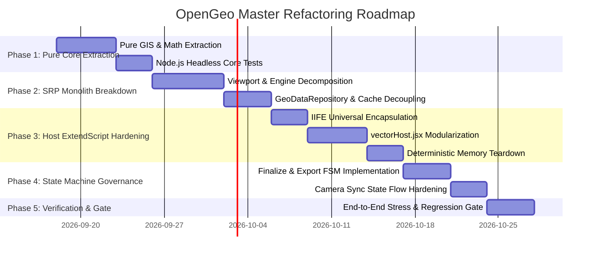

# OpenGeo — Master Architectural Modernization Roadmap (v1.0 → v2.0 Architecture)

> **Document Status:** Active Master Plan  
> **Target Version:** OpenGeo v1.0.x Architecture Hardening  
> **Governance:** Enforced by `.agents/skills/opengeo-architect`  
> **Core Constraint:** Zero New Features | Zero Feature Deletions | Zero Regressions  

---

## 1. Executive Summary & Strategic Objectives

OpenGeo has achieved its initial milestone (v1.0.0 Stable Release) with complete feature delivery: 3D Camera Rig, multi-provider tile engine, vector GeoJSON overlays, spatial pins, and bi-directional AE camera synchronization.

However, the rapid feature delivery phase introduced structural debt:
1. **Responsibility Entropy**: Core coordination classes (`OpenGeoEngine`, `GeoDataRepository`, `FinalizeController`, `vectorHost.jsx`) mix up to 4 distinct software domains (DOM UI, GIS Math, Network I/O, Host Bridge).
2. **Coupling Between Pure Calculations and Side Effects**: GIS mathematics (Mercator conversions, 3D frustum planes, tile coverage) are embedded directly inside classes that instantiate DOM elements or invoke ExtendScript.
3. **ExtendScript ES3 Fragility**: Several host modules rely on shared global scope without strict IIFE isolation, creating risks of memory retention and namespace collision inside Adobe After Effects.

### The Modernization Mission
Transform OpenGeo into an **Enterprise-Grade Geospatial Motion Graphics Engine** by implementing:
* **Hexagonal Architecture** with a strict **Functional Core, Imperative Shell (FC/IS)**.
* **Single Responsibility Principle by Actor (SRP by Actor)**.
* **Finite State Machines (FSM)** for critical asynchronous lifecycles.
* **Hermetic ExtendScript ES3 Encapsulation** with explicit memory disposal.

---

## 2. The Five Modernization Phases (Roadmap Timeline)

---

## 3. Detailed Phase Breakdown

### Phase 1: Functional Core Extraction (Pure GIS & Math Domain)
* **Goal**: Isolate all non-I/O mathematical and geometric algorithms into a pure, headless domain layer.
* **Deliverables**:
  * Create `client/js/core/geometry/`:
    * `MercatorMath.js`: Pure forward/inverse Mercator projection, meters-per-pixel, ground resolution.
    * `FrustumMath.js`: 3D camera projection matrix, ray-plane intersection, tilt bounds, horizon horizon calculation.
    * `TileMath.js`: Pure tile coordinate math, Slippy Map conversions, bounding box to tile ranges.
  * Headless Unit Test Suite: 100% test coverage running purely in Node.js without browser or CEP mocks.
* **Verification Gate**: `npm test` passes 162/162.

### Phase 2: Single Responsibility Decomposition (Client Monoliths)
* **Goal**: Break down god-classes into cohesive delegates while maintaining original entrypoint APIs via the **Façade Pattern**.
* **Deliverables**:
  * Decompose `client/js/map/Viewport.js` into:
    * `ViewportState.js`: Internal camera parameters.
    * `ViewportProjection.js`: Delegates to `FrustumMath`.
    * `Viewport.js` (Façade): Exposes original methods (`latLngToPoint`, `pointToLatLng`) without breaking existing callers.
  * Decompose `client/js/engine/OpenGeoEngine.js` into:
    * `EnginePipelineOrchestrator.js`: Download & render sequencing.
    * `EngineCameraSyncBridge.js`: AE synchronization listener.
    * `OpenGeoEngine.js` (Façade): Preserves public interface.
  * Decompose `client/js/core/GeoDataRepository.js` into:
    * `ChunkStreamReader.js`: Pure I/O reading.
    * `DatasetCacheManager.js`: Memory storage & eviction.
* **Verification Gate**: `npm test` passes 162/162 + `node scripts/tests/map/viewport-resize.test.js`.

### Phase 3: Host ExtendScript ES3 Hardening & Safety (`host/modules/`)
* **Goal**: Eliminate global variable leakage, modularize `vectorHost.jsx`, and enforce deterministic memory cleanup in After Effects.
* **Deliverables**:
  * Universal IIFE Encapsulation for all 13 JSX modules:
    * Standard wrapper pattern: `(function(context) { ... })($._opengeo);`
  * Modularize `host/modules/vectorHost.jsx` (753 SLOC, Complexity 388):
    * `vectorPathBuilder.jsx`: Point-to-bezier coordinate generation.
    * `vectorStyleApplicator.jsx`: Stroke, fill, dashes, opacity expressions.
    * `vectorHost.jsx` (Dispatcher): Clean router delegating to builders.
  * Memory Teardown Protocol: Explicit `null` assignment for large FootageItem and CompItem references in `finally` blocks.
* **Verification Gate**: `npm test` passes 162/162 + `npm run verify:package`.

### Phase 4: State Machine Governance (FSM for Critical Lifecycles)
* **Goal**: Replace ad-hoc boolean flags with formal Finite State Machines to eliminate race conditions during heavy async workflows.
* **Deliverables**:
  * `FinalizeStateMachine.js`:
    * States: `IDLE` → `PREPARING_STAGE` → `DOWNLOADING_TILES` → `STITCHING_MEGATILES` → `COMMITTING_AE_COMP` → `FINALIZED` (or `ROLLED_BACK`).
    * Rejects overlapping export requests and invalid user inputs deterministically.
  * `SyncStateMachine.js`:
    * States: `DETACHED` → `ATTACHED_IDLE` → `SCRUBBING_CTI` → `RECORDING_KEYFRAMES` → `CAPTURING_TRAJECTORY`.
* **Verification Gate**: All 162 tests pass + `scripts/ae-sync-camera-regression.js`.

### Phase 5: Architectural Certification & Documentation Baseline
* **Goal**: Re-generate codebase manifests, run deep compliance audits, and establish immutable quality gates.
* **Deliverables**:
  * Update `docs/BASELINE_MANIFEST.json`.
  * Run automated `architect-audit.js`: Confirm zero files exceed entropy score 3, and zero ES3 leakage warnings remain.
  * Package verification: `npm run verify:release`.

---

## 4. Architectural Rules of Engagement

1. **Atomic Micro-Steps**: Never refactor more than one module at a time. Each step must end in a green test pass.
2. **Façade Invariance**: Any refactored class must keep its exact public constructor and method signatures intact via delegation.
3. **No Dead Code**: Obsolete methods must not be commented out or kept as zombies; git history serves as permanent backup.
4. **ExtendScript Syntax Baseline**: ES3 only (no `let`, `const`, arrow functions, `Array.prototype.forEach`, or template literals in `host/`).
