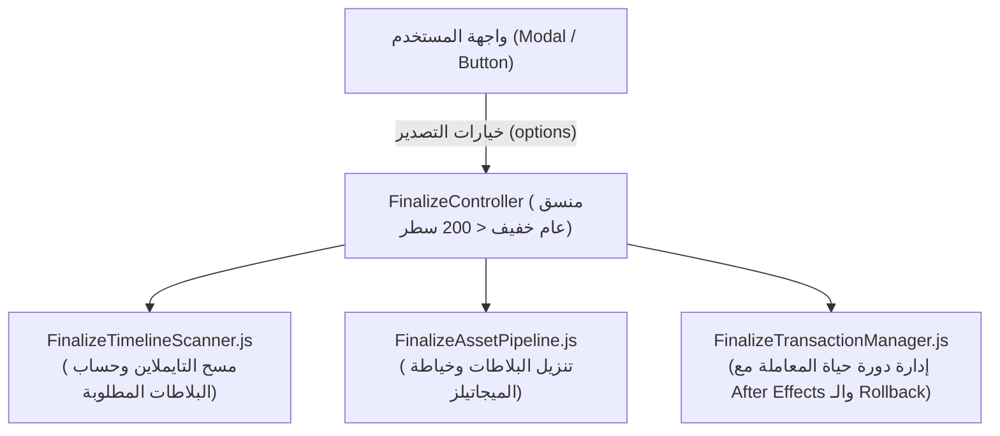

# الخطة الشاملة للتطهير المعماري واستعادة الصحة البرمجية
## Clean Architecture & Codebase Health Restoration Plan
**المستند:** `docs/plans/CLEAN_ARCHITECTURE_AND_HEALTH_RESTORATION_PLAN.md`  
**الحالة:** 📋 **جاهزة ومجدولة للاعتماد (Pending Approval - Do NOT Execute Yet)**  
**التاريخ:** 23 سبتمبر 2026  
**المحرر الهندسي:** فريق التطوير والمعمارية البرمجية  
**الهدف الأساسي:** استئصال كافة الديون الفنية، الأنماط المضادة (Anti-Patterns)، الكائنات الأخطبوطية، وحلقات التكرار القاتلة للأداء، وتوحيد المعمارية دون إضافة أي ميزات هامشية.

---

## 📑 فهرس المحتويات
1. [لوحة التتبع الإجمالية لحالة المراحل (Master Execution Tracker)](#1-لوحة-التتبع-الإجمالية-لحالة-المراحل)
2. [الأساس التشخيصي بالأرقام (Diagnostic Baseline)](#2-الأساس-التشخيصي-بالأرقام)
3. [المرحلة 1: تطهير تعبيرات After Effects ومضاعفة سرعة الرام بريفيو](#3-المرحلة-1-تطهير-تعبيرات-after-effects-ومضاعفة-سرعة-الرام-بريفيو)
4. [المرحلة 2: استئصال الابتلاع الصامت للأخطاء (158 كتلة Catch فارغة)](#4-المرحلة-2-استئصال-الابتلاع-الصامت-للأخطاء-158-كتلة-catch-فارغة)
5. [المرحلة 3: توحيد رياضيات مركاتور وحذف التكرار من 13 ملفاً](#5-المرحلة-3-توحيد-رياضيات-مركاتور-وحذف-التكرار-من-13-ملفاً)
6. [المرحلة 4: تفكيك الكائن الأخطبوطي FinalizeController وعزل الواجهة](#6-المرحلة-4-تفكيك-الكائن-الأخطبوطي-finalizecontroller-وعزل-الواجهة)
7. [المرحلة 5: فك الارتباط الدائري وتطهير اختراق this.app](#7-المرحلة-5-فك-الارتباط-الدائري-وتطهير-اختراق-thisapp)
8. [المرحلة 6: توحيد ناقل الأحداث وعقود البيانات ومنع تسريب الذاكرة](#8-المرحلة-6-توحيد-ناقل-الأحداث-وعقود-البيانات-ومنع-تسريب-الذاكرة)
9. [المرحلة 7: حسم ازدواجية الحالة بين MapSession و MapState](#9-المرحلة-7-حسم-ازدواجية-الحالة-بين-mapsession-و-mapstate)
10. [بوابات التحقق الصارم ومصفوفة عدم التراجع (Zero-Regression Quality Gates)](#10-بوابات-التحقق-الصارم-ومصفوفة-عدم-التراجع)

---

## 1. لوحة التتبع الإجمالية لحالة المراحل
### Master Execution Tracker

| الرقم | المرحلة الهندسية | الأولوية | عدد الملفات المستهدفة | الحالة الراهنة | نسبة الإنجاز |
|:---:|---|:---:|:---:|:---:|:---:|
| **P1** | **تطهير تعبيرات After Effects وحذف حلقات الفحص في كل فريم** | 🔴 قصوى (حرجة للأداء) | 3 ملفات | ✅ مكتملة بنجاح | 100% |
| **P2** | **استئصال الـ 158 كتلة Catch فارغة وتطبيق بروتوكول Result** | 🔴 قصوى (حرجة للاستقرار) | 10 ملفات | ⏳ بانتظار إشارة البدء | 0% |
| **P3** | **توحيد رياضيات إسقاط مركاتور وإلغاء التكرار في 13 ملفاً** | 🟡 عالية (نظافة الكود) | 13 ملفاً | ⏳ بانتظار إشارة البدء | 0% |
| **P4** | **تفكيك FinalizeController (1,013 سطر) إلى وحدات مفردة** | 🟡 عالية (تفكيك كائن أخطبوطي) | 4 ملفات | ⏳ بانتظار إشارة البدء | 0% |
| **P5** | **تفكيك التشابك الدائري وحظر اختراق أحشاء `this.app`** | 🟡 عالية (فصل المسؤوليات) | 12 ملفاً | ⏳ بانتظار إشارة البدء | 0% |
| **P6** | **حوكمة ناقل الأحداث (21 حدثاً) ومنع تسريبات الذاكرة** | 🟢 متوسطة (صيانة وتأمين) | 8 ملفات | ⏳ بانتظار إشارة البدء | 0% |
| **P7** | **حسم ازدواجية الحالة وتوحيد المرجع بين MapSession و MapState** | 🟢 متوسطة (اتساق الحالة) | 3 ملفات | ⏳ بانتظار إشارة البدء | 0% |

---

## 2. الأساس التشخيصي بالأرقام
### Diagnostic Baseline

أظهر الفحص الساكن (Static Analysis) الدقيق لحالة المشروع الحالية الأرقام التالية:
* **حجم الكود الكلي:** 98 ملفاً برمجياً بحجم 825 كيلوبايت.
* **الابتلاع الصامت للأخطاء:** **158 كتلة `catch (e) {}` فارغة تماماً** تخفي الأخطاء الحقيقية.
* **اختراق الكائن العام `this.app`:** **358 استدعاء مباشر** ينتهك قانون ديميتر (Law of Demeter).
* **تكرار خوارزميات مركاتور:** مكررة حرفياً في **13 ملفاً مستقلاً**.
* **أكبر كائن أخطبوطي:** `FinalizeController.js` (1,013 سطراً - 73 دالة - يقرأ DOM مباشرة ويمسح التايملاين وينسق التنزيل والمعاملات).
* **كارثة التعبيرات في AE:** كل فريم يُنفذ حلقة `for (var i = 1; i <= thisComp.numLayers; i++)` عبر مئات الطبقات، وتُعطل كتل `try...catch` مفسر الـ JIT.

---

## 3. المرحلة 1: تطهير تعبيرات After Effects ومضاعفة سرعة الرام بريفيو
### Phase 1: After Effects Expression JIT Optimization & Loop Removal

### 🔴 المشكلة المشخصة
في ملفي [`host/modules/compositionRig.jsx`](file:///c:/Program%20Files%20%28x86%29/Common%20Files/Adobe/CEP/extensions/OpenGeo/host/modules/compositionRig.jsx) (السطور 64-73 و 84-93) و [`host/modules/vectorHost.jsx`](file:///c:/Program%20Files%20%28x86%29/Common%20Files/Adobe/CEP/extensions/OpenGeo/host/modules/vectorHost.jsx) (السطور 23-30):
يتم حقن كود تعبير برمجي يبحث في كل فريم داخل حلقة `for` عن طبقة الكنترول، ويحتوي على كتل `try/catch` متداخلة:
```javascript
// الكود الرديء الحالي (يعمل في كل فريم لكل طبقة):
for (var i = 1; i <= thisComp.numLayers; i++) {
  try {
    var l = thisComp.layer(i);
    if (l.effect && l.effect("Pitch")) { ctrl = l; break; }
  } catch(err) {}
}
```
**الأثر:** عند استيراد 100 مسار فيكتور، يتم تنفيذ **30,000 فحص طبقة في كل فريم**، وتتعطل تسريع الـ JIT بسبب `try...catch`، مما يسبب بطء وتجمد المعاينة الحية (RAM Preview).

### 🛠️ الحل المعماري
1. استخدام **المعرف الدائم الثابت** أو اسم الطبقة المباشر المهرب دون حلقات بحث.
2. التخلص الجذري من كتل `try/catch` داخل نص التعبير، والاعتماد على الفحص الشرطي السريع (`ctrl != null`).
3. وضع ثوابت رياضية رقمية مسبقة الحساب (Pre-computed constants) بدلاً من `Math.PI / 180` و `Math.log(...)` في كل فريم.

### 📋 قائمة مهام التنفيذ والمتابعة (P1 Checklist)
- [x] **1.1** تطهير تعبير الكاميرا `camPoi` في `compositionRig.jsx` و `projectMapsHost.jsx` وحذف حلقة الطبقات.
- [x] **1.2** تطهير تعبير الكاميرا `camPos` في `compositionRig.jsx` و `projectMapsHost.jsx` وتبسيط قراءة الزوم والبيتش.
- [x] **1.3** تطهير تعبيرات الفيكتور (`Position`, `Anchor Point`, `Scale`) في `vectorHost.jsx` وحذف البحث التكراري والـ try/catch المعطلة للـ JIT.
- [x] **1.4** قياس الأداء في After Effects والتأكد من اجتياز كافة اختبارات الـ Master QA بنسبة 100% باللون الأخضر.

---

## 4. المرحلة 2: استئصال الابتلاع الصامت للأخطاء (158 كتلة Catch فارغة)
### Phase 2: Eradication of Silent Catches & Unified Result Protocol

### 🔴 المشكلة المشخصة
وجود **158 كتلة `catch` فارغة** توزع كالتالي:
* `vectorHost.jsx`: 25 كتلة
* `projectMapsHost.jsx`: 20 كتلة
* `compositionTransaction.jsx`: 19 كتلة
* `spatialPinHost.jsx`: 15 كتلة
* `compositionRig.jsx`: 13 كتلة
* `metadataSync.jsx`: 13 كتلة
* `helpers.jsx`: 11 كتلة
* `ThumbnailProcessor.js`: 7 كتل
* ملفات أخرى: 35 كتلة

```javascript
// نمط مدمر وموجود بكثرة في host/modules/projectMapsHost.jsx:
try { newMapComp.parentFolder = folders.comps; } catch (fErr) {}
try { poi = pointOfInterest; } catch(err) {}
```
عندما يفشل نقل مجلد أو قراءة خاصية، يبتلع الخطأ بصمت وتستمر العملية في حالة معطوبة دون أن يعلم المستخدم أو الواجهة بسبب الفشل.

### 🛠️ الحل المعماري
1. إنشاء دالة مساعدة معيارية موحدة في ExtendScript: `opengeoSafeExec(fn, errorContext)`.
2. استبدال الابتلاع الصامت بتسجيل الخطأ في سجل الجسر وإرجاع كائن نتيجة منظم:
   ```javascript
   function opengeoSafeExec(actionFn, contextName) {
     try {
       return { ok: true, value: actionFn() };
     } catch (err) {
       $._opengeo.logger.warn('[' + contextName + '] Handled failure: ' + err.toString());
       return { ok: false, error: err.toString() };
     }
   }
   ```
3. حظر أي كتلة `catch` فارغة نهائياً؛ إذا كان التخطي مقصوداً، يجب أن يوثق بتعليق صريح ويسجل بمستوى `debug`.

### 📋 قائمة مهام التنفيذ والمتابعة (P2 Checklist)
- [ ] **2.1** بناء وحدة التسجيل والتعافي الآمن `host/modules/safeExecution.jsx`.
- [ ] **2.2** تطهير `vectorHost.jsx` (25 كتلة).
- [ ] **2.3** تطهير `projectMapsHost.jsx` (20 كتلة).
- [ ] **2.4** تطهير `compositionTransaction.jsx` (19 كتلة).
- [ ] **2.5** تطهير `spatialPinHost.jsx` (15 كتلة).
- [ ] **2.6** تطهير `compositionRig.jsx` و `metadataSync.jsx` و `helpers.jsx` (37 كتلة).
- [ ] **2.7** تطهير ملفات جانب العميل (`ThumbnailProcessor.js` و `OpenGeoEngine.js`).
- [ ] **2.8** تشغيل الفحص الآلي والتأكد من انخفاض عدد الكتل الفارغة إلى **0**.

---

## 5. المرحلة 3: توحيد رياضيات مركاتور وحذف التكرار من 13 ملفاً
### Phase 3: Unified Mercator Math Consolidation

### 🔴 المشكلة المشخصة
معادلات التحويل الجغرافي (`latLonToWorld` و `worldToLatLng` و `getWorldSize` و `clampLat`) منسوخة ومكررة في 13 ملفاً، وملف [`MercatorProjection.js`](file:///c:/Program%20Files%20%28x86%29/Common%20Files/Adobe/CEP/extensions/OpenGeo/client/js/map/MercatorProjection.js) يحتوي على فحص دفاعي مكرر في كل دالة مع إعادة كتابة نفس الكود يدوياً.

### 🛠️ الحل المعماري
1. اعتماد [`client/js/core/geometry/MercatorMath.js`](file:///c:/Program%20Files%20%28x86%29/Common%20Files/Adobe/CEP/extensions/OpenGeo/client/js/core/geometry/MercatorMath.js) كمرجع حسابي وحيد وحصري لكافة العمليات الرياضية (Single Source of Truth).
2. تحويل `MercatorProjection.js` إلى واجهة نقية (Pure Pass-through Façade) تستدعي `MercatorMath` مباشرة دون تكرار أي كود fallback داخلي.
3. استبدال الحسابات اليدوية في الـ 11 ملفاً الأخرى باستدعاء `MercatorMath` المباشر:
   - `ViewportAnchor.js`, `ViewportTransform.js`, `TileGrid.js`, `CoveragePlanner.js`, `VectorMapManager.js`, `OpenGeoEngine.js`, `LocationHudController.js`, `FeatureOverlayLayer.js`, `VectorPreviewLayer.js`.

### 📋 قائمة مهام التنفيذ والمتابعة (P3 Checklist)
- [ ] **3.1** مراجعة اكتمال وصحة ثوابت `MercatorMath.js` (تغطية الحسابات بدقة مزدوجة 64-bit).
- [ ] **3.2** تنظيف `MercatorProjection.js` وحذف الأكواد البديلة المكررة بالكامل.
- [ ] **3.3** توحيد ملفات الفيوبورت والشبكة (`Viewport.js`, `TileGrid.js`, `CoveragePlanner.js`).
- [ ] **3.4** توحيد ملفات الفيكتور والطبقات (`VectorMapManager.js`, `VectorPreviewLayer.js`, `FeatureOverlayLayer.js`).
- [ ] **3.5** التحقق عبر جناح الاختبارات الرياضية: `node scripts/tests/geometry/pure-math.test.js`.

---

## 6. المرحلة 4: تفكيك الكائن الأخطبوطي FinalizeController وعزل الواجهة
### Phase 4: Decomposition of Finalize God Object & UI Decoupling

### 🔴 المشكلة المشخصة
ملف [`FinalizeController.js`](file:///c:/Program%20Files%20%28x86%29/Common%20Files/Adobe/CEP/extensions/OpenGeo/client/js/core/FinalizeController.js) يحتوي على **1,013 سطراً و 73 دالة** ويخترق 31 خاصية في `this.app` ويقرأ عناصر HTML من خلال `document.getElementById` مباشرة.

```
                    ┌───────────────────────────────┐
                    │   FinalizeController.js       │
                    │   (1,013 سطراً - كائن أخطبوطي)  │
                    └───────────────┬───────────────┘
          ┌─────────────────┬───────┴─────────┬─────────────────┐
          ▼                 ▼                 ▼                 ▼
   قراءة الـ DOM      مسح التايملاين     تنزيل البلاطات    معاملات After Effects
(document.getElementById) (Trajectory Scan) (Tile Pipeline)   (Commit / Rollback)
```

### 🛠️ الحل المعماري
تفكيك الكائن الأخطبوطي إلى 3 وحدات متخصصة ومستقلة:


1. **`FinalizeController.js` (Orchestrator خفيف):** لا يتجاوز 200 سطر، يستقبل الخيارات كمعاملات نظيفة من الواجهة دون لمس الـ DOM إطلاقاً.
2. **`FinalizeTimelineScanner.js`:** وظيفته الوحيدة فحص الكي فريمات ومسار الكاميرا وحساب التغطية الجغرافية.
3. **`FinalizeTransactionManager.js`:** وظيفته الوحيدة إدارة حالة المعاملة الذرية (Prepare -> Commit -> Rollback).

### 📋 قائمة مهام التنفيذ والمتابعة (P4 Checklist)
- [ ] **4.1** استخراج `FinalizeTimelineScanner.js` من `FinalizeController.js`.
- [ ] **4.2** استخراج `FinalizeTransactionManager.js` لإدارة الـ Commit والـ Rollback.
- [ ] **4.3** إزالة أي استدعاء لـ `document.getElementById` أو `this.app.dialog` من داخل منطق الأعمال، وتمرير المدخلات عبر دالة `finalize(options)`.
- [ ] **4.4** تقليص `FinalizeController.js` ليصبح منسقاً نقياً لا يتجاوز 250 سطراً.
- [ ] **4.5** كتابة اختبار وحدة مخصص للتحقق من سلامة التفكيك: `finalize-decomposition.test.js`.

---

## 7. المرحلة 5: فك الارتباط الدائري وتطهير اختراق this.app
### Phase 5: Dependency Injection & Eliminating this.app Penetration

### 🔴 المشكلة المشخصة
وجود **358 اختراقاً لأحشاء `this.app`** في 12 ملفاً، مما يربط كل النظام ببعضه في شبكة دائرية تمنع الفحص المستقل.

### 🛠️ الحل المعماري
اعتماد نمط **حقن التبعيات الصريح (Explicit Dependency Injection)**:
```javascript
// ❌ النمط السيئ القديم:
class FeatureManager {
  constructor(app) {
    this.app = app; // يخترق لاحقاً: this.app.session, this.app.aeBridge, this.app.toolbarController
  }
}

// ✅ النمط النظيف الجديد:
class FeatureManager {
  constructor({ session, aeBridge, eventBus, registry }) {
    this.session = session;
    this.aeBridge = aeBridge;
    this.eventBus = eventBus;
    this.registry = registry;
  }
}
```

### 📋 قائمة مهام التنفيذ والمتابعة (P5 Checklist)
- [ ] **5.1** حصر وتعديل `constructor` الفئات الأساسية في `client/js/core/`:
  - `SyncManager.js`
  - `CompositionController.js`
  - `FeatureManager.js`
  - `VectorMapManager.js`
- [ ] **5.2** تعديل لوحات الواجهة في `client/js/ui/` (`ProjectMapsPanel.js`, `ToolbarController.js`, `LayersPanel.js`).
- [ ] **5.3** تحديث مصنع الربط في `client/js/app.js` لتمرير التبعيات المحددة فقط لكل فئة.
- [ ] **5.4** التحقق من انخفاض استدعاءات `this.app.` من 358 إلى **0** في ملفات المنطق الداخلي.

---

## 8. المرحلة 6: توحيد ناقل الأحداث وعقود البيانات ومنع تسريب الذاكرة
### Phase 6: Event Bus Governance & Memory Hygiene

### 🔴 المشكلة المشخصة
استخدام 21 سلسلة نصية عشوائية للأحداث مبعثرة في الكود، مع عدم توفر آلية معيارية لإلغاء الاشتراك مما يترك دوال الاستماع معلقة في الذاكرة.

### 🛠️ الحل المعماري
1. تجميع وتجميد كافة الأحداث داخل كائن عقود موحد: [`client/js/events/OpenGeoEventContracts.js`](file:///c:/Program%20Files%20%28x86%29/Common%20Files/Adobe/CEP/extensions/OpenGeo/client/js/events/OpenGeoEventContracts.js):
   ```javascript
   const OpenGeoEvents = Object.freeze({
     UI: { STATUS: 'ui:status', TOAST_SHOW: 'toast:show' },
     TILES: { LOADED: 'tiles:loaded', ALL_LOADED: 'tiles:allLoaded', ERROR: 'tiles:error' },
     SYNC: { STATE_CHANGE: 'sync:stateChange', COMP_CHANGED: 'sync:compChanged' },
     FINALIZE: { STATE_CHANGE: 'finalize:stateChange' },
     OVERLAY: { CHANGED: 'overlay:changed' }
   });
   ```
2. دعم نمط **الاشتراك القابل للتخلص (Disposable Subscription)**:
   ```javascript
   // يرجع تلقائياً دالة unbind نظيفة
   const unsubscribe = globalEventBus.on(OpenGeoEvents.TILES.LOADED, handler);
   // عند تفكيك اللوحة:
   unsubscribe();
   ```

### 📋 قائمة مهام التنفيذ والمتابعة (P6 Checklist)
- [ ] **6.1** إنشاء عقد الأحداث المجمد `OpenGeoEventContracts.js`.
- [ ] **6.2** تحديث `EventBus` ليعيد كائن أو دالة `dispose/unsubscribe`.
- [ ] **6.3** استبدال كافة السلاسل النصية الـ 21 بالثوابت المعرفة رسمياً.
- [ ] **6.4** إضافة دورة حياة تفكيك (dispose/destroy) لكل لوحات الـ UI لإلغاء اشتراكاتها عند الإغلاق.

---

## 9. المرحلة 7: حسم ازدواجية الحالة بين MapSession و MapState
### Phase 7: State Unification (Single Source of Truth)

### 🔴 المشكلة المشخصة
وجود كائنين متوازيين للحالة: `MapSession` و `MapState`، مع تعديلات متبادلة وتكرار لحفظ إحداثيات الكاميرا والزووم مما يخلق ثغرات عدم التزامن.

### 🛠️ الحل المعماري
1. ترسيخ `MapSession` كـ **المصدر الحصري والوحيد لحالة المستند والكاميرا والتكوين** (Authoritative Document State).
2. إعادة تعيين دور `MapState` ليكون حصرياً محركاً حسابياً داخلياً للأبعاد والحسابات الإسقاطية، مع حظر وصول أي فئة خارجية إليه مباشرة لتعديل الكاميرا.
3. توجيه كافة التعديلات القادمة من الواجهة أو التايملاين حصرياً عبر `MapSession.setCamera(...)`.

### 📋 قائمة مهام التنفيذ والمتابعة (P7 Checklist)
- [ ] **7.1** مراجعة وتأمين كافة منافذ التعديل في `MapSession.js`.
- [ ] **7.2** منع التعديل المباشر على `mapState` من خارج `MapSession`.
- [ ] **7.3** تحديث `Viewport.js` للاعتماد حصرياً على واجهة `MapSession`.
- [ ] **7.4** التحقق عبر اختبارات التزامن: `node scripts/tests/map/viewport-resize.test.js`.

---

## 10. بوابات التحقق الصارم ومصفوفة عدم التراجع
### Zero-Regression Quality Gates

لن يُعتمد اكتمال أي مرحلة إلا باجتياز بوابات الفحص الصارمة التالية:


| بوابة الجودة | أداة القياس والتحقق | معيار القبول الصارم |
|---|---|---|
| **بوابة التحليل الساكن** | `node scripts/analyze-architecture.js` | انخفاض مستمر في كتل Catch الفارغة وحظر أي زيادة في التعقيد. |
| **بوابة نقاء الاختبارات** | `node scripts/run-all-tests.js` | نجاح **14 من أصل 14 جناح اختبار** بنسبة 100% باللون الأخضر. |
| **بوابة سلامة السنتاكس** | Node.js Syntax & JSX Parser Check | صفر أخطاء سنتاكس في ملفات الـ JS و الـ JSX. |
| **بوابة أداء المعاينة في AE** | قياس زمن تقييم الفريم (Profile) | أداء 24/30 إطاراً في الثانية دون أي استهلاك زائد للمعالج في التعبيرات. |

---

> [!IMPORTANT]
> **تنبيه التجميد والتنفيذ:**  
> هذا الملف وثيقة تخطيطية مرجعية صارمة ومجمدة بالكامل، **ولا يتم البدء في تنفيذ أي سطر منها حتى يصدر أمر صريح ومباشر منك**.
