# Corrective Architecture Plan: Safe Composition Duplication & Identity Isolation

> **Type:** Corrective / Stabilization Architecture Plan (خطة تصحيحية لحماية سلامة المشاريع)  
> **Target Module:** Project Maps (`ProjectMapsPanel.js`, `projectMapsHost.jsx`, `bridgeDispatcher.jsx`)  
> **Status:** **🏆 100% EXECUTED & CERTIFIED (تم التنفيذ والاعتماد بالكامل — 100% GREEN)**  
> **Date:** 2026-09-18  

---

## 🎯 1. الهدف وداعي التصحيح (The Problem & The Goal)

### المشكلة الفنية (The Critical Collision Vulnerability)
في برنامج After Effects، يقوم المستخدمون بشكل روتيني بعمل تكرار للكومبوزيشن عبر اختصار البرنامج الأصيل (`Ctrl+D / Cmd+D`). عندما يتم تكرار كومبوزيشن خريطة OpenGeo بهذه الطريقة اليدوية:
1. **تطابق الهوية (Document Identity Collision):** الكومب الجديد ينسخ حرفياً حقل `comp.comment` وتعليقات الطبقات، حاملاً نفس الـ `documentId` تماماً (مثل `map_doc_1`).
2. **عدم تكرار الكومب الداخلي (Shared Inner Map Pre-Comp):** برنامج After Effects يكرر فقط الكومبوزيشن الخارجية؛ بينما الكومبوزيشن التحتية الحاملة للبلاطات (`OpenGeo Map - Map - <suffix>`) تظل **مشتركة بين الكومبين**. أي تعديل أو تحريك في الكومب الجديد يعدل فوراً الكومب القديم!
3. **الحذف الكارثي للبلاطات (Catastrophic Asset Deletion):** عندما يقوم المستخدم بعمل Preview أو Finalize لأحد الكومبين، يقوم كود التنظيف (`opengeoRemoveDocumentAssets`) بحذف بلاطات الوثيقة القديمة بناءً على الـ `documentId`، مما يمسح بلاطات الكومب التوأم بصمت ويفسد مشروعه!

### الحل التصحيحي المعتمد (The Corrective Native Solution)
كما وجه المستخدم الكريم، الحل الجذري والآمن هو توفير خيار تكرار أصيل عبر **زر "Duplicate"** في بطاقة الخريطة بنافذة المشاريع (**Project Maps**):
- إضافة زر تكرار (`.project-map-duplicate`) بجانب زر التقاط الغلاف في بطاقة كل خريطة.
- بناء محرك استنساخ عميق وذري في ExtendScript (`projectMapsHost.jsx`) تحت كتلة تراجع موحدة `withUndoGroup("OpenGeo: Duplicate Map")`.
- الاستنساخ يكرر كلاً من:
  1. الكومبوزيشن الداخلية للبلاطات (`mapComp.duplicate()`) ويعزلها تماماً.
  2. الكومبوزيشن الخارجية (`containingComp.duplicate()`).
  3. إعادة ربط الطبقة التحتية عبر `nestedLayer.replaceSource(newMapComp, false)`.
  4. توليد `documentId` فريد ومستقل كلياً وتحديث تعليقات كافة الطبقات والكنترولر والميتاداتا.
  5. نسخ ملف الصورة المصغرة (Thumbnail) على القرص للكومب الجديد.
  6. فتح وتفعيل الكومبوزيشن الجديدة فوراً وتحديث قائمة المشاريع.

---

## 🏗️ 2. التفاصيل الهندسية لتنفيذ خطوة الاستنساخ (Architecture Flow)

```mermaid
sequenceDiagram
    autonumber
    actor Artist as المستخدم
    participant UI as ProjectMapsPanel.js
    participant Dispatcher as bridgeDispatcher.jsx
    participant Host as projectMapsHost.jsx
    participant AE as After Effects Engine
    participant Disk as الأقراص OpenGeo_Assets

    Artist->>UI: النقر على زر Duplicate في بطاقة الخريطة
    UI->>UI: تفعيل حالة الانتظار للزر (Busy Pulse Animation)
    UI->>Dispatcher: invoke('project.duplicateMap', { compId, documentId })
    Dispatcher->>Host: opengeoDuplicateProjectMap(compId, documentId)

    rect rgb(20, 35, 25)
        Note over Host,AE: تنفيذ ذري داخل withUndoGroup واحد
        Host->>Host: توليد newDocumentId فريد وتحديد الاسم الجديد (مثلاً • 3017)
        Host->>AE: تكرار الكومب الداخلي للبلاطات: mapComp.duplicate()
        Host->>AE: تحديث اسم وتعليق الكومب الداخلي وطبقة MapPivot والبلاطات
        Host->>AE: تكرار الكومب الخارجي: containingComp.duplicate()
        Host->>AE: تبديل مصدر الطبقة التحتية: layer.replaceSource(newMapComp, false)
        Host->>AE: تحديث تعليق OpenGeo Controller والـ Expressions
        Host->>AE: كتابة ميتاداتا JSON جديدة كلياً في newContainingComp.comment
    end

    rect rgb(30, 30, 45)
        Host->>Disk: نسخ صورة الغلاف thumb_<oldDoc>.png إلى thumb_<newDoc>.png
    end

    Host->>AE: newContainingComp.openInViewer()
    Host-->>Dispatcher: إرجاع بيانات الكومب الجديد (newCompId, newDocumentId)
    Dispatcher-->>UI: رد النجاح
    UI->>UI: إظهار إشعار Toast بنجاح النسخ وتحديث القائمة
```

---

## 📁 3. الملفات المعنية بالتعديل (Scope of Changes)

### 1. طبقة ExtendScript Host:
- **[`host/modules/projectMapsHost.jsx`](file:///c:/Program%20Files%20%28x86%29/Common%20Files/Adobe/CEP/extensions/OpenGeo/host/modules/projectMapsHost.jsx):**
  - دالة `opengeoGenerateDuplicateName(baseName, existingComps)` لإنتاج أسماء مانعة للتعارض (مثل `OpenGeo Map • 3017` أو `North Africa (Copy)`).
  - دالة `opengeoDuplicateProjectMap(compId, documentId)` لتنفيذ الاستنساخ العميق والتبديل والعزل الشامل.
  - تسجيل الدالة على النطاق `$._opengeo.projectMaps.duplicateProjectMap`.
- **[`host/modules/bridgeDispatcher.jsx`](file:///c:/Program%20Files%20%28x86%29/Common%20Files/Adobe/CEP/extensions/OpenGeo/host/modules/bridgeDispatcher.jsx):**
  - إضافة المسار `'project.duplicateMap'` في جدول الأوامر المعتمد `opengeoBridgeHandlers`.

### 2. طبقة واجهة المستخدم (Client Panel & Styles):
- **[`client/js/ui/ProjectMapsPanel.js`](file:///c:/Program%20Files%20%28x86%29/Common%20Files/Adobe/CEP/extensions/OpenGeo/client/js/ui/ProjectMapsPanel.js):**
  - في دالة `_createCard`: إضافة زر التكرار `.project-map-duplicate` بجانب زر الكاميرا يحمل أيقونة `copy` من مكتبة Lucide.
  - إضافة دالة المعالجة `_duplicateMap(map, duplicateButton, card)` مع مؤشر انشغال وإشعار Toast وتحديث فوري للوحة.
- **[`client/css/modules/08-project-maps.css`](file:///c:/Program%20Files%20%28x86%29/Common%20Files/Adobe/CEP/extensions/OpenGeo/client/css/modules/08-project-maps.css):**
  - تنسيق حاوية الأزرار `.project-map-card-actions` في الركن العلوي الأيمن للبطاقة.
  - تنسيق زر التكرار `.project-map-duplicate` ليتطابق بجمالية وفخامة مع زر الكاميرا الحالي.

### 3. الاختبارات المؤتمتة (Automated Test Suite):
- **[`scripts/tests/project-maps/project-maps.test.js`](file:///c:/Program%20Files%20%28x86%29/Common%20Files/Adobe/CEP/extensions/OpenGeo/scripts/tests/project-maps/project-maps.test.js):**
  - إضافة اختبارات وحدة تتحقق من:
    - توليد معرف فريد `newDocumentId`.
    - عزل الكومب الداخلي وتبديل مصدره عبر `replaceSource`.
    - تحديث تعليقات الكنترولر والميتاداتا بدون تداخل.
    - سلامة تكرار الغلاف للكومب الجديد.
    - الحفاظ على نسبة النجاح 100% في كافة أجنحة الاختبارات الـ 12.

---

## 🏆 4. حالة الخطة واعتماد التنفيذ (Execution Status & Sign-off)

> [!NOTE]
> **تم التنفيذ والاعتماد بنجاح 100%:** تم تطبيق هذه الخطة الهندسية بالكامل في الإصدار v1.0.2 عبر الالتزام الصارم بمعايير الهندسة التصحيحية (Commit `7031607`):
> 1. **ExtendScript Host:** تم بناء دالة `opengeoDuplicateProjectMap` مع استنساخ الكومبوزيشن الداخلية وتبديل المصدر `replaceSource(newMapComp, false)` وإعادة توجيه تعبيرات `MapPivot` داخل كتلة تراجع موحدة `withUndoGroup`.
> 2. **منع تعارض الأسماء:** تم بناء دالة `opengeoGenerateDuplicateName` للترقيم التلقائي الآمن المتزايد (مثل `• 3017` أو `North Africa (Copy)`).
> 3. **واجهة المستخدم (UI):** تم إضافة زر الاستنساخ `.project-map-duplicate` بأيقونة `copy` في بطاقة كل خريطة مع مؤشر انتظار نبضي وتحديث فوري للوحة المشاريع.
> 4. **بروتوكول الجسر:** تم تسجيل المسار `'project.duplicateMap'` في `bridgeDispatcher.jsx`.
> 5. **الأصول والصور المصغرة:** يتم نسخ صورة الغلاف وشريط الإطارات تلقائياً على القرص بالمعرف الجديد `thumb_<newDoc>.png`.
> 6. **الاختبارات المؤتمتة:** تم إضافة 18 فحص وحدة في `project-maps.test.js` واجتياز جميع أجنحة الاختبارات الـ 12 بنسبة 100% Green بدون أي انحدار.
