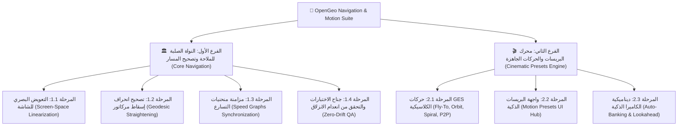
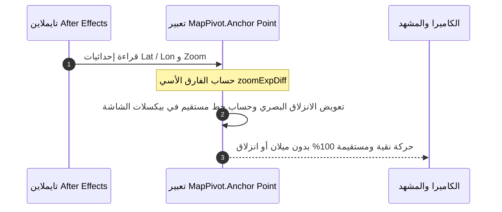
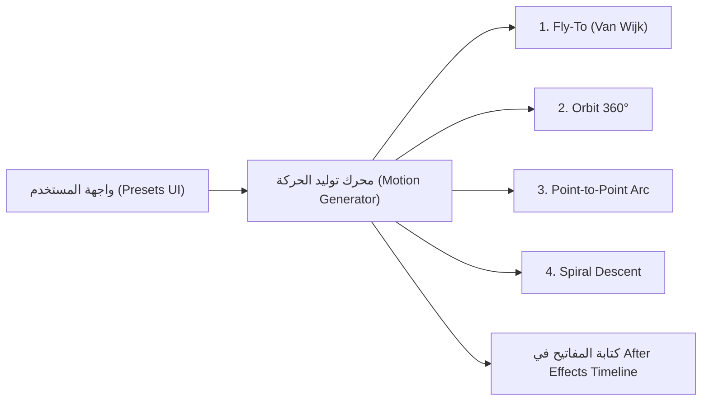

# خارطة الطريق الهندسية: محرك الملاحة الفضائية والبريسات السينمائية
## Engineering Roadmap: Cinema-Grade Navigation Engine & Google Earth Studio Presets

> **النوع:** خارطة طريق معمارية وتنفيذية (Architecture & Execution Roadmap)  
> **النطاق:** تطوير محرك الملاحة الأساسي وبناء مكتبة الحركات السينمائية الجاهزة داخل OpenGeo  
> **الحالة:** 📋 **مخططة ومصنفة (Planned & Structured)**  
> **الموقع:** `docs/plans/NAVIGATION_AND_PRESETS_ROADMAP.md`  
> **التاريخ:** 20 سبتمبر 2026  

---

## 🎯 1. الرؤية الهندسية (The Vision)

الهدف الاستراتيجي هو نقل إضافة **OpenGeo** من مجرد أداة لتنزيل وترتيب بلاطات الخرائط إلى **محرك ملاحة وإخراج سينمائي متكامل (Cinema-Grade Camera Engine)** يضاهي ويتفوق على **Google Earth Studio**، مع الاحتفاظ بكافة المزايا الحصرية لـ OpenGeo:
1. العمل **Native بنسبة 100% داخل Adobe After Effects** دون الحاجة لتصدير واستيراد خارجي.
2. دعم **أي مزود خرائط وصور أقمار صناعية في العالم** (Bing, Esri, Mapbox, Google, OSM, CartoDB).
3. التكامل المباشر مع عناصر الفيكتور والـ 3D Nulls والـ Shape Layers والنصوص.

---

## 🗺️ 2. الهيكل الهيكلي للفرعين (Two-Branch Architecture)

---

## 🏛️ الفرع الأول: النواة الصلبة للملاحة وتصحيح المسارات
### Branch 1: Rock-Solid Core Navigation & Drift Elimination

الهدف من هذا الفرع هو ضمان أن **أي مفاتيح حركة يدوية** يضعها المستخدم في التايملاين تسير في مسار بصري مستقيم تماماً بدون انزلاق، وبدون حدوث القفزة المفاجئة أو الهبوط الساحق في آخر ثانية.

### 📋 مراحل تنفيذ الفرع الأول:

#### 🔹 المرحلة 1.1: التعويض البصري للشاشة في تعبير `MapPivot` (Screen-Space Linearization)
* **المشكلة الحالية:** المقياس يتضاعف أسياً ($S \propto 2^{\text{zoom}}$) بينما الإحداثيات تتحرك خطياً، مما يجعل الكاميرا تبدو وكأنها بطيئة جداً في البداية ثم تهجم بسرعة عنيفة في آخر لحظة، مسببة انزلاقاً بصرياً (Drift).
* **المهمة التنفيذية:**
  - تطوير تعبير `MapPivot.property('Anchor Point')` في [`host/modules/compositionRig.jsx`](file:///c:/Program%20Files%20%28x86%29/Common%20Files/Adobe/CEP/extensions/OpenGeo/host/modules/compositionRig.jsx).
  - قراءة مفاتيح الزووم والموقع السابقة واللاحقة (`key1`, `key2`).
  - حساب الفارق الأسي `zoomExpDiff = scaleLinear - scaleExponential`.
  - تعويض موضع الـ `Anchor Point` في كل فريم لضمان أن مركز الكاميرا يسير بسرعة خطية موحدة على بكسلات الشاشة.
* **مؤشر النجاح:** عند الانتقال من زووم 4 إلى زووم 16، يتحرك الهدف باتجاه منتصف الشاشة في خط مستقيم وبسرعة بصرية منتظمة من أول فريم لآخر فريم.

#### 🔹 المرحلة 1.2: تصحيح انحناء مسار مركاتور (Geodesic Straightening)
* **المشكلة الحالية:** التحريك الخطي للـ `Latitude` ينتج عنه قوس منحنٍ (S-Curve) بسبب دالة اللوغاريتم في مركاتور ($\ln(\tan(\pi/4 + \text{lat}/2))$).
* **المهمة التنفيذية:**
  - إضافة تصحيح تحويلي يحسب الموضع النظري على خريطة البيكسلات ويحولها لخط مستقيم بين نقطتي البداية والنهاية.
* **مؤشر النجاح:** انعدام أي انحناء جانبي للكاميرا أثناء الرحلات الطويلة بين القارات أو الدول.

#### 🔹 المرحلة 1.3: مزامنة منحنيات التسارع (Speed Graphs Synchronization)
* **المهمة التنفيذية:**
  - توفير دالة مساعدة لضبط الـ Bezier Handles لمفاتيح `Latitude`, `Longitude`, و `Zoom` معاً بحيث لا يسبق الموقع الزووم أو العكس.
* **مؤشر النجاح:** وصول الكاميرا إلى الارتفاع المطلوب تماماً في نفس لحظة وصولها إلى الإحداثيات المستهدفة.

#### 🔹 المرحلة 1.4: جناح الاختبارات والتحقق من انعدام الانزلاق (Zero-Drift Suite)
* **المهمة التنفيذية:**
  - إنشاء اختبار آلي جديد [`scripts/tests/map/navigation-drift.test.js`](file:///c:/Program%20Files%20%28x86%29/Common%20Files/Adobe/CEP/extensions/OpenGeo/scripts/tests/map/navigation-drift.test.js) يقيس معدل الانحراف البصري للبيكسلات أثناء الهبوط والنزول من ارتفاع شاهق.
* **مؤشر النجاح:** نسبة انحراف أقل من 0.5 بيكسل عبر مسار الهبوط بالكامل.

---

## 🎬 الفرع الثاني: محرك البريسات السينمائية الجاهزة
### Branch 2: Google Earth Studio Style Motion Presets

بناء واجهة برمجية وتفاعلية تُمكّن المصمم من اختيار نوع الحركة، وضبط مدتها، وتوليد مفاتيح الحركة السينمائية بضغطة زر واحدة.

### 📋 مراحل تنفيذ الفرع الثاني:

#### 🔹 المرحلة 2.1: مكتبة الحركات السينمائية الأساسية (Core Motion Presets)
1. **بريسات الهبوط السينمائي (Cinematic Fly-To):**
   - تطبيق **خوارزمية Van Wijk** المعتمدة في أنظمة الملاحة العالمية:
     - مرحلة الإقلاع والرفع (Lift-off): رفع الزووم قليلاً في بداية الرحلة لتوسيع الرؤية.
     - مرحلة الطيران السريع (Fast Travel): التحرك نحو الهدف في أعلى نقطة رؤية.
     - مرحلة الهبوط اللوغاريتمية (Smooth Cushion Landing): انسياب ناعم على النقطة المستهدفة.
2. **بريسات الدوران المداري (Orbit / 360° POI):**
   - تثبيت الهدف في النقطة `(Lat, Lon)` المحددة.
   - تدوير الكاميرا في دائرة كاملة $360^\circ$ حول الهدف مع الحفاظ التام على مركزيته.
   - دعم زاوية الميلان (Pitch) والارتفاع الثابت.
3. **بريسات الرحلة بين نقطتين (Point-to-Point Ballistic Arc):**
   - التحليق من مدينة أ إلى مدينة ب بقوس طيران مكافئ (Parabolic Altitude Profile).
4. **بريسات النزول الحلزوني (Spiral Descent):**
   - الدوران حول الهدف مع التكبير المستمر بالتزامن.

#### 🔹 المرحلة 2.2: واجهة التحكم بالحركات (Motion Presets Hub UI)
* **المهمة التنفيذية:**
  - بناء قسم جديد أنيق في واجهة OpenGeo باسم **Camera Studio / Motion Presets**.
  - إتاحة مدخلات:
    - اختيار النقطة المستهدفة (من البحث أو الموقع الحالي).
    - مدة الحركة بالثواني (مثلاً 3s, 5s, 8s).
    - أسلوب التوقف (Ease-In, Ease-Out, Smooth Cruise).
    - زر توليد الحركة: `Generate Camera Flight`.
* **مؤشر النجاح:** ضغطة زر واحدة تُنشئ مفاتيح حركة كاملة ومنسقة على طبقة الـ Controller في After Effects مع منحنيات Easing مثالية.

#### 🔹 المرحلة 2.3: ديناميكية الكاميرا الذكية (Auto-Banking & Lookahead)
* **المهمة التنفيذية:**
  - توجيه الكاميرا تلقائياً باتجاه الحركة (Auto-Orientation / Heading).
  - إمالة الكاميرا الجانبية أثناء المنعطفات السريعة (Banking Roll) لمحاكاة حركة الطائرات الحقيقية.

---

## 📊 3. جدول تتبع التقدم والتنفيذ (Progress Matrix)

| الفرع | المرحلة | الوصف | الحالة | الأولوية |
| :--- | :--- | :--- | :--- | :--- |
| **الفرع 1** | **المرحلة 1.1** | التعويض البصري للشاشة في `MapPivot` (`zoomExpDiff`) | ✅ **مكتملة (100% Green)** | 🔴 أولوية قصوى |
| **الفرع 1** | **المرحلة 1.2** | تصحيح انحناء مركاتور للمسارات المستقيمة والتفاف الطول | ✅ **مكتملة (100% Green)** | 🟡 أولوية عالية |
| **الفرع 1** | **المرحلة 1.3** | مزامنة منحنيات التسارع والـ Bezier Handles | ✅ **مكتملة (100% Green)** | 🟡 أولوية عالية |
| **الفرع 1** | **المرحلة 1.4** | جناح الاختبارات الآلية لثبات الملاحة (Zero-Drift 8/8) | ✅ **مكتملة (100% Green)** | 🔴 أولوية قصوى |
| **الفرع 2** | **المرحلة 2.1** | خوارزمية Van Wijk وبريسات Fly-To و Orbit | ⏳ قيد التخطيط | 🟢 مرحلة تالية |
| **الفرع 2** | **المرحلة 2.2** | واجهة المستخدم Motion Presets UI Hub | ⏳ قيد التخطيط | 🟢 مرحلة تالية |
| **الفرع 2** | **المرحلة 2.3** | التوجيه والميلان التلقائي (Banking & Heading) | ⏳ قيد التخطيط | ⚪ ميزة متقدمة |

---

## 🏁 4. معايير الاعتماد والجاهزية (Definition of Done)
1. **Zero Drift:** انعدام أي انزلاق أو تأرجح بصري للكاميرا أثناء الهبوط بين أي مستويي زووم (مثلاً من Z3 إلى Z17).
2. **One-Click Cinema:** توليد حركة طيران سينمائية شبيهة بـ Google Earth Studio بضغطة زر واحدة ومن واجهة أنيقة.
3. **100% Green QA:** نجاح كافة الاختبارات الحالية والجديدة في `scripts/run-all-tests.js` بنسبة 100%.
4. **Clean Baseline:** مطابقة تامة لـ `baseline-manifest.js` بعد إضافة الوحدات الجديدة.
