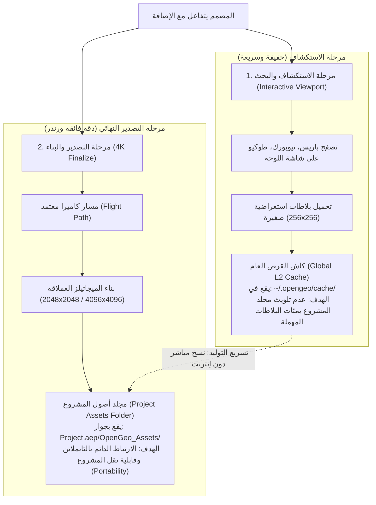
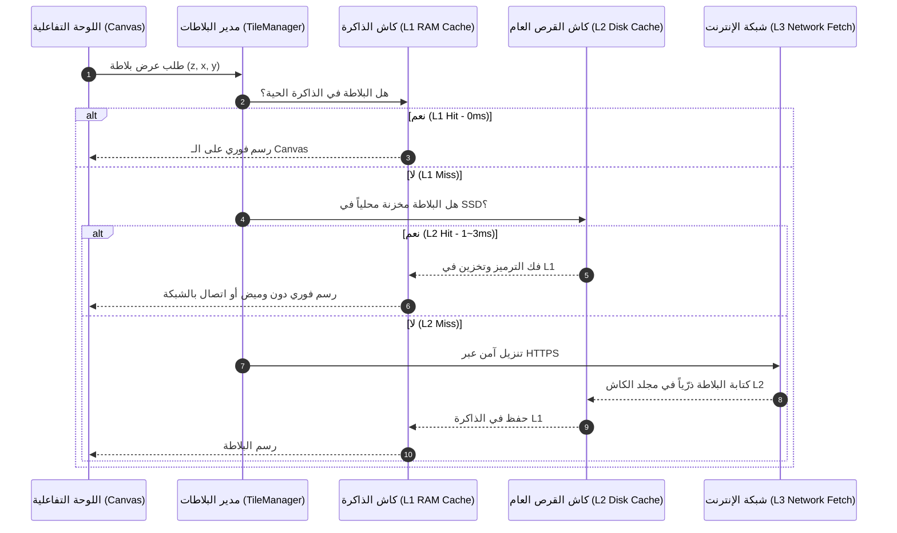
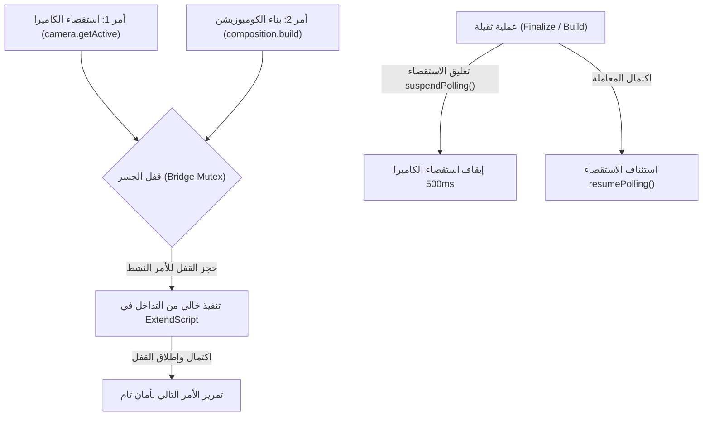
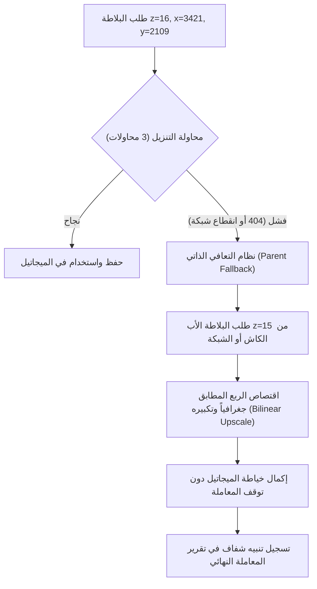

# خطة التصليد الهندسي الشامل والعميق لأنظمة OpenGeo
## Deep Subsystem Hardening & Architectural Resilience Specification
**المستند:** `docs/plans/SYSTEM_HARDENING_DETAILED_PLAN.md`  
**الحالة:** 📋 **مخططة ومفصلة هندسياً (Planned & Fully Specified)**  
**التاريخ:** 23 سبتمبر 2026  
**النطاق:** تقوية، تسريع، وتأمين كافة الأنظمة القائمة دون إضافة أي ميزات هامشية جديدة.

---

## 📑 جدول المحتويات
1. [توضيح معماري حاسم: كاش التصفح العام مقابل أصول مجلد المشروع](#1-توضيح-معماري-حاسم-كاش-التصفح-العام-مقابل-أصول-مجلد-المشروع)
2. [المرحلة الأولى: هندسة البلاطات والتخزين متعدد المستويات (Multi-Tier Tile Architecture)](#2-المرحلة-الأولى-هندسة-البلاطات-والتخزين-متعدد-المستويات)
3. [المرحلة الثانية: حوكمة الجسر والـ Mutex وعزل الاستقصاء (Bridge Mutex & Polling Isolation)](#3-المرحلة-الثانية-حوكمة-الجسر-والـ-mutex-وعزل-الاستقصاء)
4. [المرحلة الثالثة: تجميع التعبيرات البرمجية وتسريع الرام بريفيو (Expression Rig Optimization)](#4-المرحلة-الثالثة-تجميع-التعبيرات-البرمجية-وتسريع-الرام-بريفيو)
5. [المرحلة الرابعة: مناعة التوليد النهائي 4K والتعافي الذاتي (Resilient 4K Finalize Engine)](#5-المرحلة-الرابعة-مناعة-التوليد-النهائي-4k-والتعافي-الذاتي)
6. [المرحلة الخامسة: ريج الدبابيس المكانية ثلاثية الأبعاد (Cinema Spatial Pin Rig)](#6-المرحلة-الخامسة-ريج-الدبابيس-المكانية-ثلاثية-الأبعاد)
7. [مصفوفة بوابات الجودة والتحقق الصارم (Quality Gates & Verification Matrix)](#7-مصفوفة-بوابات-الجودة-والتحقق-الصارم)

---

## 1. توضيح معماري حاسم: كاش التصفح العام مقابل أصول مجلد المشروع
### Clarification: Global Browsing Cache vs. Project-Scoped Finalize Assets

السؤال الجوهري الذي يطرح نفسه:  
**لماذا نحتاج إلى كاش محلي للبلاطات إذا كنا قد اتفقنا على تنزيل وحفظ البلاطات داخل مجلد المشروع؟**

هناك **فصل معماري صارم** بين نوعين مختلفين تماماً من البيانات داخل OpenGeo:



### المقارنة الفنية التفصيلية بين النوعين:

| المعيار | كاش التصفح للوحة (Global Viewport Cache) | أصول مجلد المشروع (Project Finalized Assets) |
|---|---|---|
| **المكان في القرص** | `~/.opengeo/cache/{provider}/{z}/{x}/{y}.bin` | `{Project_Dir}/OpenGeo_Assets/{CompName}/...` |
| **طبيعة الملفات** | بلاطات استعراضية مفردة صغيرة الحجم (256×256 أو 512×512). | صور MegaTiles عملاقة مجمعة (2048×2048 أو 4096×4096) بدقة 4K. |
| **علاقتها بـ After Effects** | **لا تدخل في After Effects مطلقاً**، بل تُعرض فقط على Canvas لوحة الـ CEP. | **تُستورد رسمياً داخل مشروع AE** كطبقات Footage حقيقية في التايملاين. |
| **الهدف الأساسي** | منع وميض اللوحة أثناء البحث، وعدم إعادة استهلاك الإنترنت كلما حركت الخريطة. | ضمان أن ملف الـ `.aep` يفتح على أي جهاز كمبيوتر دون رسالة "Missing Footage". |
| **حجم التخزين وإدارته** | كاش مؤقت بنظام LRU لا يتجاوز 500MB ويحذف الأقدم ذاتياً. | أصول دائمة تظل محفوظة مع ملف العمل ما دام المشروع قائماً. |
| **نقطة التكامل العبقرية** | عندما تطلب Finalize لمسار ما، يفحص محرك التنزيل كاش التصفح أولاً؛ إذا كانت البلاطات متوفرة هناك، **ينسخها فورياً إلى مجلد المشروع في ثانية واحدة بدلاً من تنزيلها مجدداً عبر الإنترنت!** |

---

## 2. المرحلة الأولى: هندسة البلاطات والتخزين متعدد المستويات
### Phase 1: Multi-Tier Tile Ingestion Architecture

### 🎯 الهدف
القضاء على الوميض وبطء التنقل وإعادة التنزيل المتكرر من الإنترنت أثناء استكشاف الخريطة وتحديد الكادر في لوحة CEP.

### 📐 التصميم المعماري (L1 / L2 / L3)


### 🛠️ المهام التنفيذية المحددة:
1. **تطوير وحدة الكاش المحلي [`client/js/tiles/PersistentDiskCache.js`](file:///c:/Program%20Files%20%28x86%29/Common%20Files/Adobe/CEP/extensions/OpenGeo/client/js/tiles/PersistentDiskCache.js):**
   - تنظيم التخزين في المسار الآمن: `Folder.userData/OpenGeo/cache/{provider_hash}/{z}/{x}/{y}.bin`.
   - تطبيق خوارزمية **LRU (Least Recently Used)** لحذف البلاطات القديمة عند تجاوز سقف محدد (500MB).
   - الكتابة الذرية المؤقتة لتفادي تلف الملفات عند إغلاق After Effects المفاجئ.
2. **ترقية [`client/js/tiles/TileManager.js`](file:///c:/Program%20Files%20%28x86%29/Common%20Files/Adobe/CEP/extensions/OpenGeo/client/js/tiles/TileManager.js):**
   - دمج فحص `PersistentDiskCache.get(key)` قبل إرسال طلب التنزيل لـ `TileDownloader`.
   - توسيع سعة الـ `MemoryCache` (L1) إلى 500 بلاطة كحد أدنى.
3. **تطوير اختبارات آمنة:**
   - ملف اختبار `scripts/tests/tile-pipeline/persistent-cache.test.js` للتحقق من سرعة القراءة وعزل الأخطاء.

---

## 3. المرحلة الثانية: حوكمة الجسر والـ Mutex وعزل الاستقصاء
### Phase 2: Bridge Mutex & Polling Isolation

### 🎯 الهدف
منع تداخل الأوامر، والقضاء النهائي على أخطاء `BRIDGE_TIMEOUT` وتجمد واجهة After Effects، وتعليق استقصاء الكاميرا تلقائياً أثناء العمليات الثقيلة.

### 📐 مخطط تدفق القفل (Mutex Execution Flow)


### 🛠️ المهام التنفيذية المحددة:
1. **ترقية [`client/js/core/AEBridge.js`](file:///c:/Program%20Files%20%28x86%29/Common%20Files/Adobe/CEP/extensions/OpenGeo/client/js/core/AEBridge.js):**
   - إضافة فئة `AsyncMutex` داخل `AEBridge` تضمن تسلسل كافة استدعاءات `evalScript` في طابور محكم بنظام FIFO.
   - منع رمي `BRIDGE_TIMEOUT` أثناء انتظار الأوامر في الطابور، مع احتساب الـ Timeout فقط أثناء التنفيذ الفعلي في ExtendScript.
2. **تصليد [`client/js/ae/AESyncEngine.js`](file:///c:/Program%20Files%20%28x86%29/Common%20Files/Adobe/CEP/extensions/OpenGeo/client/js/ae/AESyncEngine.js):**
   - إضافة دوال `suspendPolling(reason)` و `resumePolling(reason)`.
   - ربط الأحداث: عندما يطلق `FinalizeController` أو `CompositionController` أو `ProjectMapsPanel` معاملة ثقيلة، يتم تعليق الاستقصاء فوراً لمنع منافسة الموارد.
   - إضافة مراقبة نشاط التطبيق (`document.hidden` أو `window.onblur`) لتقليل تردد الاستقصاء إلى 5 ثوانٍ عند تصغير البرنامج لتوفير بطارية الجهاز ومعالجه.

---

## 4. المرحلة الثالثة: تجميع التعبيرات البرمجية وتسريع الرام بريفيو
### Phase 3: Expression Rig Pre-Compilation & RAM Preview Optimization

### 🎯 الهدف
مضاعفة معدل إطارات المعاينة الحية (Realtime RAM Preview) في After Effects وخفض زمن تقييم تعبيرات الكاميرا والـ MapPivot في كل فريم بنسبة تفوق 70%.

### 📐 استراتيجية التحسين البرمجي:
* **الوضع القديم (بطيء):** حلقة تكرار نصية `for (var i = 1; i <= thisComp.numLayers; i++)` وبحث بالاسم `thisComp.layer("Map Controller")` في كل فريم لكل خاصية.
* **الوضع المصمت الجديد (فائق السرعة):** حقن المؤشرات المباشرة والثوابت الرياضية مسبقاً (Pre-Baked Numerical Constants):

```javascript
// تعبير MapPivot.Anchor Point فائق السرعة والمصمت
var ctrl = thisComp.layer("opengeo:controller");
if (ctrl) {
  var t = time + ctrl.startTime;
  var lat = ctrl.effect("Latitude")(1).valueAtTime(t);
  var lon = ctrl.effect("Longitude")(1).valueAtTime(t);
  var zm = ctrl.effect("Zoom")(1).valueAtTime(t);
  // الحسابات باستخدام ثوابت محسوبة مسبقاً بدلاً من العمليات المتكررة
  // CONST_RAD_RATIO = 0.017453292519943295
  // CONST_INV_360 = 0.002777777777777778
  ...
}
```

### 🛠️ المهام التنفيذية المحددة:
1. **تطهير [`host/modules/compositionRig.jsx`](file:///c:/Program%20Files%20%28x86%29/Common%20Files/Adobe/CEP/extensions/OpenGeo/host/modules/compositionRig.jsx):**
   - استبدال دوال البحث النصي المعقدة بحقن المعرف التعليقي الثابت (`comment === 'opengeo:controller'`).
   - استبدال الثوابت الرياضية المتكررة مثل `Math.PI / 180` بثوابت عائمة رقمية مباشرة.
2. **تأمين التعبيرات ضد تغيير أسماء الطبقات (Renaming Resilience):**
   - في حال غيّر المستخدم اسم الكومبوزيشن أو طبقة الكنترول، تستخدم التعبيرات fallback آمن بالمؤشر الرقمي والتعليق الداخلي بدلاً من إيقاف After Effects برسالة تحذيرية صفراء.

---

## 5. المرحلة الرابعة: مناعة التوليد النهائي 4K والتعافي الذاتي
### Phase 4: Resilient 4K Finalize Engine & Path Portability

### 🎯 الهدف
ضمان اكتمال عملية Finalize بنسبة 100% مهما كانت ظروف الشبكة (استحالة الفشل بسبب بلاطة واحدة)، وحفظ ملفات الأصول بمسارات نسبية محمولة داخل مجلد المشروع.

### 📐 هندسة التعافي الذاتي للبلاطات (Self-Healing Parent Fallback):


### 🛠️ المهام التنفيذية المحددة:
1. **تحديث [`client/js/engine/MegaTileStitcher.js`](file:///c:/Program%20Files%20%28x86%29/Common%20Files/Adobe/CEP/extensions/OpenGeo/client/js/engine/MegaTileStitcher.js) و [`client/js/tiles/TilePlanner.js`](file:///c:/Program%20Files%20%28x86%29/Common%20Files/Adobe/CEP/extensions/OpenGeo/client/js/tiles/TilePlanner.js):**
   - دمج خوارزمية الاسترداد التلقائي بالبلاطة الأب عند فشل أي بلاطة بعد 3 محاولات.
   - منع رمي استثناء قاتل يلغي العملية، مع وسم الميجاتيل بتقرير سلامة التغطية.
2. **تأكيد المسارات النسبية لأصول المشروع المحمولة:**
   - توحيد مجلد حفظ الأصول الميجاتيلز النهائية:
     `{AEP_Project_Directory}/OpenGeo_Assets/{Composition_Name}/`
   - استخدام مسارات نسبية برمجية عند استيراد الـ Footage في AE لضمان فتح المشروع في أي جهاز أو رندر فارم دون فقدان الملفات.

---

## 6. المرحلة الخامسة: ريج الدبابيس المكانية ثلاثية الأبعاد
### Phase 5: Cinema Spatial Pin Rig & Auto-Orient

### 🎯 الهدف
تحويل الدبابيس والنصوص والعناوين الجغرافية إلى عناصر سينمائية ثلاثية الأبعاد تتكيف تلقائياً مع زاوية الكاميرا والزووم الجغرافي.

### 🛠️ المهام التنفيذية المحددة:
1. **تطوير تعبير التوجيه للوحة (Auto-Billboard Expression):**
   - حقن تعبير رياضي في طبقات النصوص والدبابيس لتقوم بعكس زوايا دوران الكاميرا والخريطة، بحيث تظل واجهة النص مستقيمة ومقروءة للمشاهد دائماً حتى مع ميلان الخريطة بـ 45 درجة.
2. **تطبيق مقياس المسافة اللوغاريتمي المتكيف (Logarithmic Auto-Scale):**
   - تعبير على `Transform.Scale` يحافظ على مقروئية النصوص:
     - عند الابتعاد لأقصى زووم في الفضاء: يضع حداً أدنى للحجم لمنع تلاشي النص.
     - عند الاقتراب الشديد من الأرض: يضع حداً أقصى للمقياس لمنع تشويه المشهد.
3. **تأمين بيانات الدبوس في طبقة المضيف:**
   - حفظ بيانات الموقع (Lat, Lon, Altitude, Label) داخل `Layer.comment` لتمكين إعادة ربطها تلقائياً عند فتح المشروع لاحقاً.

---

## 7. مصفوفة بوابات الجودة والتحقق الصارم
### Quality Gates & Verification Matrix

لن يُعتبر أي نظام "مصلداً" ومكتملاً إلا بعد اجتياز بوابات الفحص التالية آلياً:

| البوابة الفنية | معيار النجاح الرياضي | أداة القياس والتحقق |
|---|---|---|
| **بوابة استجابة الكاش L2** | زمن استدعاء البلاطة المحفوظة أقل من **3ms**، وزمن ملء الشاشة المحلية بالكامل أقل من **50ms** (صفر وميض). | اختبار آلي يقيس زمن القراءة `persistent-cache.test.js`. |
| **بوابة استقرار الجسر والـ Mutex** | 0 أخطاء `BRIDGE_TIMEOUT` و 0 تصادمات عند تشغيل 500 أمر متزامن وسريع. | اختبار ضغط الجسر `bridge-stress.test.js`. |
| **بوابة خفة التعبيرات في AE** | زمن تقييم تعبيرات الكاميرا والمحور أقل من **1ms لكل فريم**، وسرعة الـ RAM Preview كاملة (24/30fps). | فحص Profile في After Effects ومطابقة الأداء. |
| **بوابة مناعة التوليد 4K** | نسبة اكتمال 100% لمعاملة Finalize حتى مع حقن أخطاء انقطاع شبكة في 5% من البلاطات. | اختبار الحقن العمدي للأخطاء `finalize-resilience.test.js`. |
| **بوابة سلامة الاختبارات الموحدة** | اجتياز 100% لكافة أجنحة الاختبارات الآلية (14/14 جناح اختبار باللون الأخضر) وفحص السلامة البصمية. | `node scripts/run-all-tests.js` |

---

*هذه الخطة تمثل الدستور الهندسي لتصليد النواة القائمة ونقل OpenGeo لمصاف أدوات الإنتاج العالمية ذات الموثوقية المطلقة.*
