# خطة المعمارية الهندسية: نظام تلاشي البلاطات المتداخل وموازنة تفاوت الألوان
### Smooth Tile Zoom Blending & Color Discrepancy Mitigation

> **النوع:** خطة هندسية لتحسين جودة الصورة والتناسق البصري  
> **المكونات المستهدفة:** `TilePlanner.js`, `FinalizeController.js`, `compositionTransaction.jsx`  
> **الحالة:** ✅ **مكتملة ومُعتمدة بنسبة 100% (Completed & Verified 100% Green)**  
> **التاريخ:** 20 سبتمبر 2026  

---

## 🎯 1. المشكلة الفنية والهدف

### المشكلة:
أظهر الفحص الدقيق والحي الذي أجرته أداة **GeoInspector** على مشاريع After Effects الحقيقية وجود قفزة لونية حادة ($\Delta E = 59$) بين مستويات الزووم (تحديداً بين Zoom 4 و Zoom 5):
* قفزة في السطوع: **$+13.7\%$**.
* انخفاض في التشبع: **$-22.5\%$**.
* غياب التلاشي بالشفافية في OpenGeo حالياً، مما يجعل الانتقال يبدو كصدمة بصرية فجائية (Hard Cut).
* استخدام نمط المزج `ALPHA_ADD` الذي يسبب توهجاً ووميضاً مفرطاً (Over-exposure) إذا تداخلت الطبقات بالشفافية.

### الحل المعتمد المستلهم من دراستنا:
1. **تعديل نمط المزج:** تحويل نمط مزج طبقات البلاطات في After Effects من `ALPHA_ADD` إلى `BlendingMode.NORMAL` (القيمة 5244) لضمان ذوبان خطي ناعم بدون توهج.
2. **نافذة تداخل الزووم (0.25s):** إضافة نافذة تداخل زمنية في `TilePlanner.js` لتحميل المستويين معاً عند لحظة الانتقال بين الزوومات.
3. **تطبيق مفاتيح الشفافية التلقائية:** وضع مفتاحي حركة `Opacity` في After Effects ($100\% \rightarrow 0\%$ للمستوى القديم، و $0\% \rightarrow 100\%$ للمستوى الجديد) خلال مدة 0.25 ثانية (~8 إطارات).
4. **الترتيب الهرمي الصحيح:** وضع بلاطات الـ MegaTiles ذات الزووم الأعلى فوق بلاطات الزووم الأدنى لتتلاشى فوقها كطبقة تفاصيل متصاعدة.
5. **طبقة ضبط اختيارية موحدة:** إضافة `OpenGeo Color Balance` كطبقة ضبط علوية داخل `mapComp` لتمكين المصمم من موازنة التباين العام بضغطة زر واحدة.

---

## 🏗️ 2. مخطط التسلسل الزمني للتلاشي

```mermaid
sequenceDiagram
    autonumber
    participant Camera as كاميرا After Effects
    participant Planner as TilePlanner.js
    participant Finalize as FinalizeController.js
    participant Host as compositionTransaction.jsx
    participant AE as محرك After Effects

    Camera->>Planner: مسار الحركة (انتقال من زووم 4 إلى 5 عند 0.65s)
    Planner->>Planner: حساب نافذة التداخل (من 0.55s إلى 0.75s بمدة 0.20s)
    Planner->>Planner: تنزيل بلاطات زووم 4 و 5 المتداخلة
    Planner->>Finalize: إرسال الـ MegaTiles + بيانات zoomTransitions
    Finalize->>Host: استدعاء opengeoImportCompositionRevision مع zoomTransitions
    
    rect rgb(20, 35, 25)
        Note over Host,AE: تنفيذ ذري في كتلة تراجع موحدة
        Host->>AE: 1. ضبط نمط المزج: BlendingMode.NORMAL
        Host->>AE: 2. ترتيب طبقات زووم 5 فوق زووم 4
        Host->>AE: 3. مفاتيح شفافية زووم 4: 100% ➔ 0%
        Host->>AE: 4. مفاتيح شفافية زووم 5: 0% ➔ 100%
        Host->>AE: 5. إضافة طبقة ضبط OpenGeo Color Balance
    end
    
    Host-->>Finalize: تم الاعتماد مع تلاشٍ ناعم 100%
```

---

## 📁 3. نطاق التعديلات البرمجية

1. **[`client/js/engine/TilePlanner.js`](file:///c:/Program%20Files%20%28x86%29/Common%20Files/Adobe/CEP/extensions/OpenGeo/client/js/engine/TilePlanner.js):**
   - إضافة `DEFAULT_BLEND_DURATION = 0.25`.
   - كشف حدود تغير الزووم في المسار وتوليد مصفوفة `zoomTransitions`.
   - تنزيل البلاطات المزدوجة أثناء نافذة الانتقال فقط.

2. **[`client/js/core/FinalizeController.js`](file:///c:/Program%20Files%20%28x86%29/Common%20Files/Adobe/CEP/extensions/OpenGeo/client/js/core/FinalizeController.js):**
   - تمرير `zoomTransitions` إلى أوامر استيراد المضيف.

3. **[`host/modules/compositionTransaction.jsx`](file:///c:/Program%20Files%20%28x86%29/Common%20Files/Adobe/CEP/extensions/OpenGeo/host/modules/compositionTransaction.jsx):**
   - تحويل `blendingMode` إلى `NORMAL`.
   - ترتيب الطبقات حسب قيمة `z`.
   - وضع مفاتيح `Opacity` للمستويات المتداخلة.
   - إضافة طبقة `OpenGeo Color Balance` لتوحيد المظهر العام.

4. **[`scripts/tests/tile-pipeline/tile-blending.test.js`](file:///c:/Program%20Files%20%28x86%29/Common%20Files/Adobe/CEP/extensions/OpenGeo/scripts/tests/tile-pipeline/tile-blending.test.js):**
   - بناء جناح اختبارات كامل للميزة لضمان استقرارها بنسبة 100%.

---

## 🚀 4. نتائج التنفيذ والتحقق المخبري
- ✅ **تعديل نمط المزج:** تم استبدال `ALPHA_ADD` بنمط `BlendingMode.NORMAL` في كل من `compositionTransaction.jsx` و `compositionTiles.jsx`.
- ✅ **تخطيط التداخل المتزامن:** تم تفعيل كشف حدود الزووم ونافذة التلاشي (`0.25s`) في `TilePlanner.js` وتمرير `zoomTransitions` عبر `FinalizeController.js`.
- ✅ **مفاتيح الشفافية التلقائية:** تم وضع مفاتيح `Opacity` ($100\% \rightarrow 0\%$ للمستوى المغادر، و $0\% \rightarrow 100\%$ للمستوى القادم).
- ✅ **ترتيب الطبقات وتوحيد الألوان:** ترتيب البلاطات تصاعدياً حسب الزووم لتوضع التفاصيل في الأعلى، وإدراج طبقة `OpenGeo Color Balance` كطبقة ضبط رئيسية.
- ✅ **جناح الاختبارات الموحد:**
  - `node scripts/tests/tile-pipeline/tile-blending.test.js`: نجاح 9/9 اختبارات بنسبة 100%.
  - `npm test`: نجاح 162/162 اختباراً بنسبة 100%.
  - `node scripts/run-all-tests.js`: نجاح 13/13 جناح فحص رئيسي بنسبة 100%.
  - `node scripts/baseline-manifest.js verify`: مطابقة تامة لـ 270 ملفاً مسجلاً.
